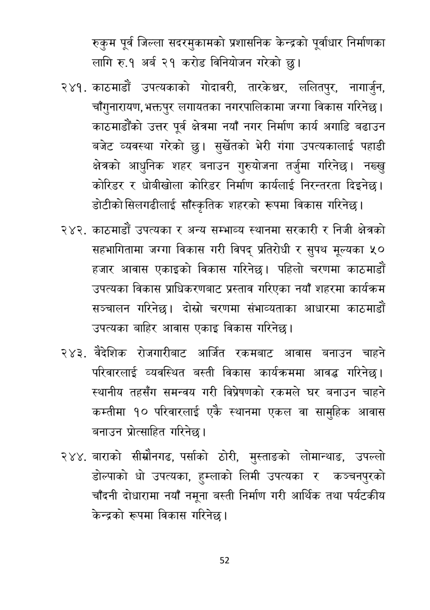

# Page 53 QA

## Rendered page


## Extracted text

```text
रुकुम पूर्व जिल्ला सदरमुकामको प्रशासनिक केन्द्रको पूर्वाधार निर्माणका लागि रु.१ अर्ब २१ करोड विनियोजन गरेको छु।
काठमाडौं उपत्यकाको गोदावरी, तारकेश्वर, ललितपुर, नागार्जुन, चाँगुनारायण, भक्तपुर लगायतका नगरपालिकामा जग्गा विकास गरिनेछ | काठमाडौंको उत्तर पूर्व क्षेत्रमा नयाँ नगर निर्माण कार्य अगाडि बढाउन बजेट व्यवस्था गरेको छु। सुर्खेतको भेरी गंगा उपत्यकालाई पहाडी क्षेत्रको आधुनिक शहर बनाउन गुरुयोजना तर्जुमा गरिनेछ। नख्खु कोरिडर र धोबीखोला कोरिडर निर्माण कार्यलाई निरन्तरता दिइनेछ | डोटीको सिलगढीलाई साँस्कृतिक शहरको रूपमा विकास गरिनेछ।
काठमाडौं उपत्यका र अन्य सम्भाव्य स्थानमा सरकारी र निजी क्षेत्रको सहभागितामा जग्गा विकास गरी विपद्‌ प्रतिरोधी र सुपथ मूल्यका ५० हजार आवास एकाइको विकास गरिनेछ। पहिलो चरणमा काठमाडौं उपत्यका विकास प्राधिकरणबाट प्रस्ताव गरिएका नयाँ शहरमा कार्यक्रम सञ्चालन गरिनेछ। दोस्रो चरणमा संभाव्यताका आधारमा काठमाडौं उपत्यका बाहिर आवास एकाइ विकास गरिनेछ।
वैदेशिक रोजगारीबाट आर्जित रकमबाट आवास बनाउन चाहने परिवारलाई व्यवस्थित बस्ती विकास कार्यक्रममा आवद्ध गरिनेछ। स्थानीय तहसँग समन्वय गरी विप्रेषणको रकमले घर बनाउन चाहने कम्तीमा १० परिवारलाई एकै स्थानमा एकल वा सामुहिक आवास बनाउन प्रोत्साहित गरिनेछ |
बाराको सीम्रौनगढ, पर्साको ठोरी, मुस्ताङको लोमान्थाङ, उपल्लो डोल्पाको धो उपत्यका, हुम्लाको लिमी उपत्यका र कञ्चनपुरको चाँदनी दोधारामा नयाँ नमूना बस्ती निर्माण गरी आर्थिक तथा पर्यटकीय केन्द्रको रूपमा विकास गरिनेछ |
५२
```

## Flags
- None
