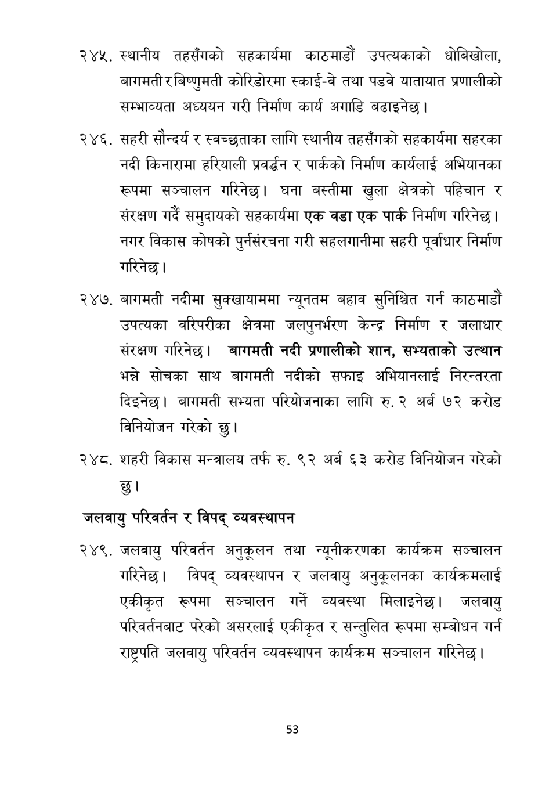

# Page 54 QA

## Rendered page


## Extracted text

```text
स्थानीय तहसँगको सहकार्यमा काठमाडौं उपत्यकाको धोबिखोला, बागमती रबिष्णुमती कोरिडोरमा स्काई-वे तथा पडवे यातायात प्रणालीको सम्भाव्यता अध्ययन गरी निर्माण कार्य अगाडि बढाइनेछ |
सहरी सौन्दर्य र स्वच्छुताका लागि स्थानीय तहसँगको सहकार्यमा सहरका नदी किनारामा हरियाली प्रवर्धन र पार्कको निर्माण कार्यलाई अभियानका रूपमा सञ्चालन गरिनेछ। घना बस्तीमा खुला क्षेत्रको पहिचान र संरक्षण गर्दै समुदायको सहकार्यमा एक वडा एक पार्क निर्माण गरिनेछ | नगर विकास कोषको पुर्नसंरचना गरी सहलगानीमा सहरी पूर्वाधार निर्माण गरिनेछ।
बागमती नदीमा सुक्खायाममा न्यूनतम बहाव सुनिश्चित गर्न काठमाडौं उपत्यका वरिपरीका क्षेत्रमा जलपुनर्भरण केन्द्र निर्माण र जलाधार संरक्षण गरिनेछ। बागमती नदी प्रणालीको शान, सभ्यताको उत्थान भन्ने सोचका साथ बागमती नदीको सफाइ अभियानलाई निरन्तरता दिइनेछ। बागमती सभ्यता परियोजनाका लागि रु. २ अर्ब ७२ करोड विनियोजन गरेको छु।
शहरी विकास मन्त्रालय तर्फ रु. ९२ अर्ब ६३ करोड विनियोजन गरेको छु।
जलवायु परिवर्तन र विपद्‌ व्यवस्थापन
२४९, जलवायु परिवर्तन अनुकूलन तथा न्यूनीकरणका कार्यक्रम सञ्चालन गरिनेछ। विपद्‌ व्यवस्थापन र जलवायु अनुकूलनका कार्यक्रमलाई एकीकृत रूपमा सञ्चालन गर्ने व्यवस्था मिलाइनेछ। जलवायु परिवर्तनबाट परेको असरलाई एकीकृत र सन्तुलित रूपमा सम्बोधन गर्न राष्ट्रपति जलवायु परिवर्तन व्यवस्थापन कार्यक्रम सञ्चालन गरिनेछ।
५३
```

## Flags
- None
