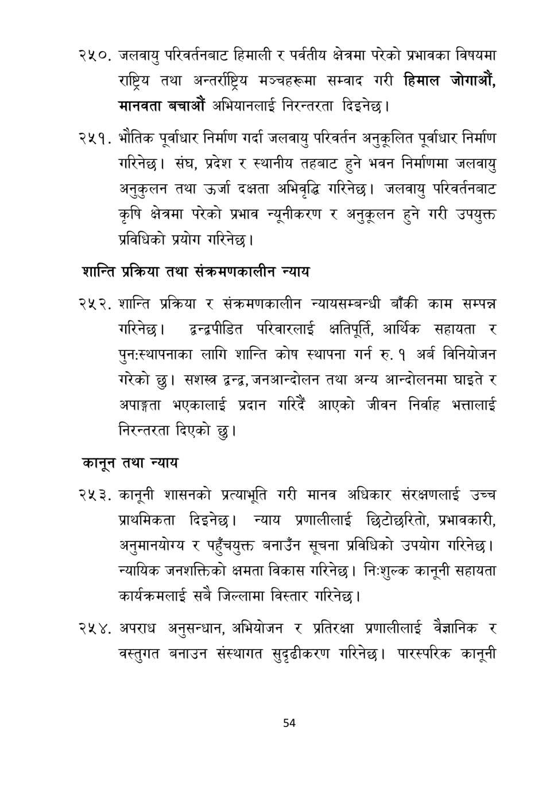

# Page 55 QA

## Rendered page


## Extracted text

```text
जलवायु परिवर्तनबाट हिमाली र पर्वतीय क्षेत्रमा परेको प्रभावका विषयमा राष्ट्रिय तथा अन्तर्राष्ट्रिय मञ्चहरूमा सम्वाद गरी हिमाल जोगाऔं, मानवता बचाऔं अभियानलाई निरन्तरता दिइनेछ।
भौतिक पूर्वाधार निर्माण गर्दा जलवायु परिवर्तन अनुकूलित पूर्वाधार निर्माण गरिनेछ। संघ, प्रदेश र स्थानीय तहबाट हुने भवन निर्माणमा जलवायु अनुकुलन तथा उर्जा दक्षता अभिवृद्धि गरिनेछ। जलवायु परिवर्तनबाट कृषि क्षेत्रमा परेको प्रभाव न्यूनीकरण र अनुकूलन हुने गरी उपयुक्त प्रविधिको प्रयोग गरिनेछ।
शान्ति प्रक्रिया तथा संक्रमणकालीन न्याय
शान्ति प्रक्रिया र संक्रमणकालीन न्यायसम्बन्धी बाँकी काम सम्पन्न गरिनेछ। द्वन्द्वपीडित परिवारलाई क्षतिपूर्ति आर्थिक सहायता र पुनःस्थापनाका लागि शान्ति कोष स्थापना गर्न रु. १ अर्ब विनियोजन गरेको | सशस्त्र द्वन्द्व, जनआन्दोलन तथा अन्य आन्दोलनमा घाइते र अपाङ्गता भएकालाई प्रदान गरिदै आएको जीवन निर्वाह भत्तालाई निरन्तरता दिएको छु।
कानून तथा न्याय
कानूनी शासनको प्रत्याभूति गरी मानव अधिकार संरक्षणलाई उच्च प्राथमिकता दिइनेछ। न्याय प्रणालीलाई छिटोछरितो, प्रभावकारी, अनुमानयोग्य र पहुँचयुक्त बनाउँन सूचना प्रविधिको उपयोग गरिनेछ | न्यायिक जनशक्तिको क्षमता विकास गरिनेछ। निःशुल्क कानूनी सहायता कार्यक्रमलाई सबै जिल्लामा विस्तार गरिनेछ।
अपराध अनुसन्धान, अभियोजन र प्रतिरक्षा प्रणालीलाई वैज्ञानिक र वस्तुगत बनाउन संस्थागत सुदृढीकरण गरिनेछ। पारस्परिक कानूनी
५४
```

## Flags
- None
