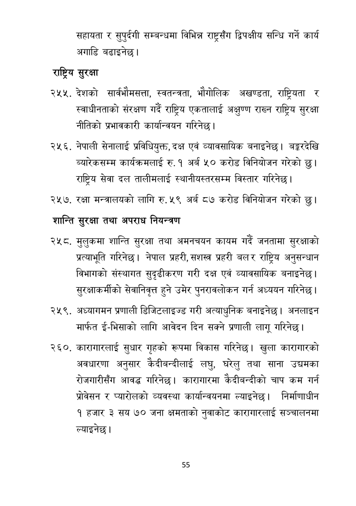

# Page 56 QA

## Rendered page


## Extracted text

```text
सहायता र सुपुर्दगी सम्बन्धमा विभिन्न राष्ट्रसँग द्विपक्षीय सन्धि गर्ने कार्य अगाडि बढाइनेछ।
राष्ट्रिय सुरक्षा
देशको सार्वभौमसत्ता, स्वतन्त्रता, भौगोलिक अखण्डता, राष्ट्रियता र स्वाधीनताको संरक्षण गर्दै राष्ट्रिय एकतालाई अक्षुण्ण राख्न राष्ट्रिय सुरक्षा नीतिको प्रभावकारी कार्यान्वयन गरिनेछ |
नेपाली सेनालाई प्रविधियुक्त, दक्ष एवं व्यावसायिक बनाइनेछ। बङ्करदेखि ब्यारेकसम्म कार्यक्रमलाई रु. १ अर्ब ५० करोड विनियोजन गरेको छु। राष्ट्रिय सेवा दल तालीमलाई स्थानीयस्तरसम्म विस्तार गरिनेछ।
२५७. रक्षा मन्त्रालयको लागि रु. ५९ अर्ब ८७ करोड विनियोजन गरेको छु।
शान्ति सुरक्षा तथा अपराध नियन्त्रण
मुलुकमा शान्ति सुरक्षा तथा अमनचयन कायम गर्दै जनतामा सुरक्षाको प्रत्याभूति गरिनेछ। नेपाल प्रहरी, सशस्त्र प्रहरी बल र राष्ट्रिय अनुसन्धान विभागको संस्थागत सुदृढीकरण गरी दक्ष एवं व्यावसायिक बनाइनेछ | सुरक्षाकर्मीको सेवानिवृत्त हुने उमेर पुनरावलोकन गर्न अध्ययन गरिनेछ।
२५९, अध्यागमन प्रणाली डिजिटलाइज्ड गरी अत्याधुनिक बनाइनेछ। अनलाइन मार्फत ई-भिसाको लागि आवेदन दिन सक्ने प्रणाली लागू गरिनेछ |
कारागारलाई सुधार गृहको रूपमा विकास गरिनेछ। खुला कारागारको अवधारणा अनुसार कैदीबन्दीलाई लघु, घरेलु तथा साना उच्चमका रोजगारीसँग आवद्ध गरिनेछ। कारागारमा कैदीबन्दीको चाप कम गर्न प्रोवसन र प्यारीलको व्यवस्था कार्यान्वयनमा ल्याइनेछ। निर्माणाधीन १ हजार ३ सय ७० जना क्षमताको नुवाकोट कारागारलाई सञ्चालनमा ल्याइनेछ |
५५
```

## Flags
- None
