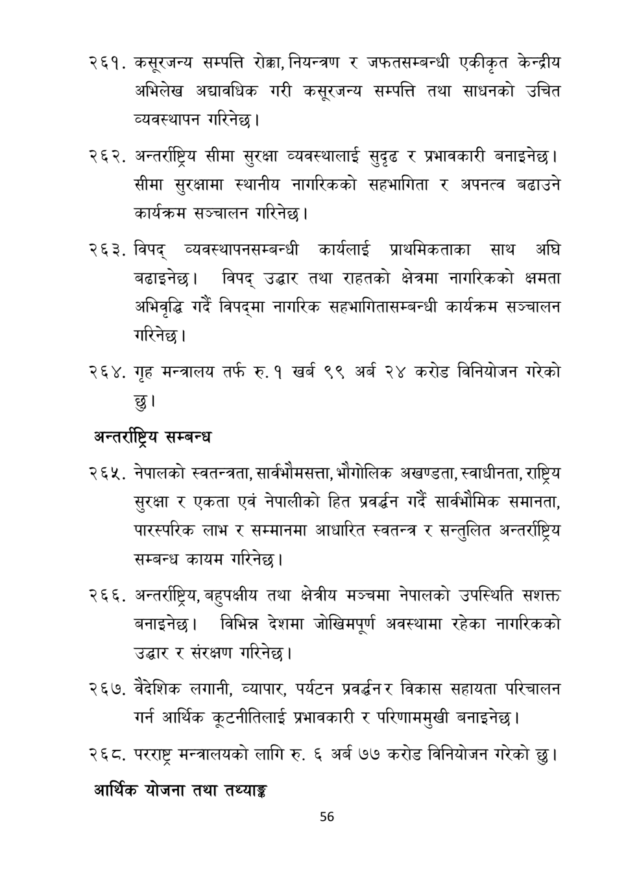

# Page 57 QA

## Rendered page


## Extracted text

```text
कस्रजन्य सम्पत्ति रोक्का, नियन्त्रण र जफतसम्बन्धी एकीकृत केन्द्रीय अभिलेख अद्यावधिक गरी कस्रजन्य सम्पत्ति तथा साधनको उचित व्यवस्थापन गरिनेछ |
अन्तर्राष्ट्रिय सीमा सुरक्षा व्यवस्थालाई सुदृढ र प्रभावकारी बनाइनेछ | सीमा सुरक्षामा स्थानीय नागरिकको सहभागिता र अपनत्व बढाउने कार्यक्रम सञ्चालन |
विपद्‌ व्यवस्थापनसम्बन्धी कार्यलाई प्राथमिकताका साथ अघि बढाइनेछ। विपद्‌ उद्धार तथा राहतको क्षेत्रमा नागरिकको क्षमता अभिवृद्धि गर्दै विपद्मा नागरिक सहभागितासम्बन्धी कार्यक्रम सञ्चालन गरिनेछ।
गृह मन्त्रालय तर्फ रु. १ खर्ब ९९ अर्ब २४ करोड विनियोजन छु।
अन्तर्राष्ट्रिय सम्बन्ध
नेपालको स्वतन्त्रता, सार्वभीमसत्ता, भौगोलिक अखण्डता, स्वाधीनता, राष्ट्रिय सुरक्षा र एकता एवं नेपालीको हित प्रवर्धन गर्दै सार्ववीमिक समानता, पारस्परिक लाभ र सम्मानमा आधारित स्वतन्त्र र सन्तुलित अन्तर्राष्ट्रिय सम्बन्ध कायम गरिनेछ |
अन्तर्राष्ट्रिय, बहुपक्षीय तथा क्षेत्रीय मञ्चमा नेपालको उपस्थिति सशक्त बनाइनेछ। विभिन्न देशमा जोखिमपूर्ण अवस्थामा रहेका नागरिकको उद्धार र संरक्षण गरिनेछ |
वैदेशिक लगानी, व्यापार, पर्यटन प्रवर्धन र विकास सहायता गर्न आर्थिक कूटनीतिलाई प्रभावकारी र बनाइनेछ।
परिचालन परिणाममुखी
परराष्ट्र मन्त्रालयको लागि रु. ६ अर्ब ७७ करोड विनियोजन गरेको छु।
आर्थिक योजना तथा तथ्याङ्क
गरेको
५६
```

## Flags
- None
