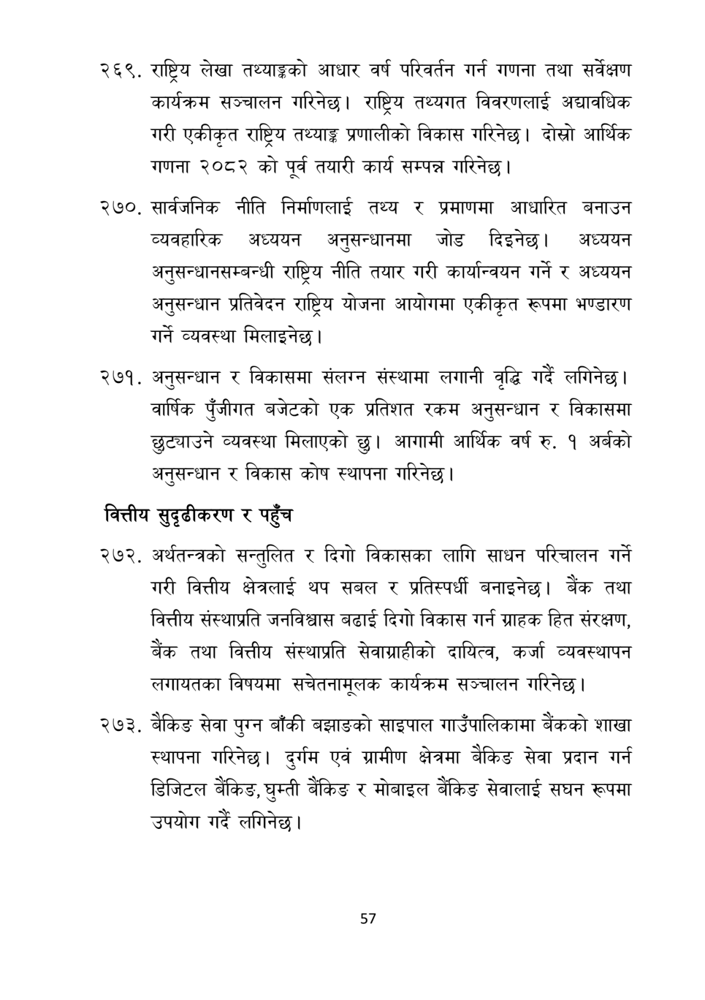

# Page 58 QA

## Rendered page


## Extracted text

```text
राष्ट्रिय लेखा तथ्याङ्कको आधार वर्ष परिवर्तन गर्न गणना तथा सर्वेक्षण कार्यक्रम सञ्चालन गरिनेछ। राष्ट्रिय तथ्यगत विवरणलाई अद्यावधिक गरी एकीकृत राष्ट्रिय तथ्याङ्क प्रणालीको विकास गरिनेछ। दोस्रो आर्थिक गणना २०८२ को पूर्व तयारी कार्य सम्पन्न गरिनेछ।
. सार्वजनिक नीति निर्माणलाई तथ्य र प्रमाणमा आधारित बनाउन व्यवहारिक अध्ययन अनुसन्धानमा जोड दिइनेछ। अध्ययन अनुसन्धानसम्बन्धी राष्ट्रिय नीति तयार गरी कार्यान्वयन गर्ने र अध्ययन अनुसन्धान प्रतिवेदन राष्ट्रिय योजना आयोगमा एकीकृत रूपमा भण्डारण गर्ने व्यवस्था मिलाइनेछ |
अनुसन्धान र विकासमा संलग्न संस्थामा लगानी वृद्धि गर्दै लगिनेछ | वार्षिक पुँजीगत बजेटको एक प्रतिशत रकम अनुसन्धान र विकासमा छुट्याउने व्यवस्था मिलाएको छु। आगामी आर्थिक वर्ष रु. १ अर्बको अनुसन्धान र विकास कोष स्थापना गरिनेछ।
वित्तीय सुदृढीकरण र पहुँच
अर्थतन्त्रको सन्तुलित र दिगो विकासका लागि साधन परिचालन गर्ने गरी वित्तीय क्षेत्रलाई थप सबल र प्रतिस्पर्धी बनाइनेछ। बैंक तथा वित्तीय संस्थाप्रति जनविश्वास बढाई दिगो विकास गर्न ग्राहक हित संरक्षण, बैंक तथा वित्तीय संस्थाप्रति सेवाग्राहीको दायित्व, कर्जा व्यवस्थापन लगायतका विषयमा सचेतनामूलक कार्यक्रम सञ्चालन गरिनेछ।
. बैकिङ सेवा पुग्न बाँकी बझाङको साइपाल गाउँपालिकामा बैंकको शाखा स्थापना गरिनेछ। दुर्गम एवं ग्रामीण क्षेत्रमा बैकिङ सेवा प्रदान गर्न डिजिटल बैंकिङ, घुम्ती बैंकिङ र मोबाइल बैंकिङ सेवालाई सघन रूपमा उपयोग गर्दै लगिनेछ |
५७
```

## Flags
- None
