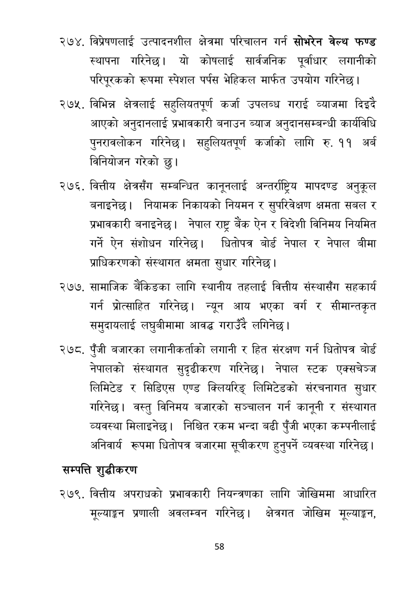

# Page 59 QA

## Rendered page


## Extracted text

```text
विप्रेषणलाई उत्पादनशील क्षेत्रमा परिचालन गर्न सोभरेन वेल्थ फण्ड स्थापना गरिनेछ। यो कोषलाई सार्वजनिक पूर्वाधार लगानीको परिपूरकको रूपमा स्पेशल पर्पस भेहिकल मार्फत उपयोग गरिनेछ |
विभिन्न क्षेत्रलाई सहुलियतपूर्ण कर्जा उपलब्ध गराई व्याजमा दिइदै आएको अनुदानलाई प्रभावकारी बनाउन ब्याज अनुदानसम्बन्धी कार्यविधि पुनरावलोकन गरिनेछ। सहुलियतपूर्ण कर्जको लागि रु. ११ अर्ब विनियोजन गरेको छु।
. वित्तीय क्षेत्रसँग सम्बन्धित कानूनलाई अन्तर्राष्ट्रिय मापदण्ड अनुकूल बनाइनेछ। नियामक निकायको नियमन र सुपरिवेक्षण क्षमता सबल र प्रभावकारी बनाइनेछ। नेपाल राष्ट्र बैंक ऐन र विदेशी विनिमय नियमित गर्ने ऐन संशोधन गरिनेछ। धितोपत्र बोर्ड नेपाल र नेपाल बीमा प्राधिकरणको संस्थागत क्षमता सुधार गरिनेछ।
सामाजिक बैंकिङका लागि स्थानीय तहलाई वित्तीय संस्थासँग सहकार्य गर्न प्रोत्साहित गरिनेछ। न्यून आय भएका वर्ग र सीमान्तकृत समुदायलाई लघुबीमामा आवद्ध गराउँदै लगिनेछ |
पुँजी बजारका लगानीकर्ताको लगानी र हित संरक्षण गर्न धितोपत्र बोर्ड नेपालको संस्थागत सुदृढीकरण गरिनेछ। नेपाल स्टक एक्सचेञ्ज लिमिटेड र सिडिएस एण्ड क्लियरिङ्‌ लिमिटेडको संरचनागत सुधार गरिनेछ। वस्तु विनिमय बजारको सञ्चालन गर्न कानूनी र संस्थागत व्यवस्था मिलाइनेछ। निश्चित रकम भन्दा बढी पुँजी भएका कम्पनीलाई अनिवार्य रूपमा धितोपत्र बजारमा सूचीकरण हुनुपर्ने व्यवस्था गरिनेछ |
सम्पत्ति शुद्धीकरण
वित्तीय अपराधको प्रभावकारी नियन्त्रणका लागि जोखिममा आधारित मूल्याङ्कन प्रणाली अवलम्वन गरिनेछ। क्षेत्रगत जोखिम मूल्याङ्कन,
५८
```

## Flags
- None
