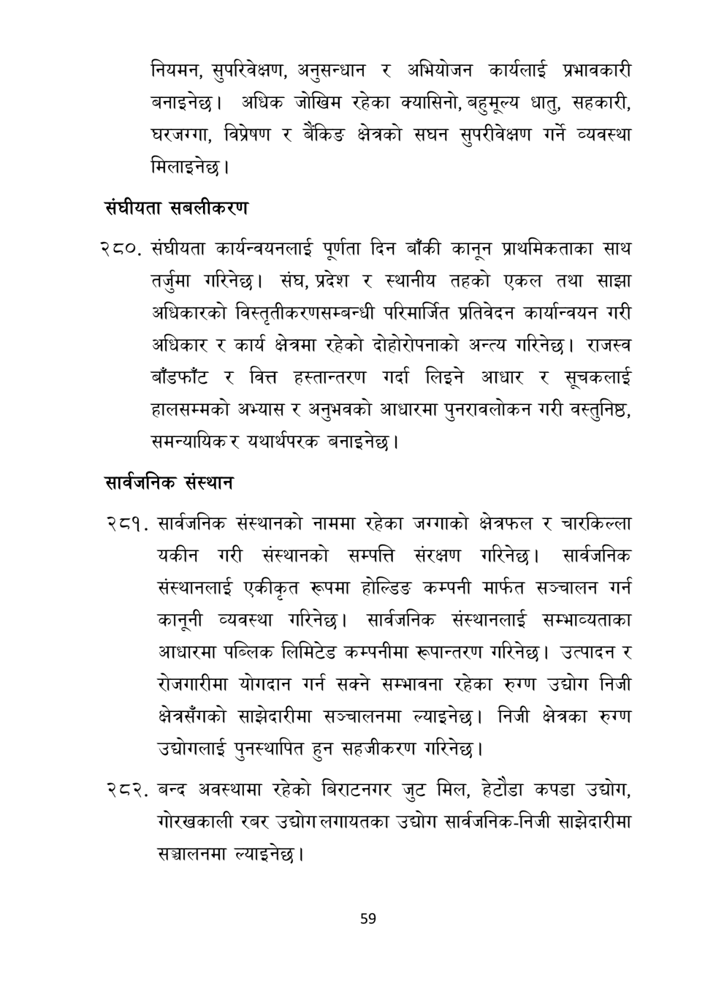

# Page 60 QA

## Rendered page


## Extracted text

```text
नियमन, सुपरिवेक्षण, अनुसन्धान र अभियोजन कार्यलाई प्रभावकारी बनाइनेछ। अधिक जोखिम रहेका क्यासिनो, बहुमूल्य धातु, सहकारी, घरजग्गा, विप्रेषण र बैंकिङ क्षेत्रको सघन सुपरीवेक्षण गर्ने व्यवस्था मिलाइनेछ।
संघीयता सबलीकरण
२८०, संघीयता कार्यन्वयनलाई पूर्णता दिन बाँकी कानून प्राथमिकताका साथ तर्जुमा गरिनेछ। संघ, प्रदेश र स्थानीय तहको एकल तथा साझा अधिकारको विस्तृतीकरणसम्बन्धी परिमार्जित प्रतिवेदन कार्यान्वयन गरी अधिकार र कार्य क्षेत्रमा रहेको दोहोरोपनाको अन्त्य गरिनेछ। राजस्व बाँडफाँट र वित्त हस्तान्तरण गर्दा लिइने आधार र सूचकलाई हालसम्मको अभ्यास र अनुभवको आधारमा पुनरावलोकन गरी वस्तुनिष्ठ, समन्यायिक यथार्थपरक
र बनाइनेछ।
सार्वजनिक संस्थान
सार्वजनिक संस्थानको नाममा रहेका जग्गाको क्षेत्रफल र चारकिल्ला यकीन गरी संस्थानको सम्पत्ति संरक्षण गरिनेछ। सार्वजनिक संस्थानलाई एकीकृत रूपमा होल्डिङ कम्पनी मार्फत सञ्चालन गर्न कानूनी व्यवस्था गरिनेछ। सार्वजनिक संस्थानलाई सम्भाव्यताका आधारमा पब्लिक लिमिटेड कम्पनीमा रूपान्तरण गरिनेछ। उत्पादन र रोजगारीमा योगदान गर्न सक्ने सम्भावना रहेका रुग्ण उद्योग निजी क्षेत्रसँगको साझेदारीमा सञ्चालनमा ल्याइनेछ। निजी क्षेत्रका रुग्ण उद्योगलाई पुनस्थापित हुन सहजीकरण गरिनेछ |
बन्द अवस्थामा रहेको बिराटनगर जुट मिल, हेटौडा कपडा उद्योग, गोरखकाली रबर उद्योग लगायतका उद्योग सार्वजनिक-निजी साझेदारीमा सञ्चालनमा ल्याइनेछ।
५९
```

## Flags
- None
