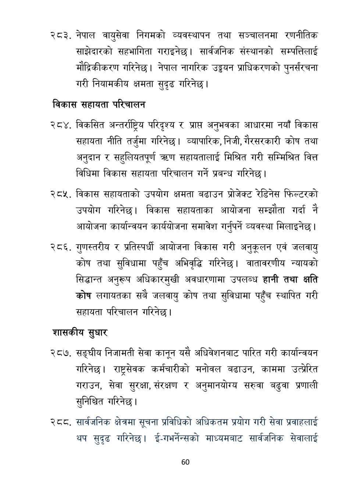

# Page 61 QA

## Rendered page


## Extracted text

```text
नेपाल वायुसेवा निगमको व्यवस्थापन तथा सञ्चालनमा रणनीतिक साझेदारको सहभागिता गराइनेछ। सार्वजनिक संस्थानको सम्पत्तिलाई मौद्रिकीकरण गरिनेछ। नेपाल नागरिक उड्डयन प्राधिकरणको पुनर्संरचना गरी नियामकीय क्षमता सुदृढ गरिनेछ |
विकास सहायता परिचालन
२८४, विकसित अन्तर्राष्ट्रिय परिदृश्य र प्राप्त अनुभवका आधारमा नयाँ विकास सहायता नीति तर्जुमा गरिनेछ। व्यापारिक, निजी, गैरसरकारी कोष तथा अनुदान र सहुलियतपूर्ण =० सहायतालाई मिश्चित गरी सम्भिश्चित वित्त विधिमा विकास सहायता परिचालन गर्ने प्रबन्ध गरिनेछ।
विकास सहायताको उपयोग क्षमता बढाउन प्रोजेक्ट रेडिनेस फिल्टरको उपयोग गरिनेछ। विकास सहायताका आयोजना सम्झौता गर्दा नै आयोजना कार्यान्वयन कार्ययोजना समावेश गर्नुपर्ने व्यवस्था मिलाइनेछ।
गुणस्तरीय र प्रतिस्पर्धी आयोजना विकास गरी अनुकूलन एवं जलवायु कोष तथा सुविधामा पहुँच अभिवृद्धि गरिनेछ। वातावरणीय न्यायको सिद्धान्त अनुरूप अधिकारमुखी अवधारणामा उपलब्ध हानी तथा क्षति कोष लगायतका सबै जलवायु कोष तथा सुविधामा पहुँच स्थापित गरी सहायता परिचालन गरिनेछ |
शासकीय सुधार
सङ्घीय निजामती सेवा कानून यसै अधिवेशनबाट पारित गरी कार्यान्वयन गरिनेछ। राष्ट्रसेवक कर्मचारीको मनोवल बढाउन, काममा उत्प्रेरित गराउन, सेवा सुरक्षा, संरक्षण र अनुमानयोग्य सरुवा बढुवा प्रणाली सुनिश्चित गरिनेछ।
र्टट,. सार्वजनिक क्षेत्रमा सूचना प्रविधिको अधिकतम प्रयोग गरी सेवा प्रवाहलाई थप सुदृढ गरिनेछ। ई-गभर्नेन्सको माध्यमबाट सार्वजनिक सेवालाई
६०
```

## Flags
- None
