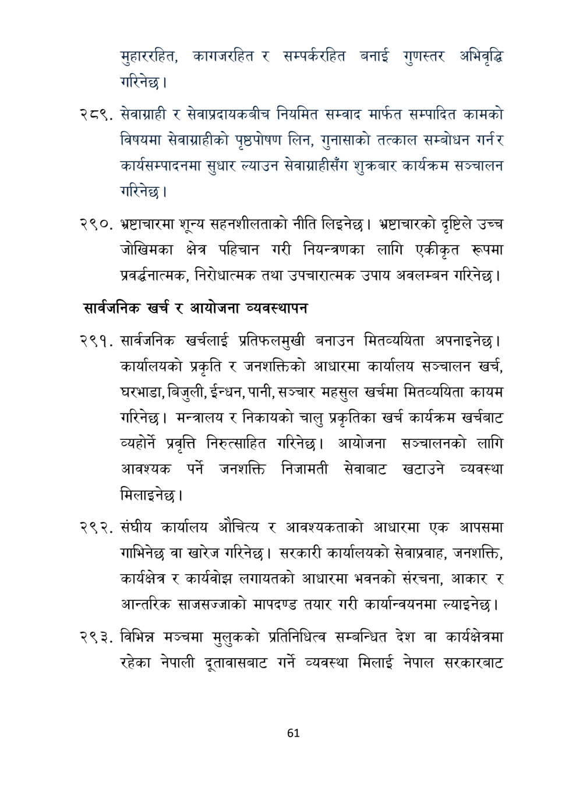

# Page 62 QA

## Rendered page


## Extracted text

```text
मुहाररहित, कागजरहित र सम्पर्करहित बनाई गुणस्तर अभिवृद्धि गरिनेछ।
सेवाग्राही र सेवाप्रदायकबीच नियमित सम्वाद मार्फत सम्पादित कामको विषयमा सेवाग्राहीको पृष्ठपोषण लिन, गुनासाको तत्काल सम्बोधन गर्नर कार्यसम्पादनमा सुधार ल्याउन सेवाग्राहीसँग शुक्रबार कार्यक्रम सञ्चालन गरिनेछ।
भ्रष्टाचारमा शून्य सहनशीलताको नीति लिइनेछ। भ्रष्टाचारको दृष्टिले उच्च जोखिमका क्षेत्र पहिचान गरी नियन्त्रणका लागि एकीकृत रूपमा प्रवर्नात्मक, निरोधात्मक तथा उपचारात्मक उपाय अवलम्बन गरिनेछ |
सार्वजनिक खर्च र आयोजना व्यवस्थापन
२९१, सार्वजनिक खर्चलाई प्रतिफलमुखी बनाउन मितव्ययिता अपनाइनेछ। कार्यालयको प्रकृति र जनशक्तिको आधारमा कार्यालय सञ्चालन खर्च, घरभाडा, बिजुली, ईन्धन, पानी, सञ्चार महसुल खर्चमा मितव्ययिता कायम गरिनेछ। मन्त्रालय र निकायको चालु प्रकृतिका खर्च कार्यक्रम खर्चबाट व्यहोर्ने प्रवृत्ति निरुत्साहित गरिनेछ। आयोजना सञ्चालनको लागि आवश्यक पर्ने जनशक्ति निजामती सेवाबाट खटाउने व्यवस्था मिलाइनेछ।
२९२, संघीय कार्यालय औचित्य र आवश्यकताको आधारमा एक आपसमा गाभिनेछ वा खारेज गरिनेछ। सरकारी कार्यालयको सेवाप्रवाह, जनशक्ति, कार्यक्षेत्र र कार्यवोझ लगायतको आधारमा भवनको संरचना, आकार र आन्तरिक साजसज्जाको मापदण्ड तयार गरी कार्यान्वयनमा ल्याइनेछ |
विभिन्न मञ्चमा मुलुकको प्रतिनिधित्व सम्बन्धित देश वा रहेका नेपाली गर्ने व्यवस्था मिलाई नेपाल
कार्यक्षेत्रमा दूतावासबाट सरकारबाट
६१
```

## Flags
- None
