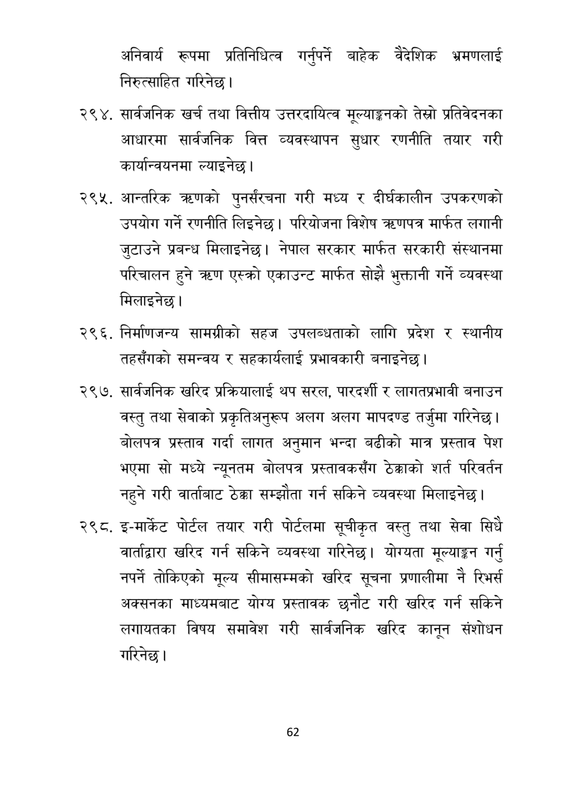

# Page 63 QA

## Rendered page


## Extracted text

```text
अनिवार्य रूपमा प्रतिनिधित्व गर्नुपर्ने बाहेक वैदेशिक भ्रमणलाई निरुत्साहित गरिनेछ।
२९४, सार्वजनिक खर्च तथा वित्तीय उत्तरदायित्व मूल्याङ्कनको तेस्रो प्रतिवेदनका आधारमा सार्वजनिक वित्त व्यवस्थापन सुधार रणनीति तयार गरी कार्यान्वयनमा ल्याइनेछ |
आन्तरिक करणको पुनर्संरचना गरी मध्य र दीर्घकालीन उपकरणको उपयोग गर्ने रणनीति लिइनेछ | परियोजना विशेष त्रहणपत्र मार्फत लगानी जुटाउने प्रबन्ध मिलाइनेछ। नेपाल सरकार मार्फत सरकारी संस्थानमा परिचालन हुने त्रहण एस्क्रो एकाउन्ट मार्फत सोझै भुक्तानी गर्ने व्यवस्था मिलाइनेछ।
. निर्माणजन्य सामग्रीको सहज उपलब्धताको लागि प्रदेश र स्थानीय तहसँगको समन्वय र सहकार्यलाई प्रभावकारी बनाइनेछ |
सार्वजनिक खरिद प्रक्रियालाई थप सरल, पारदर्शी र लागतप्रभावी बनाउन वस्तु तथा सेवाको प्रकृतिअनुरूप अलग अलग मापदण्ड तर्जुमा गरिनेछ | बोलपत्र प्रस्ताव गर्दा लागत अनुमान भन्दा बढीको मात्र प्रस्ताव पेश भएमा सो मध्ये न्यूनतम बोलपत्र प्रस्तावकसँग ठेक्काको शर्त परिवर्तन नहुने गरी वार्ताबाट ठेक्का सम्झोता गर्न सकिने व्यवस्था मिलाइनेछ |
२९८, इ-मार्केट पोर्टल तयार गरी पोर्टलमा सूचीकृत वस्तु तथा सेवा सिधै वार्ताद्वारा खरिद गर्न सकिने व्यवस्था गरिनेछ। योग्यता मूल्याङ्कन गर्नु नपर्ने तोकिएको मूल्य सीमासम्मको खरिद सूचना प्रणालीमा नै रिभर्स अक्सनका माध्यमबाट योग्य प्रस्तावक छनौट गरी खरिद गर्न सकिने लगायतका विषय समावेश गरी सार्वजनिक खरिद कानून संशोधन गरिनेछ।
६२
```

## Flags
- None
