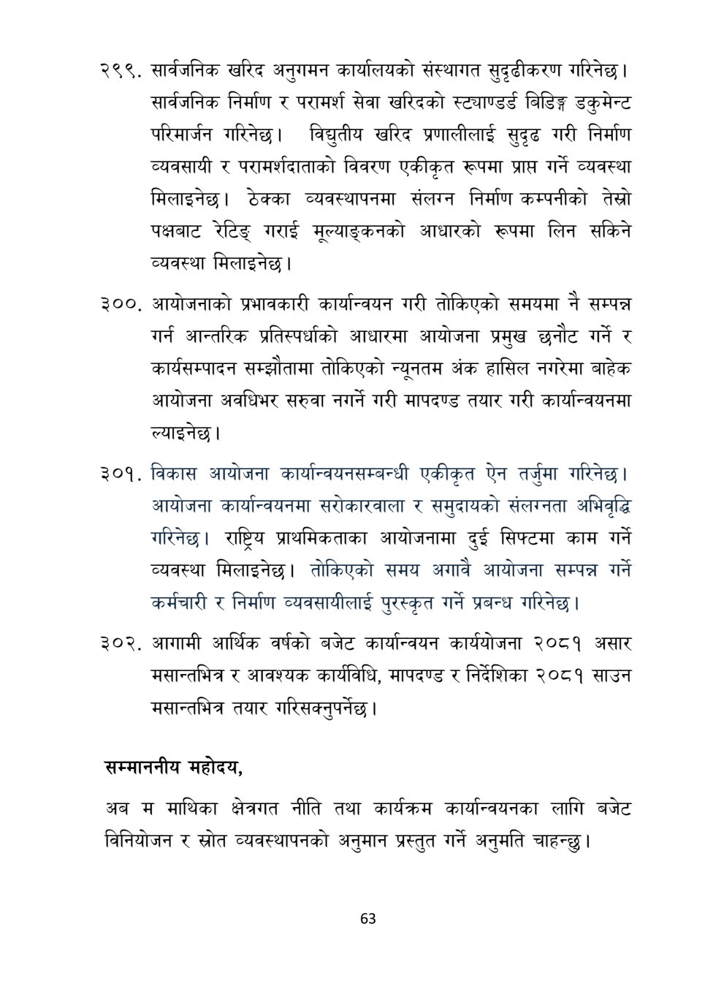

# Page 64 QA

## Rendered page


## Extracted text

```text
सार्वजनिक खरिद अनुगमन कार्यालयको संस्थागत सुदृढीकरण गरिनेछ। सार्वजनिक निर्माण र परामर्श सेवा खरिदको स्ट्याण्डर्ड बिडिङ्ग डकुमेन्ट परिमार्जन गरिनेछ। विद्युतीय खरिद प्रणालीलाई सुदृढ गरी निर्माण व्यवसायी र परामर्शदाताको विवरण एकीकृत रूपमा प्राप्त गर्ने व्यवस्था मिलाइनेछ। ठेक्का व्यवस्थापनमा संलग्न निर्माण कम्पनीको तेस्रो पक्षबाट रेटिङ्‌ गराई मूल्याङ्कनको आधारको रूपमा लिन सकिने व्यवस्था मिलाइनेछ |
३००, आयोजनाको प्रभावकारी कार्यान्वयन गरी तोकिएको समयमा नै सम्पन्न गर्न आन्तरिक प्रतिस्पर्धाको आधारमा आयोजना प्रमुख छनौट गर्ने र कार्यसम्पादन सम्झौतामा तोकिएको न्यूनतम अंक हासिल नगरेमा बाहेक आयोजना अवधिभर सरुवा नगर्ने गरी मापदण्ड तयार गरी कार्यान्वयनमा ल्याइनेछ।
विकास आयोजना कार्यान्वयनसम्बन्धी एकीकृत ऐन तर्जुमा गरिनेछ | आयोजना कार्यान्वयनमा सरोकारवाला र समुदायको संलग्नता अभिवृद्धि गरिनेछ। राष्ट्रिय प्राथमिकताका आयोजनामा दुई सिफ्टमा काम गर्ने व्यवस्था मिलाइनेछ। तोकिएको समय अगावै आयोजना सम्पन्न गर्ने कर्मचारी र निर्माण व्यवसायीलाई पुरस्कृत गर्ने प्रबन्ध गरिनेछ |
३०२, आगामी आर्थिक वर्षको बजेट कार्यान्वयन कार्ययोजना २०८१ असार मसान्तभित्र र आवश्यक कार्यविधि, मापदण्ड र निर्देशिका २०८१ साउन मसान्तभित्र तयार गरिसक्नुपर्नेछ।
सम्माननीय महोदय,
अब म माथिका क्षेत्रगत नीति तथा कार्यक्रम कार्यान्वयनका लागि बजेट विनियोजन र स्रोत व्यवस्थापनको अनुमान प्रस्तुत गर्ने अनुमति चाहन्छु।
६३
```

## Flags
- None
