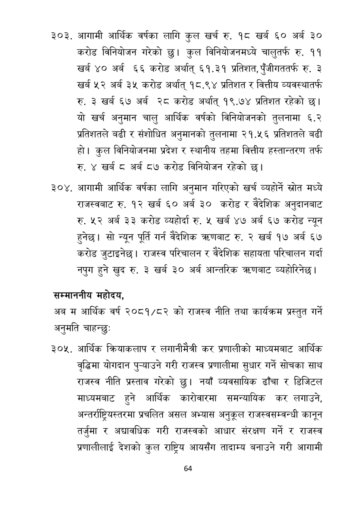

# Page 65 QA

## Rendered page


## Extracted text

```text
आगामी आर्थिक वर्षका लागि कुल खर्च रु. १८ खर्ब ६० अर्ब ३० करोड विनियोजन गरेको कुल विनियोजनमध्ये चालुतर्फ रु. ९९ खर्ब ४० अर्ब ६६ करोड अर्थात्‌ ६१.३१ प्रतिशत, पुँजीगततर्फ रु. ३ खर्ब ५२ अर्ब ३५ करोड अर्थात्‌ १८.९४ प्रतिशत र वित्तीय व्यवस्थातर्फ रु. ३ खर्ब ६७ अर्ब २८ करोड अर्थात्‌ १९.७४ प्रतिशत रहेको छ। यो खर्च अनुमान चालु आर्थिक वर्षको विनियोजनको तुलनामा ६.२ प्रतिशतले बढी र संशोधित अनुमानको तुलनामा २१.५६ प्रतिशतले बढी हो। कुल विनियोजनमा प्रदेश र स्थानीय तहमा वित्तीय हस्तान्तरण तर्फ रु. ४ खर्ब अर्ब ८७ करोड विनियोजन रहेको छ।
आगामी आर्थिक वर्षका लागि अनुमान गरिएको खर्च व्यहोर्ने स्रोत मध्ये राजस्वबाट रु. १२ खर्ब ६० अर्ब ३० करोड र वैदेशिक अनुदानबाट रु. ५२ अर्ब ३३ करोड व्यहोर्दा रु. ५ खर्ब ४७ अर्ब ६७ करोड न्यून हुनेछ। सो न्यून पूर्ति गर्न वैदेशिक त्रहणबाट रु. २ खर्ब १७ अर्ब ६७ करोड जुटाइनेछ। राजस्व परिचालन र वैदेशिक सहायता परिचालन गर्दा नपुग हुने खुद रु. ३ खर्ब ३० अर्ब आन्तरिक त्रहणबाट व्यहोरिनेछ।
सम्माननीय महोदय,
अब म आर्थिक वर्ष २०८१/८२ को राजस्व नीति तथा कार्यक्रम प्रस्तुत अनुमति चाहन्छु:
गर्ने
आर्थिक क्रियाकलाप र लगानीमैत्री कर प्रणालीको माध्यमबाट आर्थिक वृद्धिमा योगदान पु-याउने गरी राजस्व प्रणालीमा सुधार गर्ने सोचका साथ राजस्व नीति प्रस्ताव गरेको छु। नयाँ व्यवसायिक ढाँचा र डिजिटल माध्यमबाट हुने आर्थिक कारोवारमा समन्यायिक कर लगाउने, अन्तर्राष्ट्रियस्तरमा प्रचलित असल अभ्यास अनुकूल राजस्वसम्वन्धी कानून तर्जुमा र अद्यावधिक गरी राजस्वको आधार संरक्षण गर्ने र राजस्व प्रणालीलाई देशको कुल राष्ट्रिय आयसँग तादाम्य बनाउने गरी आगामी
६४
```

## Flags
- None
