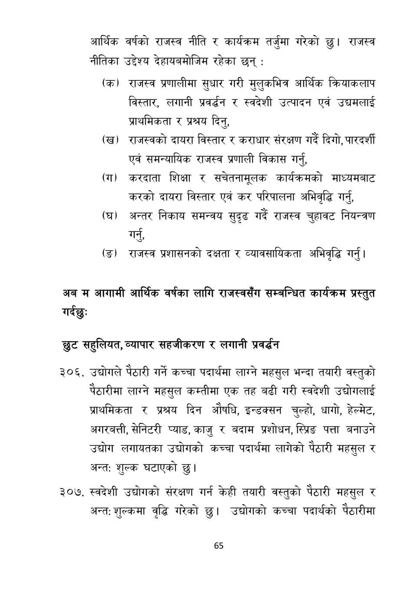

# Page 66 QA

## Rendered page


## Extracted text

```text
आर्थिक वर्षको राजस्व नीति र कार्यक्रम तर्जुमा गरेको छु। राजस्व नीतिका उद्देश्य देहायबमोजिम रहेका छन्‌:
(क) राजस्व प्रणालीमा सुधार गरी मुलुकभित्र आर्थिक क्रियाकलाप विस्तार, लगानी प्रवर्धन र स्वदेशी उत्पादन एवं उद्यमलाई प्राथमिकता र प्रश्रय दिनु,
(ख) राजस्वको दायरा विस्तार र कराधार संरक्षण गर्दै दिगो, पारदर्शी एवं समन्यायिक राजस्व प्रणाली विकास गर्नु,
(ग) करदाता शिक्षा र सचेतनामूलक कार्यक्रमको माध्यमबाट करको दायरा विस्तार एवं कर परिपालना अभिवृद्धि गर्न,
(घ) अन्तर निकाय समन्वय सुदृढ गर्दै राजस्व चुहावट नियन्त्रण
गर्नु,
(ङ) राजस्व प्रशासनको दक्षता र व्यावसायिकता अभिवृद्धि गर्नु |
अब म आगामी आर्थिक वर्षका लागि राजस्वसँग सम्बन्धित कार्यक्रम प्रस्तुत गर्दछु:
छुट सहुलियत, व्यापार सहजीकरण र लगानी प्रवर्धन
उद्योगले पैठारी गर्ने कच्चा पदार्थमा लाग्ने महसुल भन्दा तयारी वस्तुको पेठारीमा लाग्ने महसुल कम्तीमा एक तह बढी गरी स्वदेशी उद्योगलाई प्राथमिकता र प्रश्रय दिन औषधि, इन्डक्सन चुल्हो, धागो, हेल्मेट, अगरबत्ती, सेनिटरी प्याड, काजु र बदाम प्रशोधन, स्प्रिङ पत्ता बनाउने उद्योग लगायतका उद्योगको कच्चा पदार्थमा लागेको पैठारी महसुल र अन्त: शुल्क घटाएको छु।
स्वदेशी उद्योगको संरक्षण गर्न केही तयारी वस्तुको पैठारी महसुल र अन्त: शुल्कमा वृद्धि गरेको छु। उद्योगको कच्चा पदार्थको पेठारीमा
६५
```

## Flags
- None
