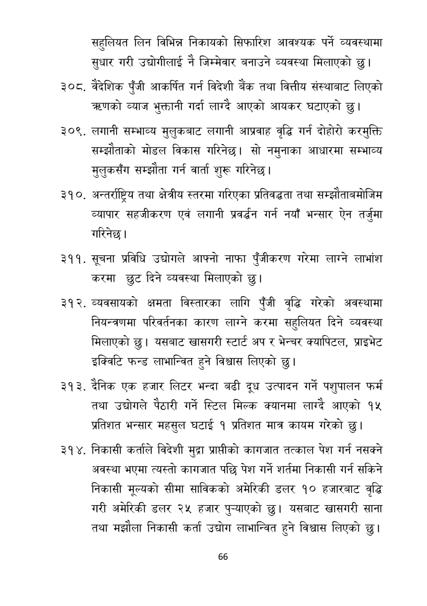

# Page 67 QA

## Rendered page


## Extracted text

```text
सहुलियत लिन विभिन्न निकायको सिफारिश आवश्यक पर्ने व्यवस्थामा सुधार गरी उद्योगीलाई नै जिम्मेवार बनाउने व्यवस्था मिलाएको छु।
३०८, वैदेशिक पुँजी आकर्षित गर्न विदेशी बैंक तथा वित्तीय संस्थाबाट लिएको करणको व्याज भुक्तानी गर्दा लाग्दै आएको आयकर घटाएको |
लगानी सम्भाव्य मुलुकबाट लगानी आप्रवाह वृद्धि गर्न दोहोरो करमुक्ति सम्झौताको मोडल विकास गरिनेछ। सो नमुनाका आधारमा सम्भाव्य मुलुकसँग सम्झौता गर्न वार्ता शुरू गरिनेछु।
अन्तर्राष्ट्रिय तथा क्षेत्रीय स्तरमा गरिएका प्रतिवद्धता तथा सम्झौताबमोजिम व्यापार सहजीकरण एवं लगानी प्रवर्द्धन गर्न नयाँ भन्सार ऐन तर्जुमा गरिनेछ।
. सूचना प्रविधि उद्योगले आफ्नो नाफा पुँजीकरण गरेमा लाग्ने लाभांश करमा छुट दिने व्यवस्था मिलाएको छु।
व्यवसायको क्षमता विस्तारका लागि पुँजी वृद्धि गरेको अवस्थामा नियन्त्रणमा परिवर्तनका कारण लाग्ने करमा सहुलियत दिने व्यवस्था मिलाएको छु। यसबाट खासगरी स्टार्ट अप र भेन्चर क्यापिटल, प्राइभेट इक्विटि फन्ड लाभान्वित हुने विश्वास लिएको छु।
दैनिक एक हजार लिटर भन्दा बढी दूध उत्पादन गर्ने पशुपालन फर्म तथा उद्योगले पैठारी गर्ने स्टिल मिल्क क्यानमा लाग्दै आएको १५ प्रतिशत भन्सार महसुल घटाई १ प्रतिशत मात्र कायम गरेको छु।
निकासी कर्ताले विदेशी मुद्रा प्राप्तीको कागजात तत्काल पेश गर्न नसक्ने अवस्था भएमा त्यस्तो कागजात पछि पेश गर्ने शर्तमा निकासी गर्न सकिने निकासी मूल्यको सीमा साविकको अमेरिकी डलर १० हजारबाट वृद्धि गरी अमेरिकी डलर २५ हजार पुन्याएको छु। यसबाट खासगरी साना तथा मझौला निकासी कर्ता उद्योग लाभान्वित हुने विश्वास लिएको छु।
६६
```

## Flags
- None
