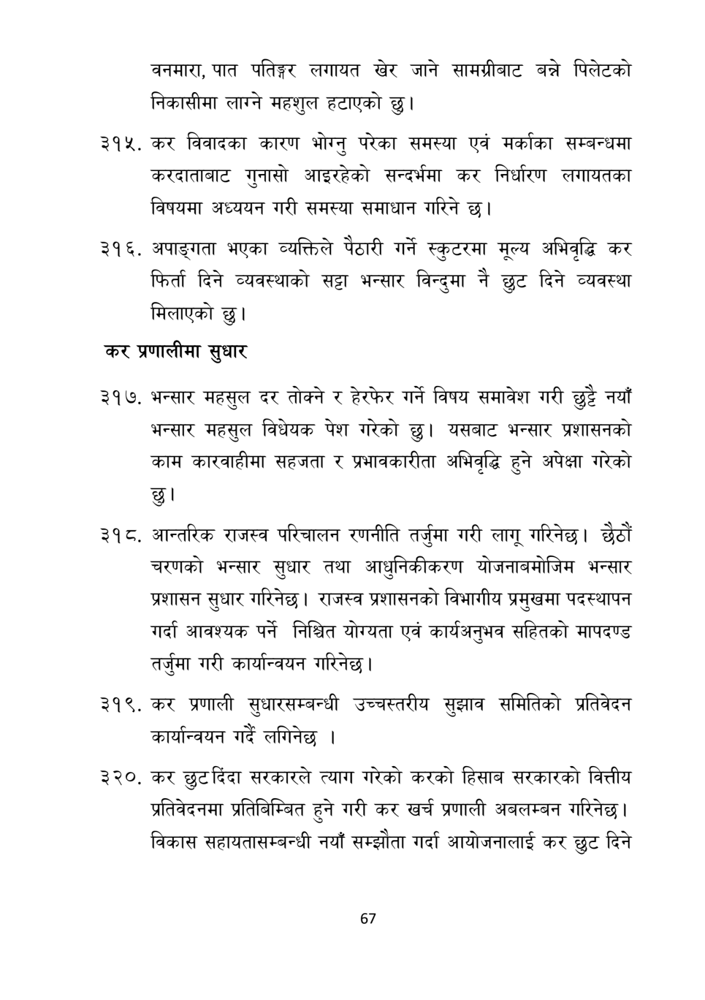

# Page 68 QA

## Rendered page


## Extracted text

```text
वनमारा, पात पतिङ्गर लगायत खेर जाने सामग्रीबाट बन्ने पिलेटको निकासीमा लाग्ने महशुल हटाएको छु।
कर विवादका कारण भोग्नु परेका समस्या एवं मर्काका सम्बन्धमा करदाताबाट गुनासो आइरहेको सन्दर्भमा कर निर्धारण लगायतका विषयमा अध्ययन गरी समस्या समाधान गरिने छ।
अपाङ्गता भएका व्यक्तिले पैठारी गर्ने स्कुटरमा मूल्य अभिवृद्धि कर फिर्ता दिने व्यवस्थाको सट्टा भन्सार विन्दुमा नै छुट दिने व्यवस्था मिलाएको छु।
कर प्रणालीमा सुधार
भन्सार महसुल दर तोक्ने र हेरफेर गर्ने विषय समावेश गरी छुट्टै नयाँ भन्सार महसुल विधेयक पेश गरेको छु। यसबाट भन्सार प्रशासनको काम कारवाहीमा सहजता र प्रभावकारीता अभिवृद्धि हुने अपेक्षा गरेको छु।
आन्तरिक राजस्व परिचालन रणनीति तर्जुमा गरी लागू गरिनेछ। छैटौं चरणको भन्सार सुधार तथा आधुनिकीकरण योजनाबमोजिम भन्सार प्रशासन सुधार गरिनेछ। राजस्व प्रशासनको विभागीय प्रमुखमा पदस्थापन गर्दा आवश्यक पर्ने निश्चित योग्यता एवं कार्यअनुभव सहितको मापदण्ड तर्जुमा गरी कार्यान्वयन गरिनेछ |
कर प्रणाली सुधारसम्बन्धी उच्चस्तरीय सुझाव समितिको कार्यान्वयन गर्दै लगिनेछ।
प्रतिवेदन
३२०, कर छुट दिंदा सरकारले त्याग गरेको करको हिसाब सरकारको वित्तीय प्रतिवेदनमा प्रतिबिम्बित हुने गरी कर खर्च प्रणाली अबलम्बन गरिनेछ। विकास सहायतासम्बन्धी नयाँ सम्झौता गर्दा आयोजनालाई कर छुट दिने
६७
```

## Flags
- None
