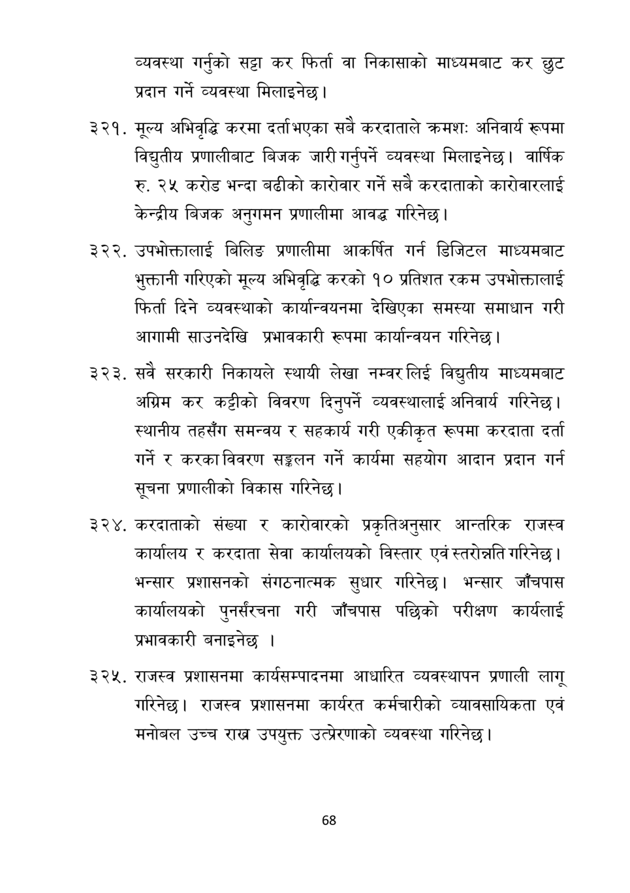

# Page 69 QA

## Rendered page


## Extracted text

```text
व्यवस्था गर्नुको सट्टा कर फिर्ता वा निकासाको माध्यमबाट कर छुट प्रदान गर्ने व्यवस्था मिलाइनेछ।
मूल्य अभिवृद्धि करमा दर्ता भएका सबै करदाताले क्रमशः अनिवार्य रूपमा विद्युतीय प्रणालीबाट बिजक जारी गर्नुपर्ने व्यवस्था मिलाइनेछ। वार्षिक रु. २५ करोड भन्दा बढीको कारोवार गर्ने सबै करदाताको कारोवारलाई केन्द्रीय बिजक अनुगमन प्रणालीमा आवद्ध गरिनेछ |
उपभोक्तालाई बिलिङ प्रणालीमा आकर्षित गर्न डिजिटल माध्यमबाट भुक्तानी गरिएको मूल्य अभिवृद्धि करको १० प्रतिशत रकम उपभोक्तालाई फिर्ता दिने व्यवस्थाको कार्यान्वयनमा देखिएका समस्या समाधान गरी आगामी साउनदेखि प्रभावकारी रूपमा कार्यान्वयन गरिनेछ |
. सवै सरकारी निकायले स्थायी लेखा नम्वर लिई विद्युतीय माध्यमबाट अग्रिम कर कट्टीको विवरण दिनुपर्ने व्यवस्थालाई अनिवार्य गरिनेछ। स्थानीय तहसँग समन्वय र सहकार्य गरी एकीकृत रूपमा करदाता दर्ता गर्ने र करका विवरण सङ्कलन गर्ने कार्यमा सहयोग आदान प्रदान गर्न सूचना प्रणालीको विकास गरिनेछ |
करदाताको संख्या र कारोवारको प्रकृतिअनुसार आन्तरिक राजस्व कार्यालय र करदाता सेवा कार्यालयको विस्तार एवं स्तरोन्नति गरिनेछ | भन्सार प्रशासनको संगठनात्मक सुधार गरिनेछ। भन्सार जाँचपास कार्यालयको पुनर्संरचना गरी जाँचपास पछिको परीक्षण कार्यलाई प्रभावकारी बनाइनेछ।
राजस्व प्रशासनमा कार्यसम्पादनमा आधारित व्यवस्थापन प्रणाली लागू गरिनेछ। राजस्व प्रशासनमा कार्यरत कर्मचारीको व्यावसायिकता एवं मनोबल उच्च राख उपयुक्त उत्प्रेरणाको व्यवस्था गरिनेछ।
६८
```

## Flags
- None
