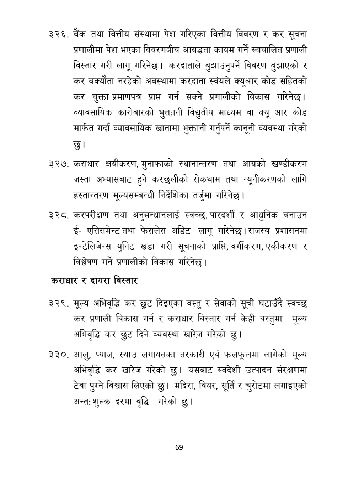

# Page 70 QA

## Rendered page


## Extracted text

```text
बैंक तथा वित्तीय संस्थामा पेश गरिएका वित्तीय विवरण र कर सूचना प्रणालीमा पेश भएका विवरणबीच आबद्धता कायम गर्ने स्वचालित प्रणाली विस्तार गरी लागू गरिनेछ। करदाताले बुझाउनुपर्ने विवरण बुझाएको र कर बक्यौता नरहेको अवस्थामा करदाता स्वंयले क्यूआर॒ कोड सहितको कर चुक्ता प्रमाणपत्र प्राप्त गर्न सक्ने प्रणालीको विकास गरिनेछ | व्यावसायिक कारोबारको भुक्तानी विद्युतीय माध्यम वा क्यू आर कोड मार्फत गर्दा व्यावसायिक खातामा भुक्तानी गर्नुपर्ने कानूनी व्यवस्था गरेको
कराधार क्षयीकरण, मुनाफाको स्थानान्तरण तथा आयको खण्डीकरण जस्ता अभ्यासबाट हुने करछलीको रोकथाम तथा न्यूनीकरणको लागि हस्तान्तरण मूल्यसम्बन्धी निर्देशिका तर्जुमा गरिनेछ।
करपरीक्षण तथा अनुसन्धानलाई स्वच्छ, पारदर्शी र आधुनिक बनाउन ईएसिसमेन्ट तथा फेसलेस अडिट लागू गरिनेछ। राजस्व प्रशासनमा इन्टेलिजेन्स युनिट खडा गरी सूचनाको प्राप्ति, वर्गीकरण, एकीकरण र विश्लेषण गर्ने प्रणालीको विकास गरिनेछ।
कराधार र दायरा विस्तार
मूल्य अभिवृद्धि कर छुट दिइएका वस्तु र सेवाको सूची घटाउँदै स्वच्छ कर प्रणाली विकास गर्न र कराधार विस्तार गर्न केही वस्तुमा मूल्य अभिवृद्धि कर छुट दिने व्यवस्था खारेज गरेको छु।
आलु, प्याज, स्याउ लगायतका तरकारी एवं फलफूलमा लागेको मूल्य अभिवृद्धि कर खारेज गरेको छु। यसबाट स्वदेशी उत्पादन संरक्षणमा टेवा पुग्ने विश्वास लिएको छु। मदिरा, वियर, सूर्ति र चुरोटमा लगाइएको अन्त: शुल्क दरमा वृद्धि गरेको छु।
६९
```

## Flags
- None
