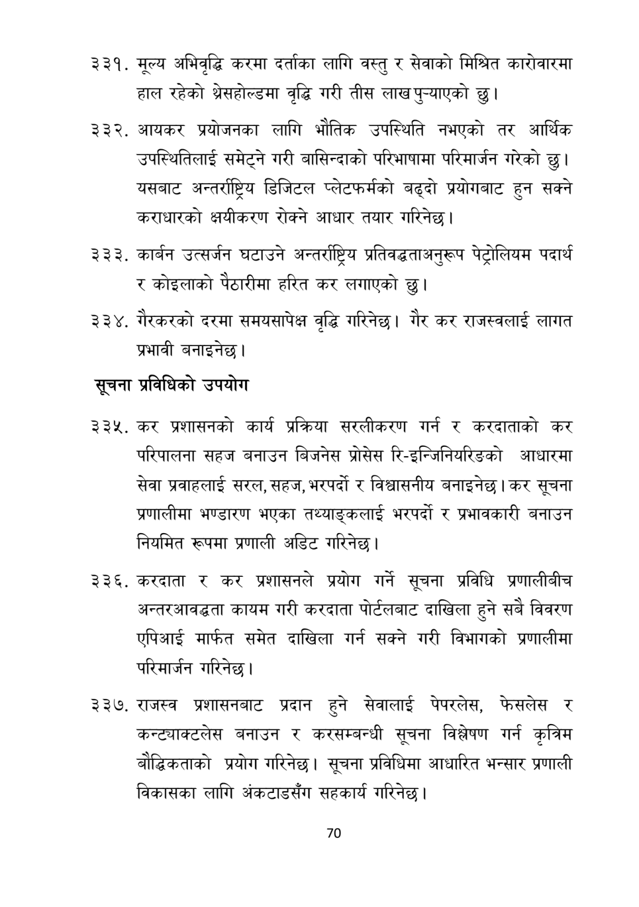

# Page 71 QA

## Rendered page


## Extracted text

```text
मूल्य अभिवृद्धि करमा दर्ताका लागि वस्तु र सेवाको मिश्चित कारोवारमा हाल रहेको श्रेसहोल्डमा वृद्धि गरी तीस लाख पुन्याएको |
आयकर प्रयोजनका लागि भौतिक उपस्थिति नभएको तर आर्थिक उपस्थितिलाई समेट्ने गरी बासिन्दाको परिभाषामा परिमार्जन गरेको छु। यसबाट अन्तर्राष्ट्रिय डिजिटल प्लेटफर्मको बढ्दो प्रयोगबाट हुन सक्ने कराधारको क्षयीकरण रोक्ने आधार तयार गरिनेछ।
कार्बन उत्सर्जन घटाउने अन्तर्राष्ट्रिय प्रतिवद्धताअनुरूप पेट्रोलियम पदार्थ र कोइलाको पैठारीमा हरित कर लगाएको |
३३४, गैरकरको दरमा समयसापेक्ष वृद्धि गरिनेछ। गैर कर राजस्वलाई लागत प्रभावी बनाइनेछ।
सूचना प्रविधिको उपयोग
कर प्रशासनको कार्य प्रक्रिया सरलीकरण गर्न र करदाताको कर परिपालना सहज बनाउन बिजनेस प्रोसेस रि-इन्जिनियरिङको आधारमा सेवा प्रवाहलाई सरल, सहज, भरपर्दो र विश्वासनीय बनाइनेछ | कर सूचना प्रणालीमा भण्डारण भएका तथ्याङ्कलाई भरपर्दा र प्रभावकारी बनाउन नियमित रूपमा प्रणाली अडिट गरिनेछ।
. करदाता र कर प्रशासनले प्रयोग गर्ने सूचना प्रविधि प्रणालीबीच अन्तरआवद्धता कायम गरी करदाता पोर्टलबाट दाखिला हुने सबै विवरण एपिआई मार्फत समेत दाखिला गर्न सक्ने गरी विभागको प्रणालीमा परिमार्जन गरिनेछ |
राजस्व प्रशासनबाट प्रदान हुने सेवालाई पेपरलेस, फेसलेस र कन्ट्याक्टलेस बनाउन र करसम्बन्धी सूचना विश्लेषण गर्न कृत्रिम बौद्धिकताको प्रयोग गरिनेछ। सूचना प्रविधिमा आधारित भन्सार प्रणाली विकासका लागि अंकटाडसँग सहकार्य गरिनेछ |
७०
```

## Flags
- None
