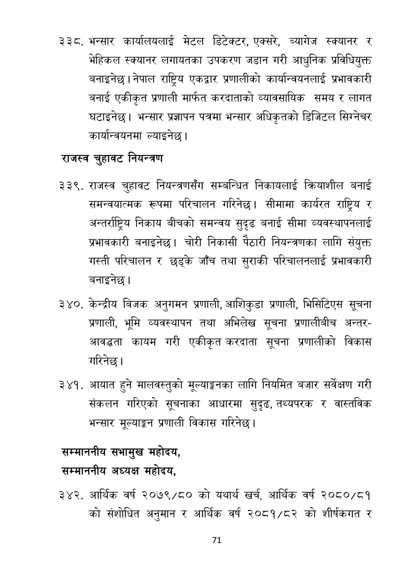

# Page 72 QA

## Rendered page


## Extracted text

```text
भन्सार कार्यालयलाई मेटल डिटेक्टर, एक्सरे, ब्यागेज स्क्यानर र भेहिकल स्क्यानर लगायतका उपकरण जडान गरी आधुनिक प्रविधियुक्त बनाइनेछ। नेपाल राष्ट्रिय एकद्वार प्रणालीको कार्यान्वयनलाई प्रभावकारी बनाई एकीकृत प्रणाली मार्फत करदाताको व्यावसायिक समय र लागत घटाइनेछ। भन्सार प्रज्ञापन पत्रमा भन्सार अधिकृतको डिजिटल सिग्नेचर कार्यान्वयनमा ल्याइनेछ।
राजस्व चुहावट नियन्त्रण
राजस्व चुहावट नियन्त्रणसँग सम्बन्धित निकायलाई क्रियाशील बनाई समन्वयात्मक रूपमा परिचालन गरिनेछ। सीमामा कार्यरत राष्ट्रिय र अन्तर्राष्ट्रिय निकाय बीचको समन्वय सुदृढ बनाई सीमा व्यवस्थापनलाई प्रभावकारी बनाइनेछ। चोरी निकासी पेठारी नियन्त्रणका लागि संयुक्त गस्ती परिचालन र छड्के जाँच तथा सुराकी परिचालनलाई प्रभावकारी बनाइनेछ।
केन्द्रीय बिजक अनुगमन प्रणाली, आशिकुडा प्रणाली, भिसिटिएस सूचना प्रणाली, भूमि व्यवस्थापन तथा अभिलेख सूचना प्रणालीबीच अन्तरआवद्धता कायम गरी एकीकृत करदाता सूचना प्रणालीको विकास गरिनेछ।
आयात हुने मालवस्तुको मूल्याङ्कनका लागि नियमित बजार सर्वेक्षण गरी संकलन गरिएको सूचनाका आधारमा सुदृढ, तथ्यपरक र वास्तविक भन्सार मूल्याङ्कन प्रणाली विकास गरिनेछ |
सम्माननीय सभामुख महोदय, सम्माननीय अध्यक्ष महोदय,
आर्थिक वर्ष २०७९/८० को यथार्थ खर्च, आर्थिक वर्ष २०८०/८१ को संशोधित र आर्थिक वर्ष २०८१/८२ को शीर्षकगत र
अनुमान
७१
```

## Flags
- None
