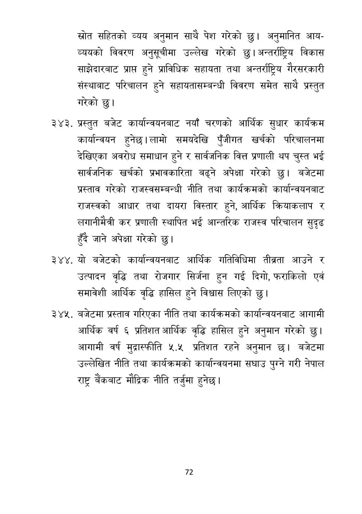

# Page 73 QA

## Rendered page


## Extracted text

```text
स्रोत सहितको व्यय अनुमान साथै पेश गरेको छु। अनुमानित आयव्ययको विवरण अनुसूचीमा उल्लेख गरेको छु। अन्तर्राष्ट्रिय विकास साझेदारबाट प्राप्त हुने प्राविधिक सहायता तथा अन्तर्राष्ट्रिय गैरसरकारी संस्थाबाट परिचालन हुने सहायतासम्बन्धी विवरण समेत साथै प्रस्तुत गरेको छु।
प्रस्तुत बजेट कार्यान्वयनबाट नयाँ चरणको आर्थिक सुधार कार्यक्रम कार्यान्वयन हुनेछ। लामो समयदेखि पुँजीगत खर्चको परिचालनमा देखिएका अवरोध समाधान हुने र सार्वजनिक वित्त प्रणाली थप चुस्त भई सार्वजनिक खर्चको प्रभावकारिता बढ्ने अपेक्षा गरेको छु। बजेटमा प्रस्ताव गरेको राजस्वसम्बन्धी नीति तथा कार्यक्रमको कार्यान्वयनबाट राजस्वको आधार तथा दायरा विस्तार हुने, आर्थिक क्रियाकलाप र लगानीमैत्री कर प्रणाली स्थापित भई आन्तरिक राजस्व परिचालन सुदृढ हुँदै जाने अपेक्षा गरेको छु।
३४४, यो बजेटको कार्यान्वयनबाट आर्थिक गतिविधिमा तीव्रता आउने र उत्पादन वृद्धि तथा रोजगार सिर्जना हुन गई दिगो, फराकिलो एवं समावेशी आर्थिक वृद्धि हासिल हुने विश्वास लिएको छु।
बजेटमा प्रस्ताव गरिएका नीति तथा कार्यक्रमको कार्यान्वयनबाट आगामी आर्थिक वर्ष ६ प्रतिशत आर्थिक वृद्धि हासिल हुने अनुमान गरेको छु। आगामी वर्ष मुद्रास्फीति ५.५ प्रतिशत रहने अनुमान छ। बजेटमा उल्लेखित नीति तथा कार्यक्रमको कार्यान्वयनमा सघाउ पुग्ने गरी नेपाल राष्ट्र बैंकबाट मौद्रिक नीति तर्जुमा हुनेछ |
७२
```

## Flags
- None
