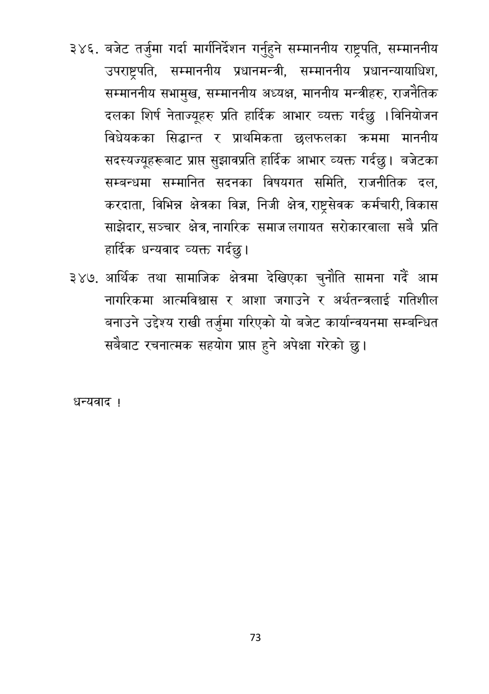

# Page 74 QA

## Rendered page


## Extracted text

```text
बजेट तर्जुमा गर्दा मार्गनिर्देशन गर्नुहुने सम्माननीय राष्ट्रपति, सम्माननीय उपराष्ट्रपति, सम्माननीय प्रधानमन्त्री, सम्माननीय प्रधानन्यायाधिश, सम्माननीय सभामुख, सम्माननीय अध्यक्ष, माननीय मन्त्रीहरु, राजनैतिक दलका शिर्ष नेताज्यूहरु प्रति हार्दिक आभार व्यक्त गर्दछु | विनियोजन विधेयकका सिद्धान्त र प्राथमिकता छलफलका क्रममा माननीय सदस्यज्यूहरूबाट प्राप्त सुझावप्रति हार्दिक आभार व्यक्त गर्दछु। बजेटका सम्बन्धमा सम्मानित सदनका विषयगत समिति, राजनीतिक दल, करदाता, विभिन्न क्षेत्रका विज्ञ, निजी क्षेत्र, राष्ट्रसेवक कर्मचारी, विकास साझेदार, सञ्चार क्षेत्र,नागरिक समाज लगायत सरोकारवाला सबै प्रति हार्दिक धन्यवाद व्यक्त गर्दछु।
३४७, आर्थिक तथा सामाजिक क्षेत्रमा देखिएका चुनौति सामना गर्दै आम नागरिकमा आत्मविश्वास र आशा जगाउने र अर्थतन्त्रलाई गतिशील बनाउने उद्देश्य राखी तर्जुमा गरिएको यो बजेट कार्यान्वयनमा सम्बन्धित सबैबाट रचनात्मक सहयोग प्राप्त हुने अपेक्षा गरेको छु।
धन्यवाद!
७३
```

## Flags
- None
