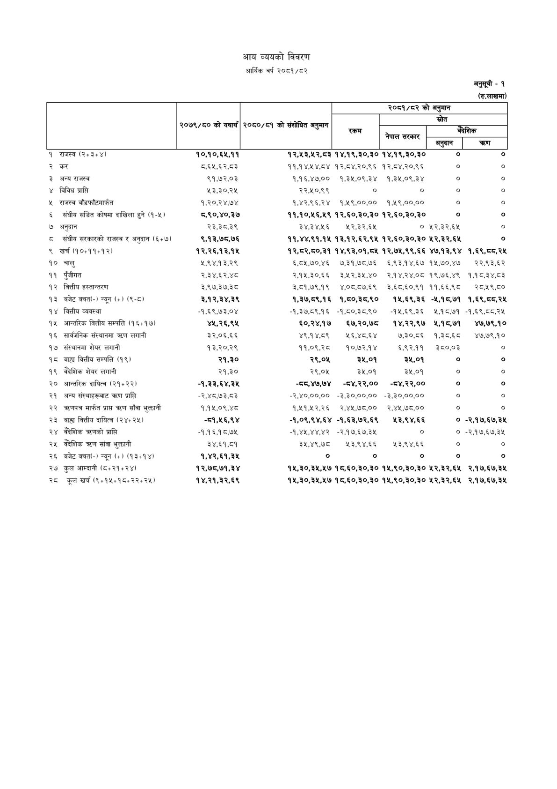

# Page 76 QA

## Rendered page


## Extracted text

```text
आय व्ययको विवरण आर्थिक वर्ष २०८१/८२
अनुसूची -१ (रु.लाखमा)

अनुसूची -१ (रु.लाखमा)

|                                             |                   | संशोधित &#124; २०८०/८१ को संशोधित अनुमान   | २०८१/८२ को अनुमान   | २०८१/८२ को अनुमान   | २०८१/८२ को अनुमान   | २०८१/८२ को अनुमान   |
|---------------------------------------------|-------------------|--------------------------------------------|---------------------|---------------------|---------------------|---------------------|
|                                             | २०७९/८० को यथार्थ |                                            |                     |                     |                     |                     |
|                                             |                   |                                            | कस                  | नेपाल सरकार         | _क्गिक अनुदान       | । त्र्ण             |
| १ राजस्व (R+3+Y)                            | १०,१०,६५,११       | १२,१५३,५२,८३                               | १४,१९,३०,३०         | १४,१९,३०,३०         | o                   | o                   |
| २ कर                                        | ८.६५,६२,८३        | ११,१४,५४,८४                                | १२,८४,२०,९६         | १२,८४,२०,९६         | o                   |                     |
| ३ अन्य राजस्व                               | ९१,७२,०३          | १,१६,४७,००                                 | १,३५,०९,३४          | १,३५,०९,३४          | o                   | o                   |
| ४ विविध प्राप्ति                            | २५३,३०,२५         | २२,५०,९९                                   | o                   | o                   | o                   | o                   |
| ५ राजस्व बाँडफाँटमार्फत                     | १,२०,२४,७४        | १,४२,९६,२४                                 | १,५९,००,००          | १,१९,००,००          | ०                   | o                   |
| ६ संघीय सञ्चित कोषमा दाखिला हुने (१-५)      | ८,९०,४०,३७        | 99,90,%§,%%                                | १२,६०,३०,३०         | १२,६०,३०,३०         | ०                   | ०                   |
| ७ अनुदान                                    | २३,३८,३९          | ३४,३४,२६                                   | २५२२,३२,६४५         | ०                   | ५२२,३२,६४५          | o                   |
| ८ संघीय सरकारको राजस्व र अनुदान (६७)        | ९,१३,७८,७६        | ११,४४,९१,१५                                | १३,१२,६२,९५         | १२,६०,३०,३०         | २५२,३२,६५           | ०                   |
| ९ खर्च (30+99+93)                           | १२,२६,१३,१५       | १२,८२,८०,३१                                | १४,९३,०१,८५         | १२,७५,९९,६६         | ४७,१३,९४            | १,६९,८०,२५          |
| १० चालु                                     | २,९४,१३,२९        | ६,८२,७०,४६                                 | ७,३१,७८,७६          | ६,९३,१४,६७          | १५,७०,४७            | २२,९३,६२            |
| ११ पुँजीगत                                  | २,३४,६२,४८        | २,१५,३०,६६                                 | ३,५२,३५,४०          | २,१४,२४,०८          | १९,७६,४९            | १,१८,३४,८३          |
| १२ वित्तीय हस्तान्तरण                       | ३,९७,३७,३८        | ३,८१,७९,१९                                 | ४,०८,८७,६९          | ३,६८,६०.९१          | ११,६६,4८            | र२८,५९,८०           |
| 93 बजेट बचत(-) न्यून (+) (९-८)              | ३,१२,३४,३९        | १,३७,८९,१६                                 | १,८०,३८,९०          | १५,६९,३६            | -५,१८,७१            | 9,8R,55,3%          |
| १४ वित्तीय व्यवस्था                         | -१,६९,७३,०४       | -१,३७,८९,१६                                | -१,८०,३८,९०         | -१५,६९,३६           | २,१८,७१             | -१,६९,८०,२४         |
| १५ आन्तरिक वित्तीय सम्पत्ति (१६:१७)         | ४५,२६,९५          | ६०,२४,१७                                   | ६७,२०,७८            | १४,२२,९७            | ५,१८,७१             | ४७,७९,१०            |
| १६ सार्वजनिक संस्थानमा त्रण लगानी           | ३२,०६,६६          | ४९,१४,८९                       
```

## Flags
- table_page
- medium_quality_table
