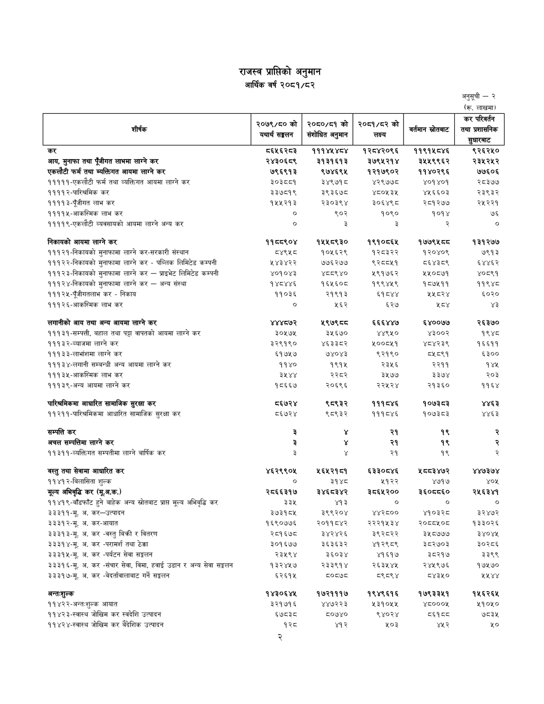

# Page 77 QA

## Rendered page


## Extracted text

```text
राजस्व प्राप्तिको अनुमान आर्थिक वर्ष २०८१/८२
अनुसूची -२
(रू.
लाखमा)
२

| शीर्षक                                                             | २०७९/८० को यथार्थ सङ्घलन &#124;   | &#124; २०८०/८१ को संशोधित संशोधित अनुमान   | २०८१/८२ को लक्ष्य   | वर्तमान स्रोतबाट   | 'कर परिवर्तन तथा प्रशासनिक सुधारबाट   |
|--------------------------------------------------------------------|-----------------------------------|--------------------------------------------|---------------------|--------------------|---------------------------------------|
| कर                                                                 | ८६५६२८३                           | १११४४५ ४८४                                 | १२८४२०९६            | ११९१५८४६           | ९२६२५०                                |
| आय, मुनाफा तथा पूँजीगत लाभमा लाग्ने कर                             | २४३०६८९                           | २१३१६१३                                    | ३७९५२१४             | २५५९९६२            | २३५२५२                                |
| एकलौटी फर्म तथा ब्यक्तिगत आयमा लाग्ने कर                           | ७९६९१३                            | ९७४६९५                                     | १२१७९०२             | ११४०२९६            | ७७६०६                                 |
| १११११-एकलौटी फर्म तथा व्यक्तिगत आयमा लाग्ने कर                     | ३०३८८१                            | ३४९७१८                                     | ४२९७७८              | ४०१४०१             | २८३७७                                 |
| ११११२-पारिश्रमिक कर                                                | ३३७८१९                            | ३९३६७८                                     | ४८०५३५              | ४५६६०३             | २३९३२                                 |
| ११११३-पूँजीगत लाभ कर                                               | १५५२१३                            | २३०३९४                                     | ३०६४९८              | २८१२७७             | २५२२१                                 |
| ११११५-आकस्मिक लाभ कर                                               | ०                                 | ९०२                                        | १०९०                | १०१४               | ७६                                    |
| ११११९-एकलौटी व्यवसायको आयमा लाग्ने अन्य कर                         | ०                                 | 3                                          | 3                   | R                  | o                                     |
| निकायको आयमा लाग्ने कर                                             | ११८८९०४                           | १५५८९३०                                    | १९१०८६४५            | १७७९४५ ८८          | १३१२७७                                |
| १११२१-निकायको मुनाफामा लाग्ने कर-सरकारी संस्थान                    | ८४९५                              | १०५६२९                                     | १२८३२२              | १२०४०९             | ७९१३                                  |
| १११२२-निकायको मुनाफामा लाग्ने कर - पब्लिक लिमिटेड कम्पनी           | २४३४२२                            | ७७६२७७                                     | ९२८०४५१             | ८६४३८९             | ६४४६२                                 |
| २३-निकायको मुनाफामा लाग्ने कर — प्राइभेट लिमिटेड कम्पनी            | ४०१०४३                            | Y55 Y0                                     | 439083              | 440569             | ४०८९१                                 |
| १११२४-निकायको मुनाफामा लाग्ने कर -- अन्य संस्था                    | १४८४४६                            | १६५६०८                                     | १९९४४५९             | १८७५११             | ११९४८                                 |
| १११२५-पूँजीगतलाभ कर - निकाय                                        | ११०३६                             | २१९१३                                      | ६१ ८४४              | २५८२४              | ६०२०                                  |
| २६-आकस्मिक लाभ कर                                                  | ०                                 | २६२                                        | ६२७              
```

## Flags
- table_page
- medium_quality_table
