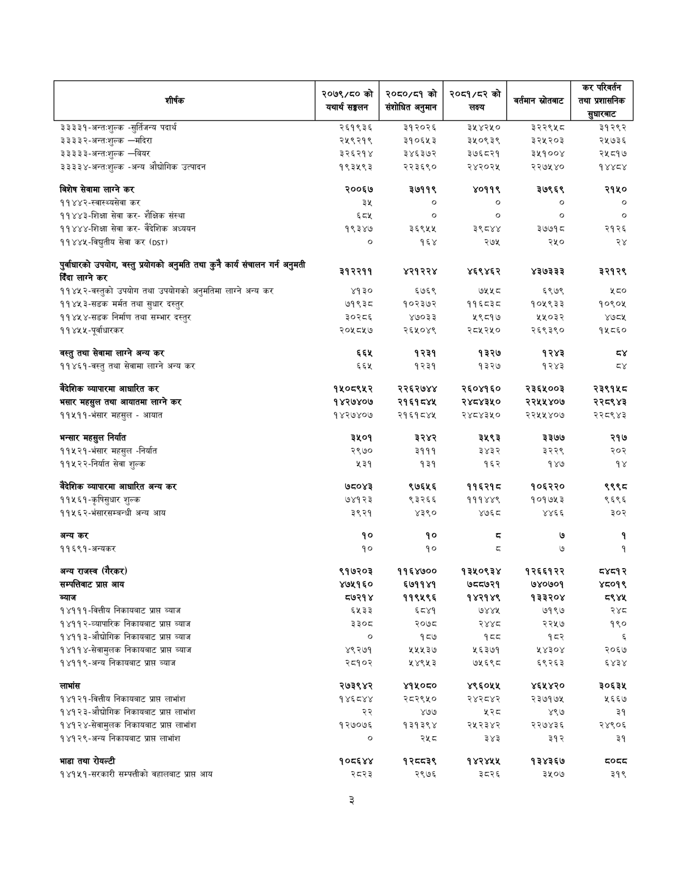

# Page 78 QA

## Rendered page


## Extracted text

```text
| शीर्षक                                                                                     | २०७९/० को यथार्थ सङ्घतन   | 050/53 को संशोधित अनुमान   | २०६१/८२ को लक्ष्य   |   वर्तमान स्रोतबाट | 'कर परिवर्तन तथा प्रशासनिक सुधारबाट   |
|--------------------------------------------------------------------------------------------|---------------------------|----------------------------|---------------------|--------------------|---------------------------------------|
| ३३३३१-अन्त:शुल्क -सुर्तिजन्य पदार्थ                                                        | २६१९३६                    | ३१२०२६                     | ३५४२५०              |            २३२२९४८ | ३१२९२                                 |
|                                                                                            | २५९२१९                    | २१०६५३                     | ३२५०९३९             |             ३२५२०३ | २५७३६                                 |
| ३३३३३-अन्त-शुल्क -बियर                                                                     | ३२६२१४                    | ३४६३७२                     | ३७६८२१              |             ३५१००४ | २५८१७                                 |
| ३३३३४-अन्त:शुल्क -अन्य औद्योगिक उत्पादन                                                    | १९३५९३                    | २२३६९०                     | २४२०२५              |             २२७५४० | १४४८४                                 |
| बिशेष सेवामा लाग्ने कर                                                                     | २००६७                     | ३७११९                      | ४०११९               |              ३७९६९ | २१५०                                  |
| ११४४२-स्वास्थ्यसेवा कर                                                                     | ३५                        | o                          | o                   |                  ० | o                                     |
| ११४४३-शिक्षा सेवा कर- शैक्षिक संस्था                                                       | ६वश                       | ०                          | ०                   |                  ० | ०                                     |
| ११४४४-शिक्षा सेवा कर- वैदेशिक अध्ययन                                                       | १९३४७                     | ३६९५५                      | ३९८४४               |              ३७७१८ | २१२६                                  |
| ११४४५-विद्युतीय सेवा कर (051)                                                              | ०                         | १६४                        | २७५                 |                २५० | २४                                    |
| पुर्वाधारको उपयोग, वस्तु प्रयोगको अनुमति तथा कुनै कार्य संचालन गर्न अनुमती विँदा लाग्ने कर | २१२२११                    | ४२१२२४                     | ४६९४६२              |             ४३७३३२ | IR                                    |
| ११४५२-वस्तुको उपयोग तथा उपयोगको अनुमतिमा लाग्ने अन्य कर                                    | ४१३०                      | ६७६९                       | ७५५८                |               ६९७९ | ५८०                                   |
| ११४५३-सडक मर्मत तथा सुधार दस्तुर                                                           | ७१९३८                     | १०२३७२                     | ११६८३८              |             १०५९३३ | १०९०४५                                |
| ११४५४-सडक निर्माण तथा सम्भार दस्तुर                                                        | ३०२८६                     | ४७०३३                      | २९८१७               |             २५५०३२ | Yooy                                  |
| flwxx-lfijw                                                                                  | २०५८५७                    | २६४५०४९                    | २८४५२५०             |             २६९३९० | १५८६०                                 |
| बस्तु तथा सेवामा लाग्ने अन्य कर                                                            | ६६४५                      | १२३१                       | १३२७                |               १२४३ | 21                                    |
| ११४
```

## Flags
- table_page
