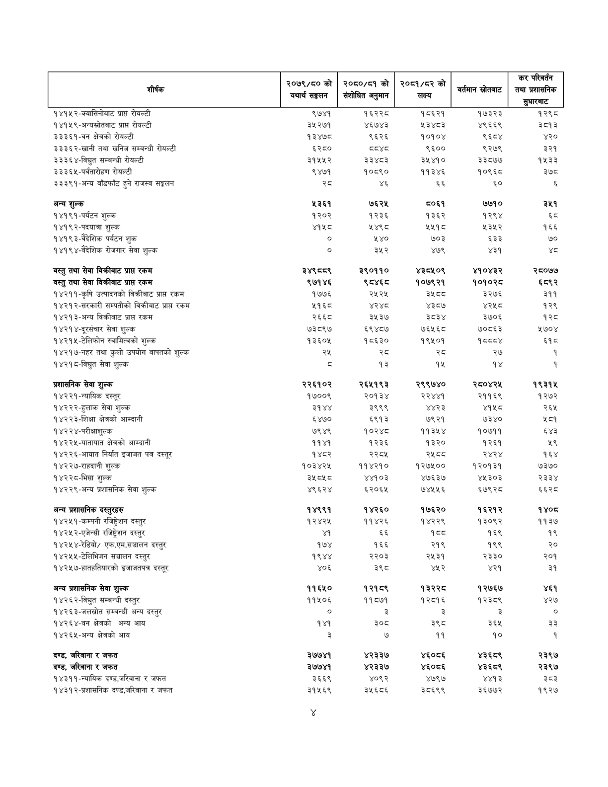

# Page 79 QA

## Rendered page


## Extracted text

```text
| शीर्षक                                                             | २०७९/० को यथार्थ सङ्घतन   | 050/53 को संशोधित अनुमान   | २०६१/८२ को लक्ष्य   | वर्तमान स्रोतबाट   | 'कर परिवर्तन तथा प्रशासनिक सुधारबाट   |
|--------------------------------------------------------------------|---------------------------|----------------------------|---------------------|--------------------|---------------------------------------|
| १४१५२-क्यासिनोबाट प्राप्त रोयल्टी                                  | ९७४१                      | १६२२८                      | १८६२१               | १७३२३              | १२९८                                  |
| १४१५९-अन्यस्रोतबाट प्राप्त रोयल्टी                                 | ३५२७१                     | ४६७४३                      | ३४८३                | ४९६६९              | ३८१३                                  |
| ३३३६१-वन क्षेत्रको रोयल्टी                                         | १३४७८                     | ९६२६                       | १०१०४               | ९६८४               | ४२०                                   |
| ३३३६२-खानी तथा खनिज सम्बन्धी रोयल्टी                               | ६२८०                      | द्वय                       | ९६००                | ९२७९               | ३२१                                   |
| ३३३६४-विद्युत सम्बन्धी रोयल्टी                                     | ३१५५२                     | ३३४८३                      | ३५४१०               | ३३८७७              | १५३३                                  |
| ३३३६५-पर्वतारोहण रोयल्टी                                           | ९४७१                      | १०८९०                      | ११३४६               | १०९६८              | ३७८                                   |
| ३३३९१-अन्य बाँडफाँट हुने राजस्व सङ्कलन                             | स्व                       | ४६                         | ६६                  | ६०                 | &                                     |
| अन्य शुल्क                                                         | ५२६१                      | ७६२५                       | ८०६१                | ७७१०               | २५१                                   |
| १४१९१-पर्यटन शुल्क                                                 | १२०२                      | १२३६                       | १३६२                | १२९४               | ६८                                    |
| १४१९ २-पदयात्रा शुल्क                                              | ४१५८                      | ५४९८                       | २५१८                | २३५२               | १६६                                   |
| १४१९३-वैदेशिक पर्यटन शुक                                           | ०                         | ५४०                        | ७०३                 | ६३३                | ७०                                    |
| १४१९४-वैदेशिक रोजगार सेवा शुल्क                                    | ०                         | ३५२                        | ४७९                 | ४३१                | शव                                    |
| वस्तु तथा सेवा विक्रीवाट प्राप्त रकम                               | ३४९८व९                    | ३९०११०                     | ४३८५०९              | ४१०४३२             | २८०७७                                 |
| बस्तु तथा सेवा विक्रीवाट प्रापत रकम                                | ९७१४६                     | RTYET                      | १०७९२१              | १०१०२८             | ६८९२                                  |
| १४२११-कृषि उत्पादनको विक्रीबाट प्राप्त रकम                         | १७७६                      | २५२५                       | ३४ ठठ               | ३२७६               | ३११                                   |
| १४२१२-सरकारी सम्पतीको विक्रीबाट प्रापत रकम                         | २१६८                      | ४२४८                       | ४३८७                | ४२५८               | १२९                                   |
| १४२१३-अन्य विक्रीबाट प्राप्त रकम                                   | २६६८                      | ३५३७                       | ३८३४                | २७०६               | १२८                            
```

## Flags
- table_page
