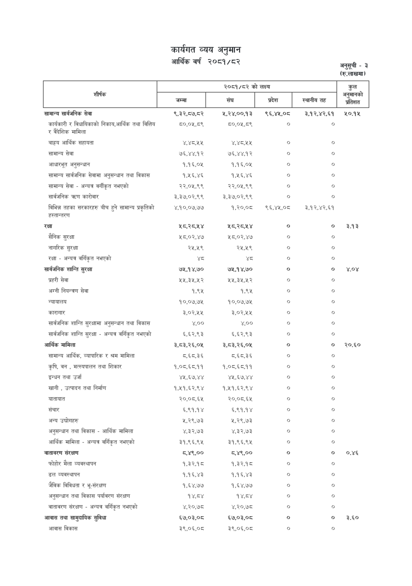

# Page 81 QA

## Rendered page


## Extracted text

```text
कार्यगत व्यय अनुमान आर्थिक वर्ष २०८१/८२
अनुसूची -३
(रू.लाखमा)

|                                                                  | २०८१/८२ को लक्ष्य   | २०८१/८२ को लक्ष्य   | २०८१/८२ को लक्ष्य   | २०८१/८२ को लक्ष्य   | कुल अनुमानको   |
|------------------------------------------------------------------|---------------------|---------------------|---------------------|---------------------|----------------|
| शीर्षक &#124;                                                    | जम्मा &#124; &#124; | का ।                | प्रदेश              | स्थानीय तह          | प्रतिशत        |
| सामान्य सार्वजनिक सेवा                                           | ९,३२,८७,८२          | ५,२४,००,१३          | ९६,४५,०८            | ३,१२,४२,६१          | २०.१५          |
| कार्यकारी र विधायिकाको निकाय,आर्थिक तथा वित्तिय र वैदेशिक मामिला | ८०,०५,८९            | ८०,०५,८९            | ०                   | ७                   |                |
| बाह्रय आर्थिक सहायता                                             | ४,४८,२५             | ४,४८,१५             | ०                   | ०                   |                |
| सामान्य सेवा                                                     | ७६,४४,१२            | ७६,४४.१२            | ०                   | o                   |                |
| आधारभूत अनुसन्धान                                                | १,१६,०५             | १,१६,०५             | ०                   | ०                   |                |
| सामान्य सार्वजनिक सेवामा अनुसन्धान तथा विकास                     | १,१६,४६             | १,१६,४६             | ०                   | ०                   |                |
| सामान्य सेवा - अन्यत्र वर्गीकृत नभएको                            | २२,०५,९९            | २२,०५,९९            | o                   | o                   |                |
| सार्वजनिक T कारोवार                                              | ३,३७,०२,९९          | ३,३७,०२,९९          | o                   | o                   |                |
| विभिन्न तहका सरकारहरु वीच हुने सामान्य प्रकृतिको हस्तान्तरण      | ४,१०,०७,७७          | १,२००               | ९६,४५,०८            | ३,१२,४२,६१          |                |
| रक्षा                                                            | Y5351               | ५८,२८,५४            | o                   | ०                   | 393            |
| सैनिक सुरक्षा                                                    | ४८,०२,४७            | ५८,०२,४७            | ०                   | ०                   |                |
| नागरिक सुरक्षा                                                   | २५,५९               | २५,५९               | ०                   | ७                   |                |
| रक्षा - अन्यत्र वर्गिकृत नभएको                                   | थ्व                 | श्                  | o                   | o                   |                |
| सार्वजनिक शान्ति सुरक्षा                                         | ७५,१४,७०            | ७५,१४,७०            | ०                   | ०                   | ४.०४           |
| प्रहरी सेवा                                                      | २५,३२२५,५२          | L3R                 | o                   | o                   |                |
| अग्नी नियन्त्रण सेवा                                             | १,९५                | १,९६५               | ०                   | ०                   |                |
| न्यायालय                                                         | १०,०७,७५            | १०,०७,७५            | ०                   | ०                   |                |
| कारागार                                                          | ३,०२,२५             | ३,०२,२५             | o                   | o                   |                |
| सार्वजनिक शान्ति सुरक्षामा अनुसन्धान तथा विकास                   | ४,००                | ४,००                | o                   | ७                   |                |
| सार्वजनिक शान्ति सुरक्षा - अन्यत्र वर्गिकृत नभएको                | €,63,23             | 5,5२,९३           
```

## Flags
- table_page
- medium_quality_table
