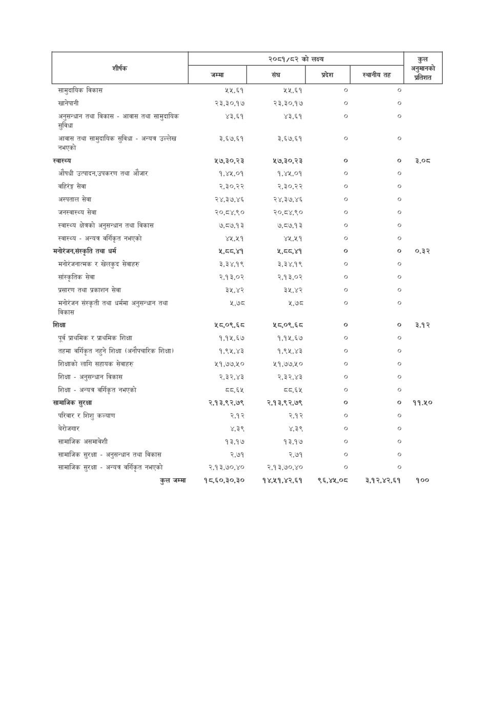

# Page 82 QA

## Rendered page


## Extracted text

```text
|                                                  | २०८१/८२ को लक्ष्य   | २०८१/८२ को लक्ष्य   | २०८१/८२ को लक्ष्य   | २०८१/८२ को लक्ष्य   | कुल अनुमानको   |
|--------------------------------------------------|---------------------|---------------------|---------------------|---------------------|----------------|
| शीर्षक                                           | जम्मा &#124;        | क ।                 | प्रदेश              | स्थानीय तह          | ——             |
| सामुदायिक विकास                                  | ५५,६१               | ५५,६१               | ०                   | o                   |                |
| खानेपानी                                         | २३,३०,१७            | २३,३०,१७            | o                   | ०                   |                |
| अनुसन्धान तथा विकास - आवास तथा सामुदायिक सुविधा  | ४३,६१               | ४३,६१               | ०                   | ०                   |                |
| आवास तथा सामुदायिक सुविधा - अन्यत्र उल्लेख नभएको | ३,६७.६१             | ३,६७,६१             | ०                   | o                   |                |
| स्वास्थ्य                                        | ५७,३०,२३            | ५७,३०,२३            | o                   | o                   | 3.0t           |
| औषधी उत्पादन,उपकरण तथा औजार                      | १,४५,०१             | १,४५,०१             | ०                   | ०                   |                |
| वहिरेङ्ग सेवा                                    | २,३०,२२             | २,.३०,२२            | ०                   | ०                   |                |
| अस्पताल सेवा                                     | २४,३७,४६            | २४,३७,४६            | ०                   | ०                   |                |
| जनस्वास्थ्य सेवा                                 | २०,८४,९०            | २०,८४,९०            | ०                   | ०                   |                |
| स्वास्थ्य क्षेत्रको अनुसन्धान तथा विकास          | ७,८७,१३             | ७,८७,१३             | ०                   | ०                   |                |
| स्वास्थ्य - अन्यत्र वर्गिकृत नभएको               | ४५,२५१              | ४५,२५१              | ०                   | o                   |                |
| मनोरेंजन,संस्कृति तथा धर्म                       | ४, ८०,४१            | ५, ८०,४१            | o                   | ०                   | o3             |
| मनोरंजनात्मक र खेलकुद सेवाहरु                    | ३,३४,१९             | ३,३४,१९             | ०                   | ९                   |                |
| सांस्कृतिक सेवा                                  | २,१३,०२             | २.१३,०२             | ०                   | o                   |                |
| प्रसारण तथा प्रकाशन सेवा                         | ३५,४२               | ३५,४२               | ०                   | ०                   |                |
| मनोरंजन संस्कृती तथा धर्ममा अनुसन्धान तथा विकास  | ५,७८                | ५,७८                | o                   | o                   |                |
| शिक्षा                                           | ५८,०९,६८            | ५८,०९,६८            | ०                   | ०                   | ३.१२           |
| पूर्व प्राथमिक र प्राथमिक शिक्षा                 | १,१५,६७             | १,१५,६७             | o                   | ०                   |                |
| तहमा वर्गिकृत नहुने शिक्षा (अनौपचारिक शिक्षा)    | १,९५,४३             | १,९५,४३             | o                   | o                   |                |
| शिक्षाको लागि सहायक सेवाहरु                      | ५१,७७,५०            | ५१,७७,५०            | ०                   | ७                   |                |
| शिक्षा - अनुसन्धान विकास                         | २.३२,४३             | २.३२,४३             | ०                   | ०                   |                |
| शिक्षा - अन्यत्र वर्गिकृत नभएको                  | 55,88               | S A                 | ०                   | ७                   |                |
| सामाजिक सुरक्षा                                 
```

## Flags
- table_page
- medium_quality_table
