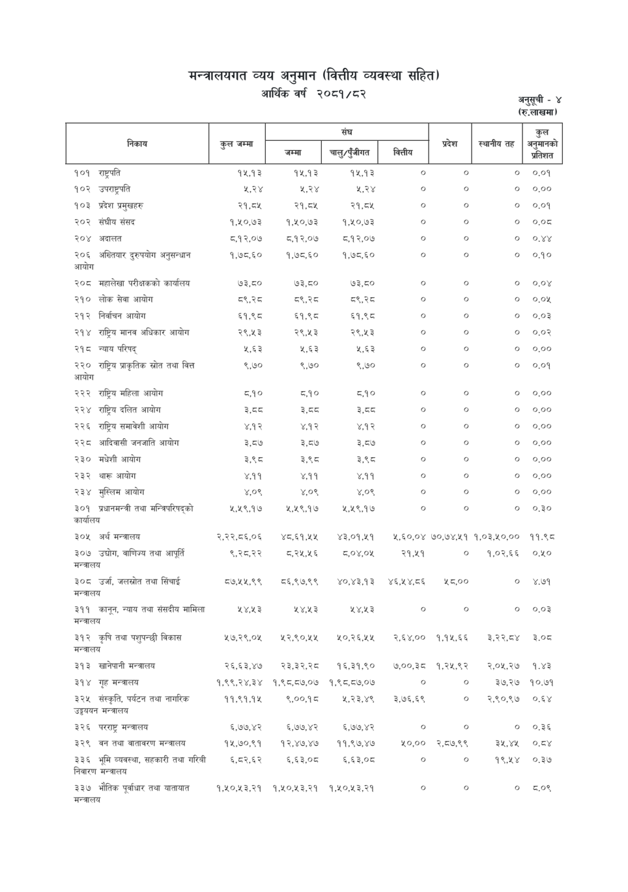

# Page 83 QA

## Rendered page


## Extracted text

```text
मन्त्रालयगत व्यय अनुमान (वित्तीय व्यवस्था सहित) आर्थिक वर्ष २०८१/८२
अनुसूची -४ (रु.लाखमा)

अनुसूची -४ (रु.लाखमा)

|               |                                                  |             | [संघ         | [संघ                  | [संघ        | प्रदेश   | स्थानीय तह   | कुल &#124; अनुमानको   |
|---------------|--------------------------------------------------|-------------|--------------|-----------------------|-------------|----------|--------------|-----------------------|
|               | निकाय                                            | कुल जम्मा   | जम्मा &#124; | /कुँजीगत चालु; &#124; | निती &#124; | &#124;   |              | प्रतिशत               |
| १०१           | राष्ट्रपति                                       | 94,93       | 14,93        | 12,93                 | ०           | ०        | ०            | ०.०१                  |
| १०२           | उपराष्ट्रपति                                     | ५,२४        | ५,२४         | ५,२४                  | o           | o        | ७            | ०.००                  |
| १०३           | प्रदेश प्रमुखहरु                                 | २१,८४५      | २१,८५        | २१,८४५                | o           | o        | ०            | ०.०१                  |
| २०२           | संघीय संसद                                       | १,१०,७३     | १,५०,७३      | १,१०,७३               | o           | o        | ०            | ०.०८                  |
| २०४           | अदालत                                            | ८,१२,०७     | ८.१२,०७      | ८,.१२,०७              | ०           | ०        | ०            | ०.४४                  |
| २०६           | अख्तियार दुरुपयोग अनुसन्धान                      | १,७८,६०     | १,७८,६०      | १,७८,६०               | o           | o        | o            | o090                  |
| २०८           | महालेखा परीक्षकको कार्यालय                       | ७३,८०       | ७३,८०        | ७३,८०                 | o           | o        | o            | o.0y                  |
| २१०           | लोक सेवा आयोग                                    | य्९,स्व     | ९.२          | ८९,२८                 | o           | o        | ७०           | ०.०५                  |
| २१२           | निर्वाचन आयोग                                    | ६१,९५८      | ६१,९८        | ६१,९८०                | ०           | ०        | ०            | o0.03                 |
| २१४           | राष्ट्रिय मानव अधिकार आयोग                       | २९,४५३      | २९,४५३       | २९,४५३                | ०           | ०        | ०            | ०.०२                  |
| २१८           | न्याय परिषद्‌                                    | 9,63        | ¥,83         | 2,83                  | o           | o        | o            | 0,00                  |
| २२० आयोग      | राष्ट्रिय प्राकृतिक स्रोत तथा वित्त              | ९,७०        | ९,७०         | ९,७०                  | o           | o        | ०            | ०.०१                  |
| २२२           | राष्ट्रिय महिला आयोग                             | ८.१०        | ८,१०         | ८,१०                  | o           | o        | 6७           | 0.00                  |
| २२४           | राष्ट्रिय दलित आयोग                              | इ,दठ        | ER=S         | ER=                   | o           | o        | 6७           | 0.00                  |
| २२६           | राष्ट्रिय समावेशी आयोग                           | ४.१२        | ४,१२         | ४,१२                  | ०           | o        | ७०           | 0.00                  |
| २२८           | आदिवासी जनजाति आयोग                              | ३,८७        | ३,८७         | ३,८७                  | o           | o        | 6७           | 0.00                  |
| २३०           | मधेशी आयोग                                       | ३,५९८       | ३,९८         | ३,९८                  | o           | o        | ०            | 0.00                  |
| २३२           | थारू आयोग                                        | ४,११        | ४,११         | ४,११                  | o           | o        | ०            | 000 
```

## Flags
- table_page
- low_quality_table
