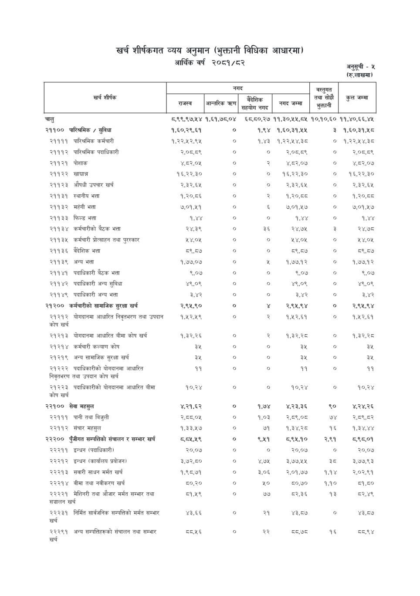

# Page 85 QA

## Rendered page


## Extracted text

```text
खर्च शीर्षकगत व्यय अनुमान (भुक्तानी विधिका आधारमा) आर्थिक वर्ष २०८१/८२
अनुसूची -५
(रु.लाखमा)

|                                                               | नगद                | नगद           | नगद                      | नगद          | वस्तुगत तथा सोझै   | &#124;      |
|---------------------------------------------------------------|--------------------|---------------|--------------------------|--------------|--------------------|-------------|
| खर्च शीर्षक                                                   | &#124; रन्ल &#124; | आन्तरिक त्रहण | बैदेशिक सहयोग नगद &#124; | नगर्दै जम्मा | भुक्तानी           | कुल जम्मा   |
| चालु                                                          | ८,९९,९७,५४         | १,६१,७८,०४    | ६८,८०,२७                 | ११,३०,५५,८५  | १०,१०,६०           | ११,४०,६६,४५ |
| २११०० पारिश्रमिक / सुविधा                                     | १,६०,२९,६१         | ०             | १,९४                     | १,६०,३१,५५   | ३                  | १,६०,३१,५८  |
| २११११ पारिश्रमिक कर्मचारी                                     | १,२२,५२,९४५        | o             | १,४३                     | १,२२,१५४,३८  | ०                  | १,२२,४५४,३८ |
| २१११२ पारिश्रमिक पदाधिकारी                                    | २,०८,८९            | o             | o                        | 2,056,568    | o                  | २,०८,८९     |
| २११२१ पोशाक                                                   | ४,८२,०५            | o             | २                        | ४,८२,०७      | ०                  | ४,८२,०७     |
| २११२२ खाद्यान्न                                               | १६,२२,३०           | o             | o                        | १६,२२,३०     | o                  | १६,२२,३०    |
| २११२३ औषधी उपचार खर्च                                         | २,३२,६४५           | o             | o                        | २,३२,६५      | o                  | R3REY       |
| 29939 स्थानीय भत्ता                                           | १,२०,८६            | o             | २                        | १,२०,व८      | o                  | १,२०,व्८    |
| २११३२ महंगी भत्ता                                             | ७,०१,५१            | o             | &                        | ७,०१,५७      | o                  | ७,०१,५७     |
| २११३३ फिल्ड भत्ता                                             | १,४४               | ०             | o                        | १,४४         | ०                  | १,४४        |
| २११३४ कर्मचारीको बैठक भत्ता                                   | २४,३९              | ०             | ३६                       | २४,७१५       | 3                  | २४,७८       |
| २११३५ कर्मचारी प्रोत्साहन तथा पुरस्कार                        | ५४,०४५             | ०             | ०                        | ५४,०४५       | o                  | २४,०४५      |
| २११३६ वैदेशिक भत्ता                                           | ८९,८७              | ०             | ०                        | ८९,८७        | ०                  | ८९,८७४      |
| २११३९ अन्य भत्ता                                              | १,७७,०७            | o             | %                        | १,७७,१२      | ०                  | १,७७.१२     |
| २११४१ पदाधिकारी वैठक भत्ता                                    | ९,०७               | ०             | ०                        | ९,०७         | ०                  | ९,०७        |
| २११४२ पदाधिकारी अन्य सुबिधा                                   | ४९,०९              | o             | o                        | ४९,०९        | o                  | ४९,०९       |
| २११४९ पदाधिकारी अन्य भत्ता                                    | ३,४२               | ०             | ०                        | ३,४२         | ०                  | ३,४२        |
| २१२०० कर्मचारीको सामाजिक सुरक्षा खर्च                         | २,९५,९०            | ०             | ¥                        | २,९५,९४      | ०                  | २,९५,९४     |
| २१२१२ योगदानमा आधारित निवृतभरण तथा उपदान कोष खर्च             | १,५२,५९            | o             |                        
```

## Flags
- table_page
- medium_quality_table
