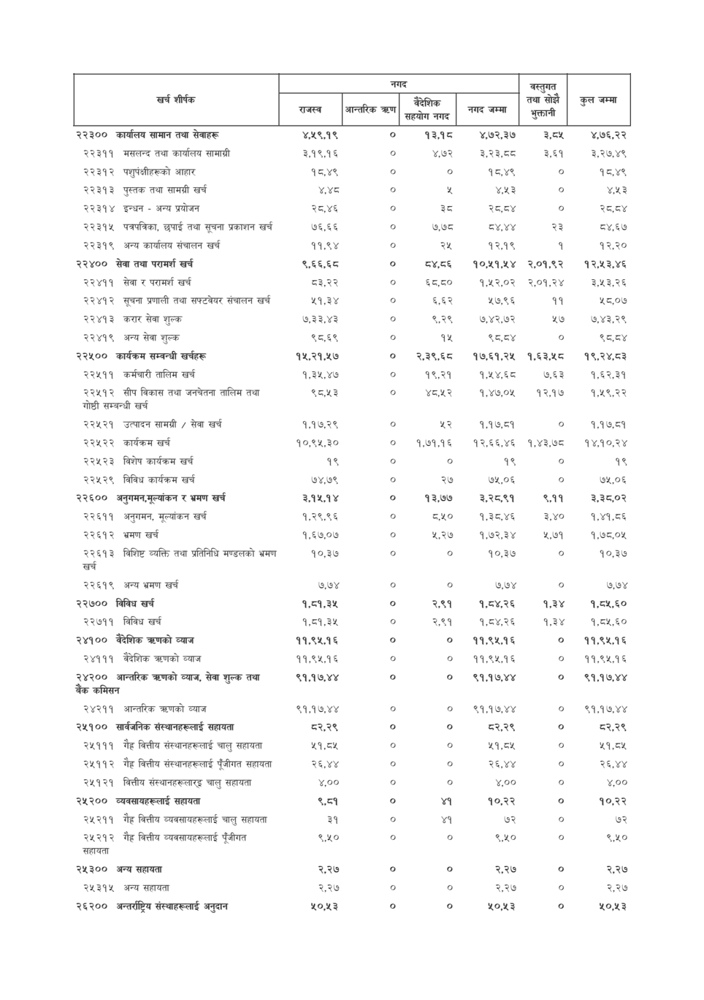

# Page 86 QA

## Rendered page


## Extracted text

```text
५०,२५३

| i शीर्षक                                                   | नगद       | नगद           | नगद     | नगद       | बस्तुगत सोचे   |          |
|------------------------------------------------------------|-----------|---------------|---------|-----------|----------------|----------|
| &#124;                                                     | लल &#124; | आन्तरिक त्रहण | सिट     | नगद जम्मा | का             | उन जन्ता |
| २२३०० कार्यालय सामान तथा सेवाहरू                           | ४,५९,१९   | ०             | १३,१८   | ४,७२,३७   | 3,54           | ४,७६,२२  |
| २२३११ मसलन्द तथा कार्यालय सामाग्री                         | ३,१९,१६   | o             | ४,७२    | 33,55     | 3,69           | ३,२७,४९  |
| २२३१२ पशुर्पक्षीहरुको आहार                                 | १८,४९     | o             | o       | १८,४९     | o              | १८,४९    |
| २२३१३ पुस्तक तथा सामग्री खर्च                              | ४,श्ठ     | o             | %       | Y43       | o              | Y43      |
| २२३१४ इन्धन - अन्य प्रयोजन                                 | २८,४६     | o             | 3c      | २८,८४     | o              | २८,८४    |
| २२३१५ पत्रपत्रिका, छपाई तथा सूचना प्रकाशन खर्च             | ७६,६६     | ०             | ७,७८    | oY, XY    | २३             | ८४,६७    |
| २२३१९ अन्य कार्यालय संचालन खर्च                            | ११,९४     | o             | २५      | १२,१९     | १              | १२,२०    |
| २२४०० सेवा तथा परामर्श खर्च                                | ९,६६,६८   | o             | ८४,८०६  | १०,११,५४  | २,०१,९२        | १२,५३,४६ |
| २२४११ सेवा र परामर्श खर्च                                  | ८३,२२     | o             | ६८,८०   | १,१२,०२   | २,०१,२४        | ३,२३,२६  |
| २२४१२ सूचना प्रणाली तथा सफ्टवेयर संचालन खर्च               | ५१,३४     | ०             | ६,६२    | ५७,९६     | ११             | ५८,०७    |
| २२४१३ करार सेवा शुल्क                                      | ७,३३,४३   | o             | ९,२९    | ७,४२,७२   | ५७             | ७,४३,२९  |
| २२४१९ अन्य सेवा शुल्क                                      | ९८६९      | o             | १५      | ९८,८४     | o              | ९्ठ,ठ४   |
| २२५०० कार्यक्रम सम्वन्धी खर्चहरू                           | १५,२१,५७  | o             | २,३९,६८ | १७,६१,२५  | १,६३,५८        | १९,२४,८३ |
| २२५११ कर्मचारी तालिम खर्च                                  | १,३५,४७   | o             | १९,२१   | १,१४,६८   | ७,.६३          | १,६२,३१  |
| २२५१२ सीप विकास तथा जनचेतना तालिम तथा गोष्ठी सम्बन्धी खर्च | ९८,५३     | ०             | ४८,५१२  | १,४७,०५   | १२,१७          | १,५९,२२  |
| २२५२१ उत्पादन सामग्री / सेवा खर्च                          | १,१७,२९   | o             | ५२      | १,१७,८१   | o              | १,१७,८१  |
| २२५२२ कार्यक्रम खर्च                                       | १०,९५,३०  | o             | १,७१,१६ | १२,६६,४६  | १,४३,७८        | १४,१०,२४ |
| २२५२३ विशेष कार्यक्रम खर्च                                 | १९        | ०             | ०       | १९        | ०              | १९       |
| २२५२९ विविध कार्यक्रम खर्च                                 | ७४,७९     | ०             | २७      | ७५,०६     | ०              | ७५,०६    |
| २२६०० अनुगमन,मूल्यांकन र भ्रमण खर्च                        | ३,१५,१४   | o             | 93,60   | 3,359     | 2,99           | 3,35,0%  |
| २२६११ अनुगमन, मूल्यांकन खर्च                               | १,२९,९६   | ०             | ८,२५०   | १,३८,४६   | 3,¥0           | १,४१,८६  |
| २२६१२ भ्रमण खर्च                                           | १,६७,०७   | o             | 4,36    | १,७२,३४   | ५,७१           | १,७८,०५  |
| २२६१३ विशिष्ट व्यक्ति तथा प्रतिनिधि मण्डलको भ्रमण खर्च     | १०,३७     | o             | o       | 90,36     | o              | 90,36    |
| २२६१९ अन्य भ्रमण खर्च                                      | ७,७४      | ०             | ०       | ७,७४      | o              | ७,७४     |
| २२७०० विविध खर्च                                           | १,८१,३५   | ०             | 24      | १,८४,२६   | १,३४           | १,८५,६०  |
| २२७११ विविध खर्च                          
```

## Flags
- table_page
- low_quality_table
