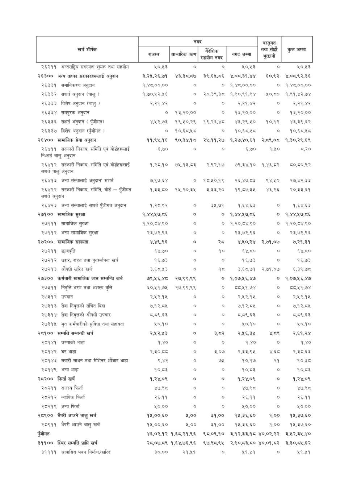

# Page 87 QA

## Rendered page


## Extracted text

```text
| i शीर्षक                                                      | नगद              | नगद           | नगद        | नगद         | वस्तुगत    |             |
|---------------------------------------------------------------|------------------|---------------|------------|-------------|------------|-------------|
|                                                               | &#124; लल &#124; | आन्तरिक त्रहण | सिट        | नगद जम्मा   | का सोचे    | उन जन्ता    |
| २६२११ अन्तराष्ट्रिय सदस्यता शुल्क तथा सहयोग                   | ५०,४५३           | ०             | ०          | ५०,४५३      | ०          | 4043        |
| २६३०० अन्य तहका सरकारहरूलाई अनुदान                            | २,२५,२६,७१       | ४३,३८,.८७     | ३९,६५,८६   | ४,०८,३१,४४  | ६०,९२      | ४,०८,९२,३६  |
| २६३३१ समानिकरण अनुदान                                         | १,४८,००,००       | o             | ०          | १,४८,००,००  | ०          | १,४८,००,००  |
| २६३३२ T अनुदान (चालु )                                        | १,७०,१२,५६       | ०             | २०,३९,३८   | १,९०,९१,९४  | ५०,८०      | १,९१,४२,७४  |
| २६३३३ विशेष अनुदान (चालु ।                                    | २,२१,४२          | ०             | ०          | २,२१,४२     | o          | २,२१,४२     |
| २६३३४ समपुरक अनुदान                                           | ०                | १३,२०,००      | o          | १३,२०,००    | o          | १३,२०,००    |
| २६३३६ W अनुदान ( पुँजीगत)                                     | ४,२२,७३          | १९,१०,२९      | १९,२६,४८   | ४३,२९,५०    | १०,१२      | ४३,३९,६२    |
| २६३३७ विशेष अनुदान (पुँजीगत )                                 | ०                | १०,६८,५८      | ७०         | १०,६८.५८    | ०          | १०,६८,५८    |
| २६४०० सामाजिक सेवा अनुदान                                     | ११,९५,१६         | ९०,३४,१८      | २५,११,२७   | १,२७,४०,६१  | २,८९,०८    | १,३०,२९,६९  |
| २६४११ सरकारी निकाय, समिति एवं बोर्डहरूलाई निःशर्त चालु अनुदान | ६,७०             | ०             | ०          | ६,७०        | १,५०       | z,20        |
| २६४१२ सरकारी निकाय, समिति एवं बोर्डहरूलाई संशर्त चालु अनुदान  | १,२८,१०          | ७५,१३,८३      | २,९२,.१७   | ७९,३४,१०    | १,४६,८२    | ८०,८०,९२    |
| २६४१३ अन्य संस्थालाई अनुदान' सशर्त                            | ७,९७,६४          | ०             | १८,५०,१९   | २६,४७.८३    | ९४,५४०     | २७,४२,३३    |
| २६४२२ सरकारी निकाय, समिति, बोर्ड - पुँजीगत संशर्त अनुदान      | 1,33,50          | १५,२०,३५      | ३,३३,२०    | १९,८७,३५    | ४६,२६      | २०,३३,६१    |
| २६४२३ अन्य संस्थालाई सशार्त पुँजीगत अनुदान                    | १,२८.९२          | o             | ३५,७१      | १,६४,६३     | o          | १,६४,६३     |
| २७१०० सामाजिक सुरक्षा                                         | १,४४,५७,८६       | o             | ०          | १,४४,२१७,८६ | ०          | १,४४,५७,८६  |
| २७१११ सामाजिक सुरक्षा                                         | १,२०,८४,९०       | ०             | ०          | १,२०,८४,९०  | ०          | १,२०,८४,९०  |
| २७११२ अन्य सामाजिक सुरक्षा                                    | २३,७२,९६         | o             | o          | २३,७२,९६    | o          | २३,७२,९६    |
| २७२०० सामाजिक सहायता                                          | ४,४९,९६          | o             | स्व        | ४,५०,२४     | २,७१,०७    | ७,२१,३१     |
| २७२११ छात्रवृत्ति                                             | ६४,७०            | ०             | १०         | ६४,८०       | o          | ६४,८०       |
| २७२१२ उद्दार, राहत तथा पुनर्स्थापना खर्च                      | १६,७३            | ०             | ०          | १६,७३       | o          | 98,03       |
| २७२१३ औषधी खरिद खर्च                                          | 36543            | o             | १८         | 385,67      | २,७१,०४    | ६,३९,७८     |
| २७३०० कर्मचारी सामाजिक लाभ सम्बन्धि खर्च                      | ७९,५६,४८         | २७,९९,९९      | ०          | १,०७,५६,४७  | ०          | १,०७,५१६,४७ |
| २७३११ निवृत्ति भरण तथा अशक्त वृत्ति                           | ६०,५१,७५         | २७,९९,९९      | ०          | दवदा११,७४  
```

## Flags
- table_page
- medium_quality_table
