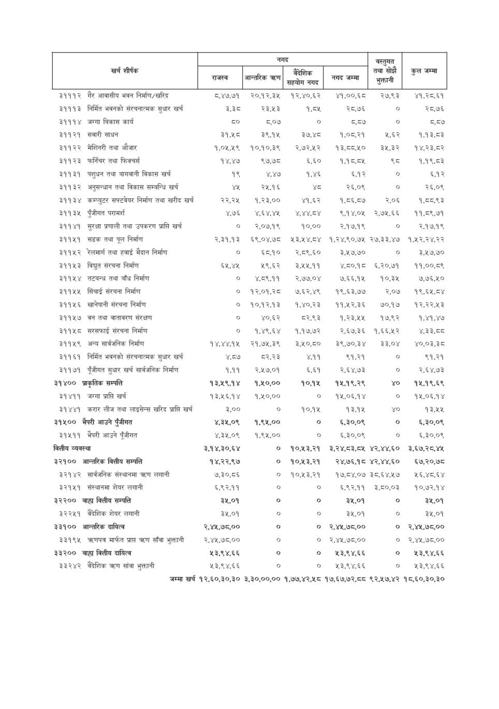

# Page 88 QA

## Rendered page


## Extracted text

```text
जम्मा खर्च १२,६०,३०,३० ३,३०,००,०० १,७७,४२,५८ १७,६७,७२,८८ ९२,५७,४२ १८,६०,३०,३०

|                                                 |                                                 | नगद              | नगद           | नगद       | नगद        | वस्तुगत   |             |
|-------------------------------------------------|-------------------------------------------------|------------------|---------------|-----------|------------|-----------|-------------|
| i शीर्षक                                        | i शीर्षक                                        | &#124; लल &#124; | आन्तरिक त्रहण | सिट       | नगद जम्मा  | का सोचे   | उन जन्ता    |
| ३१११२                                           | गैर आवासीय भवन निर्माण/खरिद                     | ८,४७,७१          | २०,१२,३५      | १२,४०,६२  | ४१,००,६८   | २७,९३३    | ४१,२८,६१    |
| ३१११३                                           | निर्मित भवनको संरचनात्मक सुधार खर्च             | डश्व             | २३,५३         | १,८४५     | २८,७६      | o         | २८,७६       |
| ३१११४                                           | जग्गा बिकास कार्य                               | zo               | ८,०७          | o         | ८,८७       | o         | द,८७        |
| ३११२१                                           | सवारी साधन                                      | ३१,५८            | ३९,१५         | ३७,४८     | १,०८,२१    | ५,६२      | 9.93,53     |
| ३११२२                                           | मेशिनरी तथा औजार                                | १,०५,१९          | १०,१०,३९      | २,७२,५२   | 93,5540    | र३े५,३२   | १४,२३,८२    |
| ३११२३                                           | फर्निचर तथा फिक्चर्स                            | १४,४७            | ९७,७८         | ६,६०      | १,१८,८४५   | थ्व       | १,१९,८३     |
| ३११३१                                           | पशुधन तथा बागवानी विकास खर्च                    | १९               | ४,४७          | १,४६      | 9%         | ०         | ६,१२        |
| ३११३२                                           | अनुसन्धान तथा विकास सम्बन्धि खर्च               | ¥4               | २५,१६         | शव        | २६,०९      | o         | २६,०९       |
| ३११३४                                           | कम्प्युटर सफ्टवेयर निर्माण तथा खरीद खर्च        | २२,२५४           | १,२३,००       | ४१,६२     | १,८६,८७    | २,०६      | १,८८,९३     |
| ३११३४५                                          | पुँजीगत परामर्श                                 | ४,७६             | ४,६४,४५       | YYYEY     | ९,१४,०५    | २,७५,६६   | ११,८९,७१    |
| ३११४१                                           | सुरक्षा प्रणाली तथा उपकरण प्राप्ति खर्च         | ०                | र२,०७,१९      | १०,००     | २,१७,१९    | ०         | २,.१७.१९    |
| ३११५१                                           | सडक तथा पूल निर्माण                             | २,३१,१३          | ६९,०४,७८      | १३,५४,८४  | १,२४,९०,७५ | २७,३३,४७  | १,५२,२४,२२  |
| ३११५२                                           | रेलमार्ग तथा हवाई मैदान निर्माण                 | o                | €590          | र२,८९,६०  | ३,५७,७०    | ०         | 346,80      |
| ३११५३                                           | विद्युत संरचना निर्माण                          | ६५,४१५           | ५९,६२         | ३,५५,११   | ४,८०,१८    | ६,२०,७१   | ११,००,८९    |
| ३११५४                                           | तटबन्ध तथा बाँध निर्माण                         | ०                | ४,८९,११       | २,७७,०४   | ७,६६.१५    | १०,३५     | ७,७६,५०     |
| ३११५५                                           | सिंचाई संरचना निर्माण                           | ०                | १२,०१,२८      | ७,६२,४९   | १९,६३,७४   | २,.०७     | १९,६५,८४    |
| ३११५६                                           | खानेपानी संरचना निर्माण                         | ०                | 909393        | १,४०,२३   | ११,५२,३६   | ७०,११७    | १२,२२,५३    |
| ३११५७                                           | वन तथा वातावरण संरक्षण                          | ०                | ४०,६२         | ८२,९३     | १,२३,५५    |
```

## Flags
- table_page
- low_quality_table
