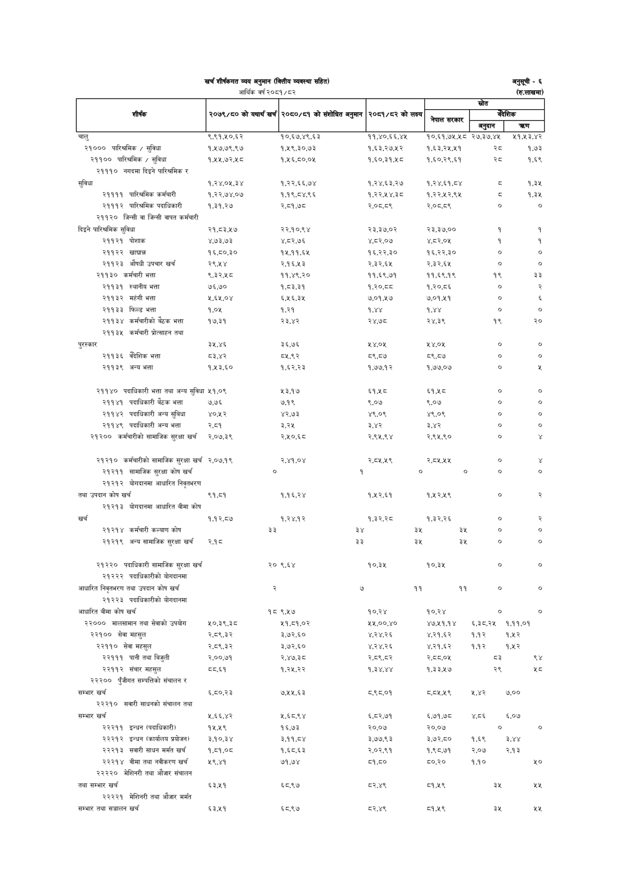

# Page 89 QA

## Rendered page


## Extracted text

```text
खर्च शीर्षकगत व्यय अनुमान (वित्तीय व्यवस्था सहित)
आर्थिक वर्ष २०८१/८२
अनुसूची -६
(रू.लाखमा)

| शीर्षक                                                               | २०७९/८० को यथार्थ खर्च   | &#124; २०८०/८१ को संशोधित अनुमान   | [ २०८१/८२ को लक्ष्य   |                 | स्रोत                      | स्रोत               |
|----------------------------------------------------------------------|--------------------------|------------------------------------|-----------------------|-----------------|----------------------------|---------------------|
|                                                                      |                          |                                    | &#124;                | नेपाल सरकार     | [____क्देशिक अनुदान &#124; | &#124; च्र्ण &#124; |
| चालु                                                                 | ९,९१,५०,६२               | १०,६७,४९,६३                        | ११,४०,६६,४५           | १०,६१,७५,५८     | २७,३७,४५                   | ५१,५३,४२            |
| २१००० पारिश्रमिक / सुविधा                                            | १,५७,७९,९७               | १,१९,३०,७३                         | १,६३,२७,५२            | १,६३,२५,४५१     | स्व                        | १,७३                |
| २११०० पारिश्रमिक / सुविधा २१११० दिइने पारिश्रमिक                     | १,५५,७२,५८               | १,१६,८०,०५                         | १,६०,३१,५८            | १,६०,२९,६१      | स्व                        | १,६९                |
| सुविधा                                                               | १,२४,०५,३४               | १,२२,६६,७४                         | १,२४.६३,२७            | १,२४,६१,८४      | c                          | 9.3%                |
| २११११ पारिश्रमिक कर्मचारी                                            | १,२२,७४,०७               | १,१९,८४,९६                         | १,२२,५४,३८            | १,२२,५२,९४५     | 3                          | १,३४५               |
| २१११२ पारिश्रमिक पदाधिकारी २११२० जिन्सी वा जिन्सी वापत कर्मचारी      | १,३१,२७                  | २,८१,७८                            | २,०८,.८९              | 2,05,5%         | ०                          | ०                   |
| दिइने पारिश्रमिक सुविधा                                              | २१,८३,५७                 | २२,१०,९४                           | २३,३७,०२              | २३,३७,००        | १                          | १                   |
| २११२१ पोशाक                                                          | ४,७३,७३                  | ४,८२,७६                            | ४,८२,०७               | ४,८२,०५         | १                          | १                   |
| २११२२ खाद्यान्न                                                      | १६,८०,३०                 | 14,99,8%                           | १६,२२,३०              | १६,२२,३०        | ०                          | ०                   |
| २११२३ औषधी उपचार खर्च                                                | २९,४५४                   | २.१६,५३                            | २,३२,६५               | २,३२,६५         | ०                          | ०                   |
| २११३० कर्मचारी भत्ता                                                 | 23345                    | ११,४९,२०                           | ११,६९,७१              | ११,६९.१९        | १९                         | ३३                  |
| २११३१ स्थानीय भत्ता                                                  | ७६,७०                    | १,८३,३१                            | १,२०,८८               | १,२०,८६         | ०                          | R                   |
| 29933 महंगी भत्ता                                                    | ५,६५,०४                  | ६,५६,३४५                           | ७,०१,५७               | ७,०१,५१         |                            | ६                   |
| २११३३ फिल्ड भत्ता                                                    | १,०४५                    | १,२१                               | १,४४                  | १,४४            |                            | ०                  
```

## Flags
- table_page
- low_quality_table
