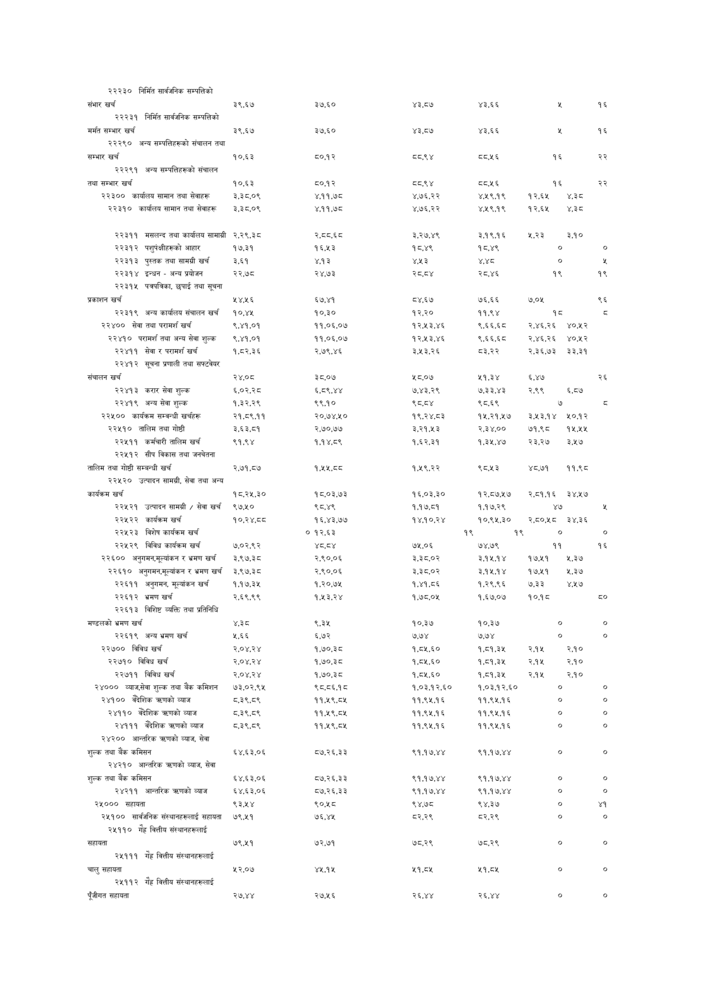

# Page 90 QA

## Rendered page


## Extracted text

```text
| २२२३० निमित सार्वजनिक सम्पत्तिको संभार खर्च          | ३९,६७     | ३७.६०    | ४३,८७४     | ४३,६६      |          |        |   १६ |
|------------------------------------------------------|-----------|----------|------------|------------|----------|--------|------|
| २२२३१ निर्मित सार्वजनिक सम्पत्तिको मर्मत सम्भार खर्च | ३९,६७     | ३७,६०    | ४३,८७      | ४३,६६      |          |        |   १६ |
| २२२९० अन्य सम्पत्तिहरूको संचालन तथा सम्भार खर्च      | १०,६३     | ८०,१२    | य्व.९४     | ८य्व.५६    | १६       |        |   २२ |
| २२२९१ अन्य सम्पत्तिहरूको संचालन                      |           |          |            |            |          |        |      |
| तथा सम्भार खर्च                                      | १०,६३     | ८०,१२    | य्व.९४     | ८य्व.५६    | १६       |        |   २२ |
| २२३०० कार्यालय सामान तथा सेवाहरू                     | 3,35,0%   | ४.११,७८  | ४,७६,२२    | ४,२९.१९    | १२,६४५   | ¥,35   |      |
| २२३१० कार्यालय सामान तथा सेवाहरू                     | 3,35,0%   | ४,११,७८  | ४,७६.२२    | ४,२९.१९    | १२,६४५   | डेट    |      |
| २२३११ मसलन्द तथा कार्यालय सामाग्री                   | २,२९,३८   | २,८८,६८  | ३,२७,४९    | ३.१९.१६    |          |        |      |
| २२३१२ पशुर्पक्षीहरूको आहार                           | १७,३१     | १६,५३    | १८,४९      | १८,४९      |          |        |      |
| २२३१३ पुस्तक तथा सामग्री खर्च                        | 2,89      | ४,१३     | Y3         | थ्व        |          |        |      |
| २२३१४ इन्धन - अन्य प्रयोजन सूचना                     | २२,७८     | २४,७३    | २८,८४      | २८,४६      |          |        |      |
| २२३१५ पत्रपत्रिका, छपाई तथा                          |           |          |            |            |          |        |      |
| प्रकाशन खर्च                                         | २४२६      | ६७,४१    | ८४,६७      | ७६,६5६     | ७,०५     |        |      |
| २२३१९ अन्य कार्यालय संचालन खर्च                      | १०,४४५    | १०,३०    | १२,२०      | ११,९४      | १८       |        |      |
| २२४०० सेवा तथा परामर्श खर्च                          | ९,४१,०१   | ११,०६,०४ | १२,५३,४६   | ६,६६,६८    | २,४६,२६  | ४०,२५२ |      |
| २२४१० परामर्श तथा अन्य सेवा शुल्क                    | ९,४१,०१   | ११,०६,०४ | १२,५३,४६   | ६,६६,६८    | २,४६,२६  | ४०,२५२ |      |
| २२४११ सेवा र परामर्श खर्च                            | १,८२,३६   | २,७९,४६  | ३,५३,२६    | ८३,२२      | २,३६,७३  | ३३,३१  |      |
| २२४१२ सूचना प्रणाली तथा सफ्टवेयर                     |           |          |            |            |          |        |      |
| संचालन खर्च                                          | २४,७०८    | ३८,०७    | ५८,०७      | २१,३३४     | ६,४७     |        |   २६ |
| २२४१३ करार सेवा शुल्क                                | ६,०२,२८   | ६,८९,४४  | ७,४३,२९    | ७,३३,४३    | २,९९     | ६,८७   |      |
| २२४१९ अन्य सेवा शुल्क                                | १,३२,२९   | ९६९,१०   | ९८,८४      | ९८,६९      |          |        |      |
| २२५०० कार्यक्रम सम्वन्धी खर्चहरू                     | २१,८९.११  | २०,७४,५० | १९,२४,८३   | १४५,२१,५७४ | २,५३,१४  | २०,१२  |      |
| २२५१० तालिम तथा गोष्ठी                               | ३,.६३,८१  | २,७०,७७  | ३,.२१,५३   | २,३४,००    | ७१,९८८   | १५,५४५ |      |
| २२५११ कर्मचारी तालिम खर्च                            | ९१,९४     | १,१४,८९  | १,६२,.३१   | १,३५,४७    | २३,२७    | ३,५७   |      |
| २२५१२ सीप विकास तथा जनचेतना                          |           |          |            |            |          |        |      |
| तालिम तथा गोष्ठी सम्बन्धी खर्च                       | २,७१,८७   | 144,58   | १,१९.२२    | ९८,५३      | ४०,७१    | ११,९८  |      |
| कार्यक्रम खर्च                                       | १८.२४५,३० | १८.०३,७३ | १६,०३,३०   | १२,८७,५७   | २,८१,१६  | ३४,१२७ |      |
| २२५२१ उत्पादन सामग्री / सेवा खर्च                    | ९७,५१०    | ९८,४९    | १,१७,८१    | १,१७,२९    | ४७       |        |      |
| २२५२२ कार्यक्रम खर्च                                 |           |          |            | १०,९५,३०   |          |        |      |
|         
```

## Flags
- table_page
- low_quality_table
