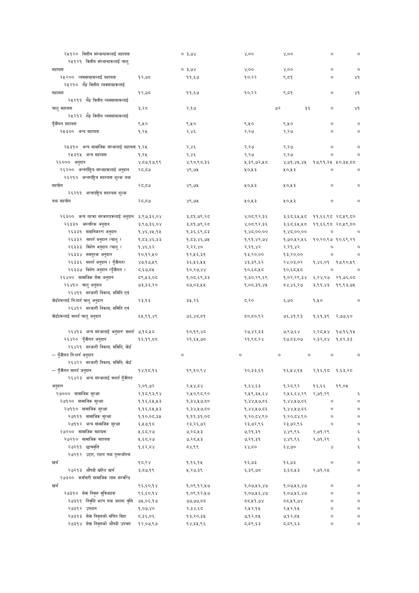

# Page 91 QA

## Rendered page


## Extracted text

```text
| २५१२० वित्तीय २५१२१ त्तीय संस्थानहरूलाई सहायता वित्तीय संस्थानहरूलाई चालु       |                        | ० ३,७४                | ४,००                   | ४,००                  |          |          |
|---------------------------------------------------------------------------------|------------------------|-----------------------|------------------------|-----------------------|----------|----------|
| सहायता                                                                          |                        | ० ३,७४                | ४,००                   | ४,००                  |          |          |
| २५२०० व्यवसायहरूलाई सहायता गह वित्तीय                                           | १२,७८                  | ११,६७४                | १०,२२                  | ९,८१                  |          | ४१       |
| २५२१० व्यवसायहरूलाई सहायता                                                      | १२,७८                  | ११,६४७                | १०,२२                  | ९,८4१                 |          | ४१       |
| २५२११ चालु सहायता गह वित्तीय व्यवसायहरूलाई                                      | ३,२८०                  | २,.१७                 |                        | ७२ ३१                 |          | ४१       |
| २५२१२ पूँजीगत सहायता शाह वित्तीय व्यवसायहरूलाई                                  | ६,२५०                  | ६,५०                  | ‘.40                   | ६,२५०                 |          |          |
| २५३०० अन्य सहायता                                                               | १,२४५                  | २,४६                  | २,२७                   | २,२७                  |          |          |
| २५३१० अन्य सामाजिक संस्थालाई सहायता                                             | १,२४५                  | २,४६                  | २,२७                   | २,२७                  | ०        |          |
| २५३१५ अन्य सहायता                                                               | १,२४५                  | २,४६                  | २,२७                   | २,२७                  | ०        |          |
| २६००० अनुदान                                                                    | ४,८७.१७,९९             | ४,९०,६८,.३६           | ५,३९,७२,१२८            | ४,७१,४५,४२            | १७,९१,२५ | ५०,३४५,  |
| २६२०० अन्तर्राष्ट्रिय संस्थाहरूलाई अनुदान २६२१० अन्तराष्ट्रिय सदस्यता शुल्क तथा | २८,८४७                 | ४९,७२५                | 4043                   | २०,२५३                | ०        |          |
| सहयोग २६२११ अन्तराष्ट्रिय सदस्यता शुल्क                                         | २८,८४७                 | ४९,७२५                | 4043                   | २०,२५३                |          |          |
| तथा सहयोग                                                                       | २८,८७                  | ४९,७५                 | ५०,५३                  | ५०,४५३                |          |          |
| २६३०० अन्य तहका सरकारहरूलाई अनुदान                                              | २,९७,३६,०४             | ३,८१,७९,२८            | ४,०८.९२,३६             | ३,६८,६४५,८०           | ११,६६,९८ | २८,५९,८० |
| २६३३० आन्तरिक अनुदान                                                            | ३,९७,३६,०४             | ३,.८१,७९,२८           | ४,०८.९२,३६             | ३,.६८,.६५,.५८०        | ११,६६,९८ | २८,५९,८० |
| २६३३१ 'समानिकरण अनुदान                                                          | १,४६,४४५,१५            | १,३६,६९,८३            | १,४८,००,००             | १,४८,००,००            | ०        |          |
| २६३३२ सशर्त अनुदान (चालु )                                                      | १,८३,४६,३३             | १,८३,४६,७४५           | १,९१,४२,७४             | १,७०,२५२,५६           | १०,२०,९७ | १०,६९.२१ |
| २६३३३ विशेष अनुदान (चालु )                                                      | १,४६.६२                | २,२२,४०               | २,२१,४२                | २,२१,४२               | ०        |          |
| २६३३४ 'समपुरक अनुदान                                                            | १०,१२,५०               | १२,५६,३१       
```

## Flags
- table_page
- medium_quality_table
