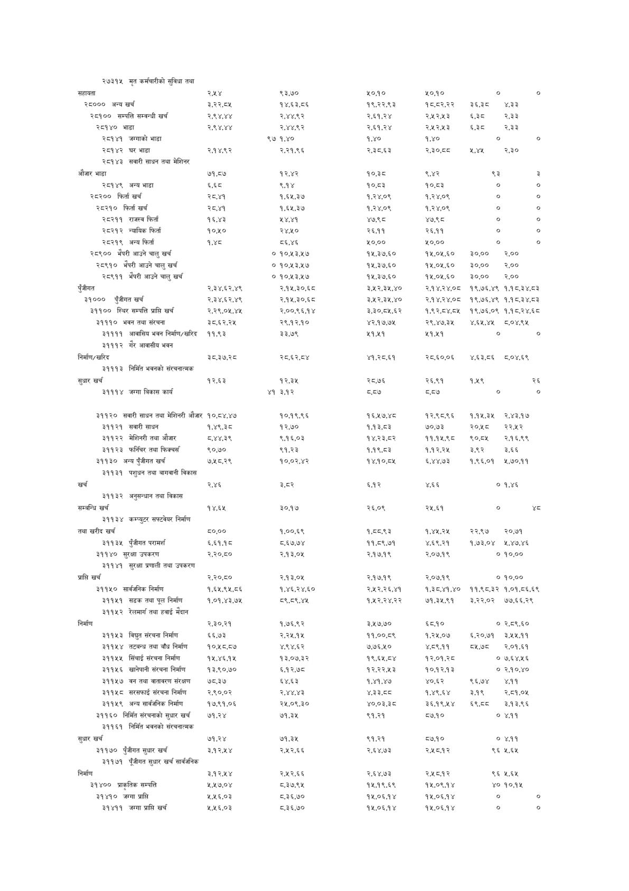

# Page 92 QA

## Rendered page


## Extracted text

```text
२७३१५
मृत
कर्मचारीको
सुविधा
तथा

| सहायता                                                       | MY             | %360             | 4090                | 4090              |           |            |          |
|--------------------------------------------------------------|----------------|------------------|---------------------|-------------------|-----------|------------|----------|
| २८००० अन्य खर्च                                              | ३,२२,८४५       | १४,६३.८६         | १९,२२,९३            | १८,.८२,२२         | ३६,३८०    | ४,३३       |          |
| २८१०० सम्पत्ति सम्वन्धी खर्च                                 | २,९४,४४        | २,४४,९२          | २,६१,२४             | २,५२,५३           | %30       | २,३३       |          |
| २८१४० भाडा                                                   | २,९४,४४        | २,४४,९२          | २,६१,२४             | २,५२,२५३          | &30       | 233        |          |
| २८१४१ जग्गाको भाडा                                           |                | ९७ १,४०          | १,४०                | १,४०              |           |            |          |
| २८१४२ घर भाडा                                                | २,.१४.९२       | २,२१,६६          | २,३८.६३             | २,३०,८८           | 044       | २,३०       |          |
| २८१४३ सवारी साधन तथा मेशिनर                                  |                |                  |                     |                   |           |            |          |
| औजार भाडा                                                    | ७१,८७          | १२,४२            | १०,३८               | ¥R                | ७         |            | w        |
| २८१४९ अन्य भाडा                                              | ६,६5८          | ६,१४             | १०,८३               | 10,53             | ०         |            | ०        |
| २८२०० फिर्ता खर्च                                            | २८,४१          | १,६५,३७          | १,२४,०९             | १,२४,०९           | ०         |            | ०        |
| २८२१० फिर्ता खर्च                                            | २८,४१          | १,६५,३७          | १,२४,०९             | १,२४,०९           |           |            |          |
| २८२११ राजस्व फिर्ता                                          | १६,४३          | 1%,              | ४७,९८               | ४७,९६८            | ००        |            | ००       |
| २८२१२ न्यायिक फिर्ता                                         | १०,५१०         | २४,५१०           | २६,११               | २६,११             | ०         |            | ०        |
| २८२१९ अन्य फिर्ता                                            | १,४८           | ८६,४६            | ¥0,00               | ५०,००             | ०         |            | ०        |
| २८९०० भेपरी आउने चालु खर्च                                   |                | १०,५३,५७४        | 14,306,580          | १५,०५,६०          | ३०,००     | २,००       |          |
| २८९१० भेपरी आउने चालु खर्च                                   |                | १०,५३,५७         | १५,३७,६०            | १५,०५,६०          | ३०,००     | २,००       |          |
| २८९११ भेपरी आउने चालु खर्च                                   |                | १०,५३,५७४        | १५,३७,६०            | १५,०४५,६०         | ३०,००     | २,००       |          |
| पुँजीगत                                                      | २,३४,६२,४९     | २,.१५,३०,६८      | ३,५२,३५,४०          | २,१४,२४,७०८       | १९,७६,४९  | १,१८,३४,८३ |          |
| ३१००० पुँजीगत खर्च                                           | २,३४,६२,४९     | २,.१५,३०,६८      | ३,५२,३५,४०          | २,.१४,२४,०८       | १९,७६,४९  | १,१८,३४,८३ |          |
| ३११०० स्थिर सम्पत्ति प्राप्ति खर्च                           | २,२९,०४५,४४    | २,००,९६,१४       | ३,३०,८५,६२          | १,९२,८४,८४५       | १९,७६,०९  | १,१८,२४,६८ |          |
| ३१११० भवन तथा संरचना                                         | ३८.६२,२५       | २९.१२.१०         | ४२,१७,७५            | २९,४७,३४५         | YRR Y     | ८.०४,९५    |          |
| ३११११ आवासिय भवन निर्माण/खर
```

## Flags
- table_page
- low_quality_table
