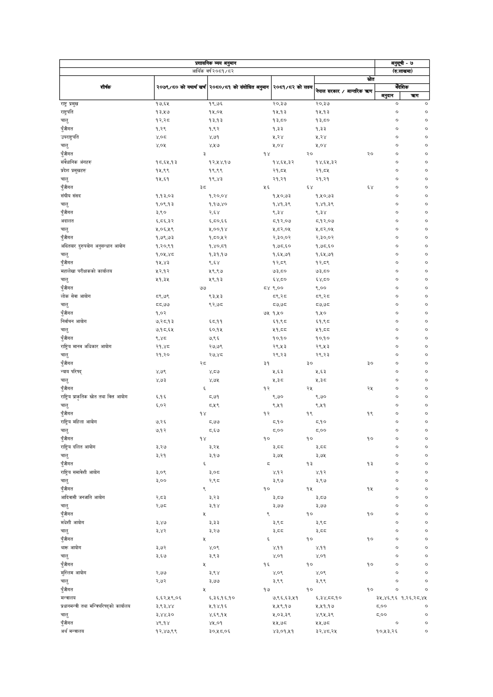

# Page 94 QA

## Rendered page


## Extracted text

```text
| प्रशासनिक व्यय अनुमान                           | प्रशासनिक व्यय अनुमान   | प्रशासनिक व्यय अनुमान                 | प्रशासनिक व्यय अनुमान    | प्रशासनिक व्यय अनुमान   | प्रशासनिक व्यय अनुमान   | अनुसूची - ७ (रु.लाखमा)   | अनुसूची - ७ (रु.लाखमा)   |
|-------------------------------------------------|-------------------------|---------------------------------------|--------------------------|-------------------------|-------------------------|--------------------------|--------------------------|
| शीर्षक                                          | २०७९/८० को              | यथार्थ खर्च &#124; २०८०/८१ को संशोधित | अनुमान &#124; २०८१/८२ को | लक्ष्य नेपाल सरकार      | स्रोत त्रहण             | [___कँदेशिक              | ।                        |
| राष्ट्र प्रमुख                                  | १७,६१५                  | १९,७६                                 | ३०,३५७                   | २०,३७                   |                         | अनुदान [&#124; o         | करण ] ०                  |
| राष्ट्रपति                                      | १३,५१७                  | १५,०५                                 | १५.१३                    | १५.१३                   |                         | ०                        | ०                        |
| चालु                                            | १२,२८                   | १३,१३                                 | १३,८०                    | १३,८०                   |                         | ०                        | ०                        |
| पुँजीगत                                         | १,२९                    | १,९२                                  | १,३३                     | १,३३                    |                         | o                        | o                        |
| उपराष्ट्रपति                                    | ४०८                     | ४७१                                   | २,२४                     | २२४                     |                         | ०                        | ०                        |
| चालु                                            | ४,०५                    | ४५७                                   | २,०४                     | ५,०४                    |                         | ०                        | ०                        |
| पुँजीगत                                         |                         | 3                                     | १४                       | २०                      | २०                      | ०                        | ०                        |
| संवैधानिक अंगहरु                                | १८.६५.१३                | १२,५४,१७                              | १४,६५.३२                 | १४,६५,३२                |                         | o                        | o                        |
| प्रदेश प्रमुखहरु                                | १५,९९                   | १९,९९                                 | २१,८४५                   | २१,८४५                  |                         | ०                        | ७                        |
| चालु                                            | 14,89                   | १९,४३                                 | २१,२१                    | २१,२१                   |                         | o                        | o                        |
| पुँजीगत                                         | 3z                      |                                       | २६                       | ६४                      | ६४                      | ०                        | ०                        |
| संघीय संसद                                      | १,१३,०३                 | १,२०,०४                               | १,१०,७३                  | १,५०,७३                 |                         | o                        | ०                        |
| चालु                                            | १,०६९.१३                | १,१७,४०                               | १,४१,३९                  | १,४१,३९                 |                         | ०                        | ०          
```

## Flags
- table_page
- low_quality_table
