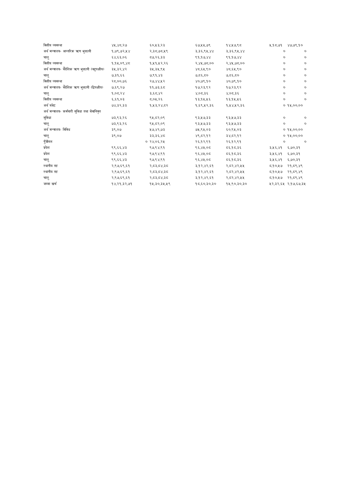

# Page 96 QA

## Rendered page


## Extracted text

```text
वित्तीय व्यवस्था अर्थ मन्त्रालयआन्तरिक त्रण भुक्तानी चालु वित्तीय व्यवस्था अर्थ मन्त्रालयवैदेशिक क्रण भुक्तानी (बहुपक्षीय) चालु वित्तीय व्यवस्था अर्थ मन्त्रालयवैदेशिक त्रण भुक्तानी (द्िपक्षीय। चालु वित्तीय व्यवस्था अर्थ बजेट अर्थ मन्त्रालयकर्मचारी सुविधा तथा सेवानिवत सुविधा चालु अर्थ मन्त्रालयविविध चालु पुँजीगत प्रदेश प्रदेश चालु स्थानीय तह स्थानीय तह चालु जम्मा खर्च ४१,४८,.२७ १,७९,७२,५४ ६४,६३.०६ १,१४५,०९,४८ ३५.३२,४२ ७,३१,६६ २८,००,७६ ७,६९,२७ १,०८,२४ ६५,६१,०३ ७४,३२,३३ ७३,९३,२६ ७३,६३,२६ ३९,०७ ३९,०७ ९९,६६,४३ ९९,६६,४३ ९९,६६,४३ २,९७,.६९.६१ २,.९७.६९.६१ २,.९७.६९.६१ १४,२१,३२,७१ ० ६५०,५३,२३ २,३८,७८.५९ ८७,२६,३३ १,५१,५२,२६ ३५,३२५,९५ ७,९१,४३ २७,४४,५२ ११,७३,६८ ३,६८,.४२ ५.०५,.२६ १,५३,२४,८२ ९५,८२,०९ ९५,८२,०९ २५७,४२,७३ ३३,३६,४८ २४,०६,२४५ ९७,९४,९१ ९७,९४,९१ ९७,९४,९१ २,८३,८४,३८ २,८३,८४,३८ २,८३,८४,३८ १५,३०,३२५,५९ ६७,१५,७९ ३,.३६,९४५,४४ ९१,१७,४४ २,४५,७८,०० ४८,६५,९० ७,८६,८० ४०,७९,१० १७,२३,९२ ४,०८.३६ १३,१५.५६ १,६९,५२,३६ ९३,१७,३३ ९३,५७,३३ ७५,९५,०३ ४९,८२.१२ २६,.१२.९१ ९६,४१५,०८ ९६,४१५,०८ ९६,४४२,०८ ३.१२,४२,.६१ ३.१२,४२,६१ ३.१२,४२,६१ १८,.६०,३०,३० १४,५७,९८ ३,.३६,९४५,४४ ९१,१७,४४ २,४५,७८,०० ४८,६५,९० ७,८६,८० ४०,७९,१० १७.२३,९२ ४,०८.३६ १३,९९४८ १,१४,१२,३६ ९३,५७,.३३ ९३,५७,.३३ ६०,९६५,०३ ३४,८२.१२ २६,१२,९१ ८६,१८,३६ ८६,१८,३६ ८६,१८,३६ २,.८२,४२,५४ २,.८२,४२,५४ २,.८२,४२,५४ १४५,९६०,३०,३० २,१८,७१ ४७,७९,१० ०० ० ०० ० ० ० ० ० ०० ० ०० ० ० १५,००,०० ० ० १५,००,०० १५,००,०० ०० ० ३,५६,४१ ६,७०,३१ ३,५६,४१ ६,७०,३१ ३,५६,४१ ६,७०,३१ ८.१०,५७ २१,८९,४९ ८.१०,५७ २१,८९,४९ ८.१०,५७ २१,८९,४९ ५२,३२,६५ २,.१७,६७,.३४५
```

## Flags
- None
