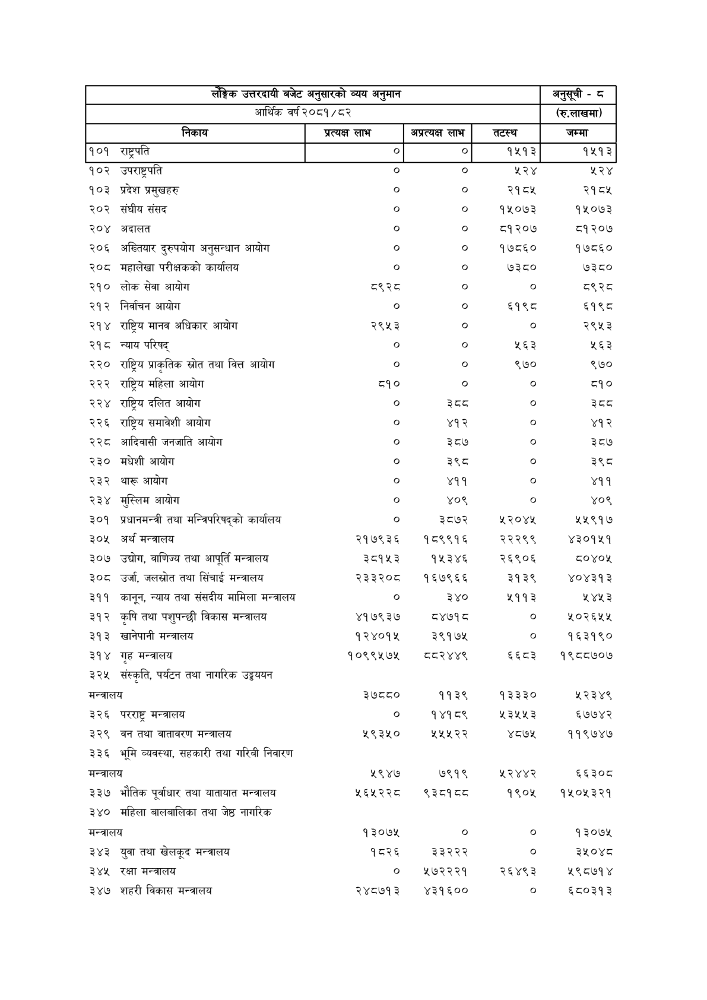

# Page 97 QA

## Rendered page


## Extracted text

```text
| T उत्तरदायी बजेट अनुसारको व्यय अनुमान २०८१/८२   | T उत्तरदायी बजेट अनुसारको व्यय अनुमान २०८१/८२   | T उत्तरदायी बजेट अनुसारको व्यय अनुमान २०८१/८२   | T उत्तरदायी बजेट अनुसारको व्यय अनुमान २०८१/८२   | अनुसूची - © (रु.लाखमा)   |
|-------------------------------------------------|-------------------------------------------------|-------------------------------------------------|-------------------------------------------------|--------------------------|
| आर्थिक वर्ष                                     | आर्थिक वर्ष                                     | लाभ अप्रत्यक्ष लाभ                              |                                                 | जम्मा                    |
| १०१                                             | राष्ट्रपति                                      | ० &#124; ०]                                     | १५१३                                            | १५१३                     |
| १०२                                             | उपराष्ट्रपति                                    | ० ०                                             | २२४                                             | २२४                      |
| १०३                                             | प्रदेश प्रमुखहरु                                | ० ०                                             | २१८५                                            | २१८५                     |
| २०२                                             | संघीय संसद                                      | o o                                             | १५०७३                                           | १५०७३                    |
| २०४                                             | अदालत                                           | ० ०                                             | १२०७                                            | ८१२०७                    |
| २०६                                             | अख्तियार दुरुपयोग अनुसन्धान आयोग                | ० ०                                             | १७८६०                                           | १७८६०                    |
| २०८                                             | महालेखा परीक्षकको कार्यालय                      | ० ०                                             | ७३८०                                            | ७३८०                     |
| २१०                                             | लोक सेवा आयोग                                   | (S ०                                            | ०                                               | ९२८                      |
| २१२                                             | निर्वाचन आयोग                                   | ० ०                                             | ६१९८                                            | ६१९८                     |
| २१४                                             | राष्ट्रिय मानव अधिकार आयोग                      | २९५३ ०                                          | ०                                               | २९५३                     |
| २१८                                             | न्याय परिषद्‌                                   | ० ०                                             | २६३                                             | २५६३                     |
| २२०                                             | राष्ट्रिय प्राकृतिक स्रोत तथा वित्त आयोग        | ० ०                                             | ९७०                                             | ९७०                      |
| २२२                                             | राष्ट्रिय महिला आयोग                            | ८१० ०                                           | ०                                               | ८१०                      |
| २२४                                             | राष्ट्रिय दलित आयोग                             | ० इेदद                                          | ०                                               | दद                       |
| २२६                                             | राष्ट्रिय समावेशी आयोग                          | ० ४१२
```

## Flags
- table_page
