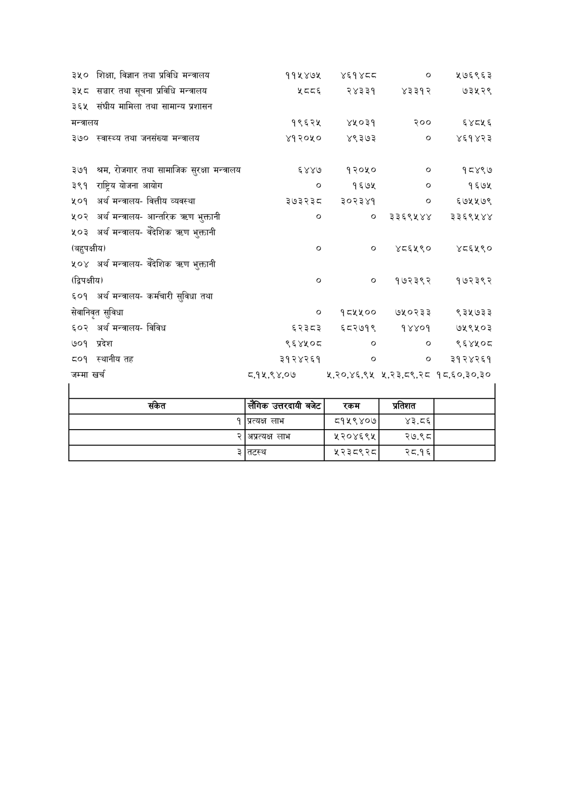

# Page 98 QA

## Rendered page


## Extracted text

```text
| ३५०                                                    | शिक्षा, विज्ञान तथा प्रविधि मन्त्रालय                  | ११५ ४७५     | ४६१४८८     | ०           | ५२७६९६३     |
|--------------------------------------------------------|--------------------------------------------------------|-------------|------------|-------------|-------------|
| ३५८                                                    | सञ्चार तथा सूचना प्रविधि मन्त्रालय                     | ५८०६        | २४३३१      | ४३३१२       | ७३५२९       |
| ३६५                                                    | संघीय मामिला तथा सामान्य प्रशासन                       |             |            |             |             |
| मन्त्रालय                                              | मन्त्रालय                                              | १९६२५       | ४२०३१      | २००         | ६४८५६       |
| ३७०                                                    | स्वास्थ्य तथा जनसंख्या मन्त्रालय                       | ४१२०५०      | ४९३७३      | ०           | ४६१४२३      |
| ३७१                                                    | श्रम, रोजगार तथा सामाजिक सुरक्षा मन्त्रालय             | ६४४७        | १२०५०      | ०           | १८४९७       |
| ३९१                                                    | राष्ट्रिय योजना आयोग                                   | ०           | १६७५       | ०           | १६७५        |
| ५०१                                                    | अर्थ मन्त्रालय- वित्तीय व्यवस्था                       | ३७३२३८      | २३०२३४१    | ०           | ६७५५७९      |
| ५०२                                                    | अर्थ मन्त्रालय- आन्तरिक त्रषण भुक्तानी                 | ०           | ०          | ३३६९५४४     | र३३६९५४४    |
| ५०३ अर्थ मन्त्रालय- वैदेशिक कर्ण भुक्तानी (बहुपक्षीय)  | ५०३ अर्थ मन्त्रालय- वैदेशिक कर्ण भुक्तानी (बहुपक्षीय)  | ०           | ०          | ४८६५९०      | ४८६५९०      |
| ५०४ अर्थ मन्त्रालय- वैदेशिक कर्ण भुक्तानी (द्विपक्षीय) | ५०४ अर्थ मन्त्रालय- वैदेशिक कर्ण भुक्तानी (द्विपक्षीय) | ०           | ०          | १७२३९२      | १७२३९२      |
| ६०१ अर्थ मन्त्रालय- कम्मचारी सुविधा तथा                | ६०१ अर्थ मन्त्रालय- कम्मचारी सुविधा तथा                |             |            |             |             |
| सेवानिवत सुविधा                                        | सेवानिवत सुविधा                                        | ०           | १८५५००     | ७५१०२३३     | ९३५७३३      |
| ६०२                                                    | अर्थ मन्त्रालय- विविध                                  | ६२३८३       | ६८२७१९     | १४४०१       | ७५९५०३      |
| ७०१                                                    | प्रदेश                                                 | ९६४४५०८     | ०          | ०           | ९६४५०८      |
| ८०१                                                    | स्थानीय तह                                             | ३१२४२६१     | ०          | ०           | ३१२४२६१     |
| जम्मा खर्च                                             | जम्मा खर्च                                             | ८,१५,९ ४,०७ | २,२०,४६,९५ | २,२३,८०९,२८ | १८,६०,३०,३० |

| सकित | लंगिक उत्तरी बजेट | रकम | प्रतिशत |  |
| --- | --- | --- | --- | --- |
| १ | प्रत्यक्ष लाभ | ८१५९४०७ | ४३.८६ |  |
| २ | अप्रत्यक्ष लाभ | २५२०४६९४५ | २७.९८ |  |
| ३ | तटस्थ | ५२३८९२८ | २८.१६ |  |
```

## Flags
- table_page
- medium_quality_table
