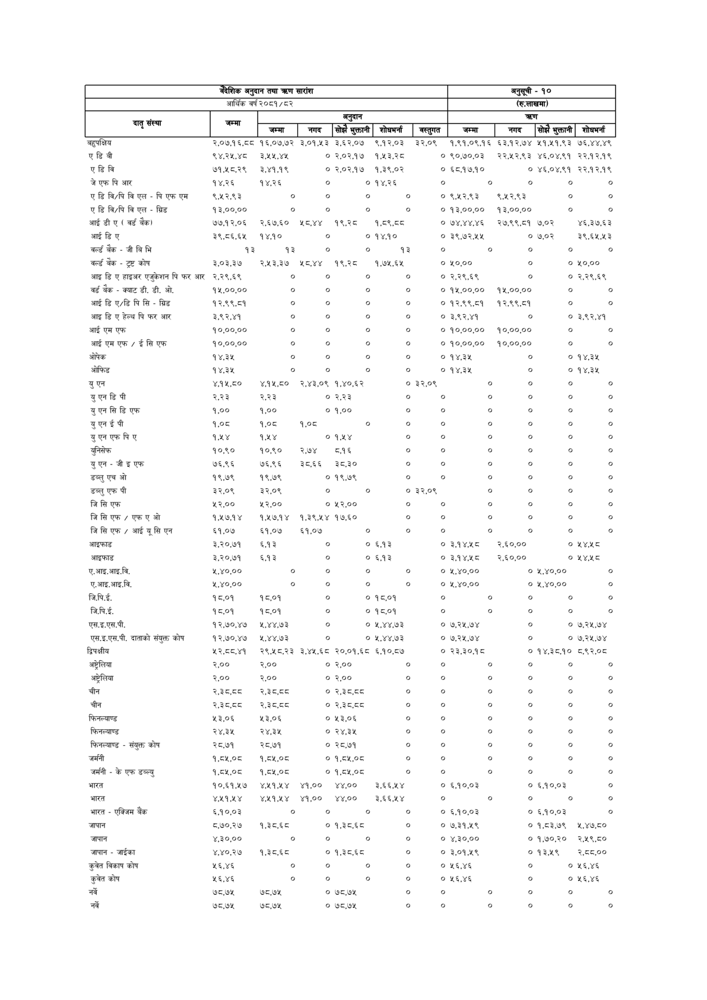

# Page 101 QA

## Rendered page


## Extracted text

```text
| वदेशिक अनुदान AT AT सारांश     | वदेशिक अनुदान AT AT सारांश   | वदेशिक अनुदान AT AT सारांश   | वदेशिक अनुदान AT AT सारांश   | वदेशिक अनुदान AT AT सारांश   | वदेशिक अनुदान AT AT सारांश   | वदेशिक अनुदान AT AT सारांश     | अनुसूची - १०   | अनुसूची - १०   | अनुसूची - १०             | अनुसूची - १०    | अनुसूची - १०   |
|--------------------------------|------------------------------|------------------------------|------------------------------|------------------------------|------------------------------|--------------------------------|----------------|----------------|--------------------------|-----------------|----------------|
|                                | आर्थिक वर्ष                  | २०८१/८२                      |                              |                              |                              | (रु.लाखमा)                     | (रु.लाखमा)     | (रु.लाखमा)     | (रु.लाखमा)               | (रु.लाखमा)      | (रु.लाखमा)     |
| कला                            | =                            | जम्मा                        | अनुदान                       | शोधभर्ना                     | अनुदान                       | [. बस्तुगत &#124; जम्मा        | कण             | नगद            | कण                       | शोध्भर्ना       | कण             |
| बहुपक्षिय                      | २,.०७.१६,८८                  | &#124; &#124; १६,०७.७२       | नगद [3 ३,०१,१३ 38,00         | भुक्तानी] 293,03             | &#124; ३२,००९                | १,९१,०९.१६                     | &#124;         | ६३.१२,७४       | ।सोझे भुक्तानी] ५१,५१,९३ | ७६,४४,४९        |                |
| एडिबी                          | ९४,२५,४८                     | ३,५४५,४४                     | 030398                       | १,५३,२८                      |                              | ० ९०,७०,०३                     |                | २२,४५२,९३      | ४६,०४,९१                 | २२,१२,१९        |                |
| एडिवि                          | ७१,५८.२९                     | ३,४१.१९                      | ०                            | २,०२,.१७                     | १,३९,०२                      | ० ६८,१७.१०                     |                | ०              | ४६,०४,९१                 | २२,१२,१९        |                |
| जे एफ पि आर                    | १४,२६                        | १४,२६                        | o                            | ० १४,२६                      |                              | ०                              | ०              | ७              | o                        | ७               |                |
| एडिवि/पि विएल - पि एफ एम       | ९,२५२,९३                     | o                            | o                            | o                            | o                            | ० ९,५२,९३                      |                | ९,५२,९३        | o                        | o               |                |
| एडिवि/पि वि एल - ग्रिड         | १३,००,००                     | o                            | ०                            | o                            | o                            | 0 93,0000                      |                | 43,0000        | ०                        | ०               |                |
| आई डी ए । वर्ड बैक)            | ७७,१२,०६                     | २,६७,६०                      | भ८,४४                        | १९,२८८                       | १,८९,८८                      | ०                              | ७४,४४,४६       | २७,९९,८१       | ७,०२                     | ४६,३७.६३        |                |
| आईडिए                          | ३९,८६,६५                     | १४,१०                        | ०                            | ०                            | १४,१०                        | ० ३९,७२,५५                     |                | 0 ७,०२         |                          | ३९,६५,५३        |                |
| वर्ल्ड बैंक - जीविभि           | १३                           | १३                           | ०                            | ०                            | १३           
```

## Flags
- table_page
- low_quality_table
