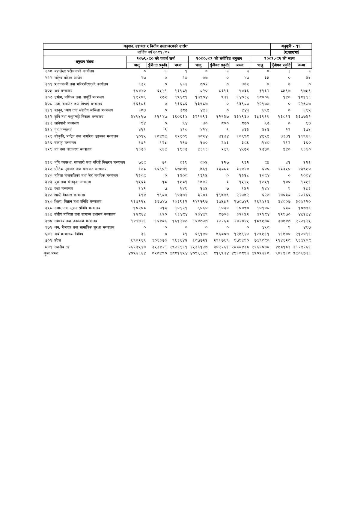

# Page 103 QA

## Rendered page


## Extracted text

```text
| अनुदान, सहायता र क्त्तीय हस्तान्तरणको सारांश आर्थिक वर्ष   | अनुदान, सहायता र क्त्तीय हस्तान्तरणको सारांश आर्थिक वर्ष   | अनुदान, सहायता र क्त्तीय हस्तान्तरणको सारांश आर्थिक वर्ष   | अनुदान, सहायता र क्त्तीय हस्तान्तरणको सारांश आर्थिक वर्ष   | अनुदान, सहायता र क्त्तीय हस्तान्तरणको सारांश आर्थिक वर्ष   | अनुदान, सहायता र क्त्तीय हस्तान्तरणको सारांश आर्थिक वर्ष   | अनुदान, सहायता र क्त्तीय हस्तान्तरणको सारांश आर्थिक वर्ष   | अनुदान, सहायता र क्त्तीय हस्तान्तरणको सारांश आर्थिक वर्ष   | अनुसूची - ११ (रू.लाखमा)   | अनुसूची - ११ (रू.लाखमा)   |
|------------------------------------------------------------|------------------------------------------------------------|------------------------------------------------------------|------------------------------------------------------------|------------------------------------------------------------|------------------------------------------------------------|------------------------------------------------------------|------------------------------------------------------------|---------------------------|---------------------------|
|                                                            | २०७९/८० को यथार्थ खर्च                                     | २०७९/८० को यथार्थ खर्च                                     | २०७९/८० को यथार्थ खर्च                                     | २०८०/८१ को संशोधित अनुमान                                  | २०८०/८१ को संशोधित अनुमान                                  | २०८०/८१ को संशोधित अनुमान                                  | २०८१/८२ को लक्ष्य                                          | २०८१/८२ को लक्ष्य         | २०८१/८२ को लक्ष्य         |
| e                                                          | चालु                                                       | पुँजीगत प्रकृति]                                           | जम्मा                                                      | &#124; चालु                                                | पपुँजीगत प्रकृति]                                          | जम्मा                                                      | चालु                                                       | पुँजीगत प्रकृति]          | जम्मा                     |
| २०८ महालेखा परीक्षकको कार्यालय                             | ०                                                          | १                                                          | १                                                          | ०                                                          | 2                                                          | 3                                                          | o                                                          | 2                         | &#124; 3                  |
| २२२ राष्ट्रिय महिला आयोग                                   | २७                                                         | ०                                                          | २७                                                         | ४७                                                         | ०                                                          | ४७                                                         | ३५                                                         | ०                         | ३५                        |
| ३०१ प्रधानमन्त्री तथा मन्त्रिपरिषद्को कार्यालय             | ६३२                                                        | ०                                                          | ६३२                                                        | ७०२                                                        | ०                                                          | ७०२                                                        | ०                                                          | ०                         | ०                         |
| ३०५ अर्थ मन्त्रालय                                         | १०४४०                                                      | ६५४१                                                  
```

## Flags
- table_page
