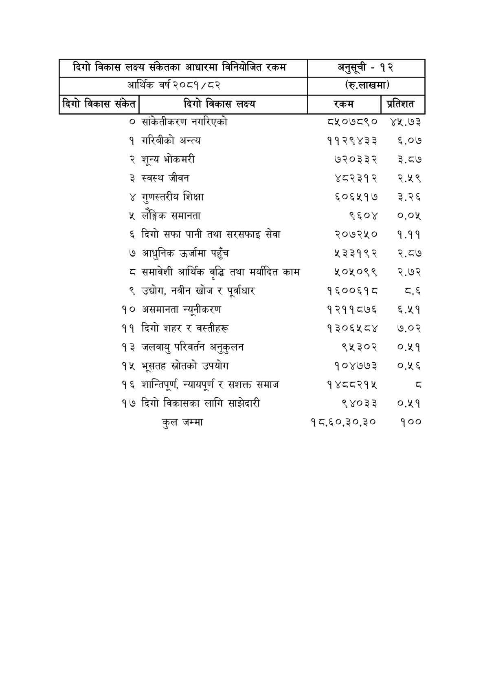

# Page 104 QA

## Rendered page


## Extracted text

```text
| दिगो विकास लक्ष्य संकेतका आधारमा विनियोजित रकम आर्थिक वर्ष २०८१/८२   | दिगो विकास लक्ष्य संकेतका आधारमा विनियोजित रकम आर्थिक वर्ष २०८१/८२   | (रू.लाखमा)   | (रू.लाखमा)   |
|----------------------------------------------------------------------|----------------------------------------------------------------------|--------------|--------------|
| ०                                                                    | सकितीकरण नगरिएको                                                     | ८५०७८९०      | ४५.७३        |
| १                                                                    | गरिबीको अन्त्य                                                       | ११२९४३३      | ६.०७         |
| २                                                                    | शून्य भोकमरी                                                         | ७२०३३२       | र२.८७        |
| ३                                                                    | स्वस्थ जीवन                                                          | ४८२३१२       | र२.५९        |
| ४                                                                    | गुणस्तरीय शिक्षा                                                     | ६5०६५१७      | २.२६         |
| ५                                                                    | लेङ्गिक समानता                                                       | ९६०४         | ०.०५         |
| ६                                                                    | दिगो सफा पानी तथा सरसफाइ सेवा                                        | २०७२५०       | १.११         |
| ७                                                                    | आधुनिक उर्जामा पहुँच                                                 | ५३३१९२       | २.७          |
| &                                                                    | समावेशी आर्थिक वद्धि तथा मर्यादित काम                                | ५०५०९९       | २.७२         |
| ९                                                                    | उद्योग, नवीन खोज र पूर्वाधार                                         | १६००६१८      | ८.६          |
| १०                                                                   | असमानता न्यूनीकरण                                                    | १२११८७६      | ६.५१         |
| ११                                                                   | दिगो शहर र वस्तीहरू                                                  | १३०६५८४      | ७.०२         |
| १३                                                                   | जलवायु परिवर्तन अनुकुलन                                              | ९५३०२        | ०.५१         |
| १५                                                                   | भूसतह स्रोतको उपयोग                                                  | १०४७७३       | ०.५६         |
| १६                                                                   | शान्तिपूर्ण, न्यायपूर्ण र सशक्त समाज                                 | १४८८२१४      | T            |
| १७                                                                   | दिगो विकासका लागि साझेदारी                                           | ९४०३३        | ०.५१         |
|                                                                      | कुल जम्मा                                                            | १८,६०,३०,३०  | १००          |
```

## Flags
- table_page
- medium_quality_table
