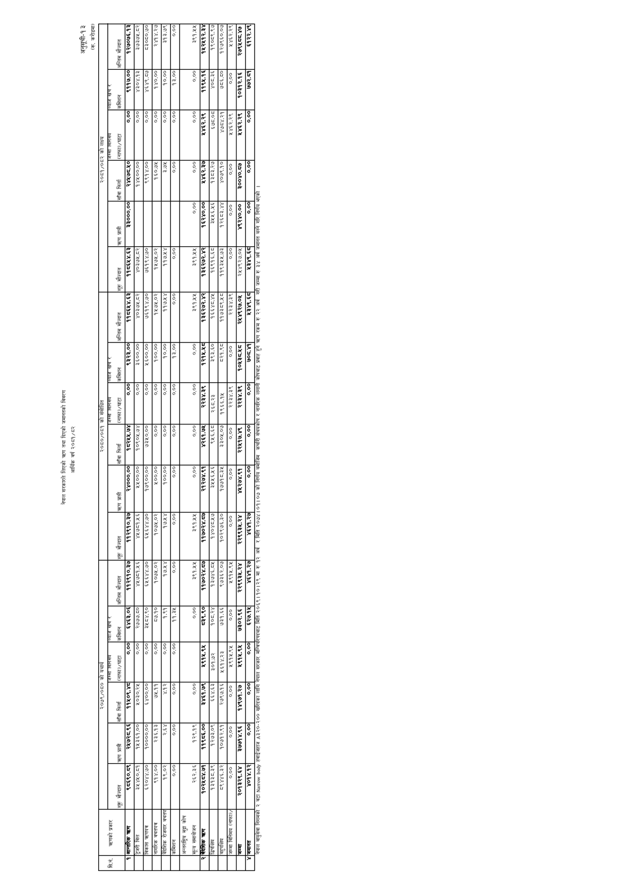

# Page 105 QA

## Rendered page


## Extracted text

```text
नेपाल सरकारले लिएको तरण तथा दिएको जमानतको विवरण आर्थिक वर्ष २०८१/८२
अनुसूची-१३
करोडमा)
भएको
हुने
वायुसेवा

|  |  |  |  | हा, |  |  |  |  |  |  |  |  |  |  |
| --- | --- | --- | --- | --- | --- | --- | --- | --- | --- | --- | --- | --- | --- | --- |
|  |  |  |  |  |  |  |  |  |  |  |  |  |  |  |
|  | हट हुई |  |  |  |  |  |  |  |  |  | क |  |  |  |
|  |  |  |  | २३३३३ |  |  |  |  |  |  | $२२५२३ |  |  |  |
|  | नि |  |  |  |  |  |  |  |  |  | ५;_:’-३८८_५ जि |  |  |  |
|  |  | हु |  |  |  |  |  |  |  |  |  |  |  |  |
|  |  |  |  |  |  |  |  |  |  |  |  |  |  |  |
|  | झरि] |  |  | ८८८८८३८ |  |  |  |  |  |  |  |  |  |  |
|  | हि |  |  |  |  |  |  |  |  |  |  |  |  |  |
|  |  |  |  |  |  |  |  |  |  |  |  |  |  |  |
|  |  | हु |  |  |  |  |  |  |  |  |  |  | - उ |  |
|  |  |  |  |  |  |  |  |  |  |  |  |  |  |  |
|  |  |  |  |  |  |  |  |  |  |  |  |  |  |  |
|  |  |  |  |  |  |  |  |  |  |  |  |  |  |  |
|  |  |  |  |  |  |  |  |  |  |  |  |  |  |  |
|  |  |  |  |  |  |  |  |  |  |  |  |  |  |  |
|  |  | २८ |  |  |  |  |  |  |  | ६०२ |  |  | ३ |  |
|  |  |  |  |  |  |  |  |  |  |  | सि |  |  |  |
|  | हु |  | ८५ |  |  | ६ |  | २१११११११११११४११ |  |  |  | छै | हु |  |
|  |  |  |  |  |  |  |  |  |  |  |  |  |  |  |
```

## Flags
- table_page
- low_quality_table
