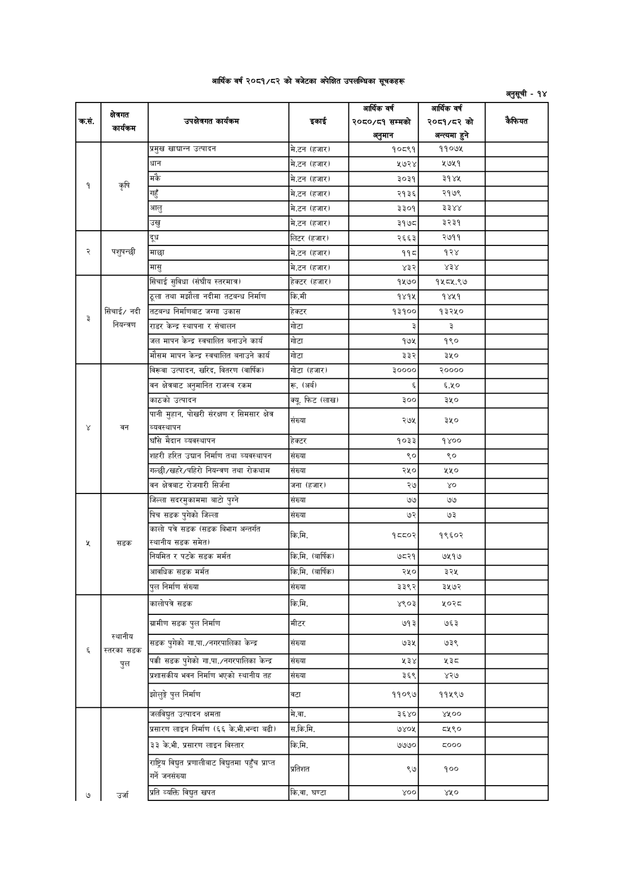

# Page 106 QA

## Rendered page


## Extracted text

```text
आर्थिक वर्ष २०८१/८२ को बजेटका अपेक्षित उपलब्धिका सूचकहरू
अनुसूची -१४

| का, | क्षेत्रगत कार्यकम | 'उपक्षेत्रगत कार्यक्रम | इकाई | आर्थिक वर्ष २०६०/६१ सम्मको अनुमान | आर्थिक वर्ष २००१/८२ को अन्त्यमा हुने | कैफियत |
| --- | --- | --- | --- | --- | --- | --- |
|  |  | प्रमुख खाद्यान्न उत्पादन | मे.टन (हजार। | १०८९१ | ११०७५ |  |
|  |  | धान | मे.टन (हजार) | ५७२४ | २७५१ |  |
|  | कृषि | मकै | मे.टन (हजार। | ३०३१ | ३१४५ |  |
|  |  | गहुँ | मे.टन (हजार) | २१३६ | २१७६ |  |
|  |  | आलु | मे.टन (हजार) | ३३०१ | ३३४४ |  |
|  |  | उखु | मे.टन (हजार) | ३१७८ | ३२३१ |  |
|  |  | दूध | लिटर (हजार) | २६६३ | २७११ |  |
| २ | पशुपन्छी | माछा | मे.टन (हजार। | ११८ | १२४ |  |
|  |  | मासु | मे.टन (हजार) | ४३२ | ११ |  |
|  |  | सिंचाई सुविधा (संघीय स्तरमात्र। | हेक्टर (हजार। | १५७० | १४५८५.९७ |  |
|  |  | ठूला तथा मझौला नदीमा तटबन्ध निर्माण | कि.मी | १४१५ | १४५१ |  |
|  | सिंचाई/ नदी | तटबन्ध निर्माणबाट जग्गा उकास | हेक्टर | १३१०० | १३२५० |  |
|  | नियन्त्रण | राडर केन्द्र स्थापना र संचालन | गोटा | ३ | ३ |  |
|  |  | 'जल मापन केन्द्र स्वचालित बनाउने कार्य | गोटा | १७५ | १९० |  |
|  |  | मौसम मापन केन्द्र स्वचालित बनाउने कार्य | गोटा | ३३२ | ३५० |  |
|  |  | विरूवा उत्पादन, खरिद, वितरण (वार्षिक) | गोटा (हजार) | ३०००० | २०००० |  |
|  |  | क्षेत्रबाट अनुमानित राजस्व रकम | रू. (अर्ब) |  | ६.५० |  |
|  |  | काठको उत्पादन | क्यू. फिट (लाख) | ३०० | ३५० |  |
| ४ | का | पानी मुहान, पोखरी संरक्षण र सिमसार क्षेत्र | जा | क | रट |  |
|  |  | घाँसे मैदान व्यवस्थापन | हेक्टर | १०३३ | १४०० |  |
|  |  | शहरी हरित उद्यान निर्माण तथा व्यवस्थापन | संख्या | ९० |  |  |
|  |  | 'गल्छी/खहरे/पहिरो नियन्त्रण तथा रोकथाम | संख्या | २५० | २५० |  |
|  |  | बन क्षेत्रबाट रोजगारी सिर्जना | जना (हजार) | २७ |  |  |
|  |  | जिल्ला खवरसुकानमा बाटो पुग्ने | संख्या | ७७ | ७७ |  |
|  |  | पिच सडक पुगेको जिल्ला | संख्या | ७२ | ७३ |  |
|  | सडक | कालो पत्रे डक (सडक बिभाग अन्तर्गत स्थानीय सडक समेत) | किमि, | भन्च््र | टर |  |
|  |  | नियमित र पटके सडक मर्मत | कि.मि. (वार्षिक) | ७८२१ | ७५१७ |  |
|  |  | आवधिक सडक मर्मत | कि.मि. (बार्षिक) | २५० | ३२५ |  |
|  |  | पुल निर्माण संख्या | संख्या | ३३९२ | ३५७२ |  |
|  |  | कालोपत्रे सडक | कि.मि. | ४९०३ | ५०२८ |  |
|  |  | ग्रामीण सडक पुल निर्माण | मीटर | ७१३ | ७६३ |  |
| ६ | स्थानीय स्तरका सडक | न सडक पुगेको गा.पा./नन२पालिका केन्द्र | संख्या | ७३५ | ७३९ |  |
|  | पल | पक्की सडक पुगेको गा.पा./नभरपालिका केन्द्र | संख्या | ५३४ | २३८ |  |
|  |  | प्रशासकीय भवन निर्माण भएको स्थानीय तत | संख्या | ३६९ | ४२७ |  |
|  |  | झोलुङ्गे पुल निर्माण | वटा | ११०९७ | ११५९७ |  |
|  |  | जलविधुत उत्पादन क्षमता | मे.वा. | ३६४० | ४५०० |  |
|  |  | प्रसारण लाइन निर्माण (६६ के.भी.भन्दा बढी) | स.कि.मि. | ७४०५ | ८५९० |  |
|  |  | ३३ के.भी. प्रसारण लाइन विस्तार | कि.मि. | ७७७० | ८००० |  |
|  |  | पाम नइ परभासीबा पहँच प्राप्त | तिशत | २७ | १०० |  |
| ७ | जना | प्रति व्यक्ति विद्युत खपत | कि.वा. घण्टा | ४०० | ४५० |  |
```

## Flags
- table_page
- medium_quality_table
