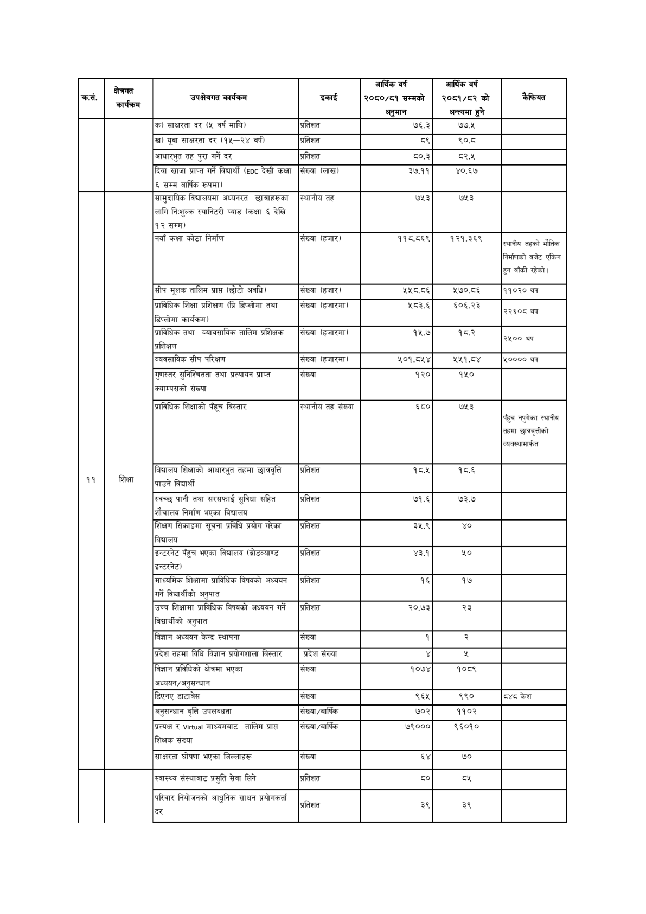

# Page 108 QA

## Rendered page


## Extracted text

```text
| कसे, | क्षेत्रगत कार्यक्रम | 'उपझेकगत कार्यक्रम | इकाई | आर्थिक वर्ष र२०६०/५१ सम्मको अनुमान | आर्थिक वर्ष २०८१/८२ को अन्त्यमा हुने | कैफियत |
| --- | --- | --- | --- | --- | --- | --- |
|  |  | ) साक्षरता दर (५ वर्ष माथि। | प्रतिशत | ७६.३ | ७७५ |  |
|  |  | ) यूवा साक्षरता दर (१५--२४ वर्ष) | प्रतिशत | ५२ | ९०.८ |  |
|  |  | आधारभुत तह पुरा गर्ने दर | प्रतिशत | ५०.३ | ५.४ |  |
|  |  | दिवा खाजा प्राप्त गर्ने विद्यार्थी (६०८ देखी कक्षा सम्म वार्षिक रूपमा) | संख्या (लाख। | ३७.११ | ४०.६७ |  |
|  |  | सामुदायिक विदालयमा अध्यनरत छ।जाहरूका लागि निःशुल्क स्यानिटरी प्याड (कक्षा ६ देखि १२ सम्म) | स्थानीय तह | ७५३ | ७५३ |  |
|  |  | नयाँ कक्षा कोठा निर्माण | संख्या (हजार) | ११८:८६९ | १२१.,३६९ | सएानीय तहको भौतिक निर्माणको बजेट एकिन हुन बाँकी रहेको। |
|  |  | सीप मूलक तालिम प्राप्त (छोटो अवधि) | संख्या (हजार। | ५५८.८६ | ५७०.८६ | ११०२० थप |
|  |  | प्राविधिक शिक्षा प्रशिक्षण (प्रि डिप्लोमा तथा डिप्लोमा कार्यक्रम) | संख्या (हजारमा) | ५८३.६ | ६०६.२३ | २२६०८ वप |
|  |  | प्राविधिक तथा न्यावसाविक तालिम प्रशिक्षक प्रशिक्षण | संख्या (हजारमा) | १५.७ | १८.२ | २५०० |
|  |  | व्यवसायिक सीप परिक्षण | संख्या (हजारमा) | ५०१.८५४ | २४९.५% | ४०००० थप |
|  |  | 'गुणस्तर सुनिश्चितता तथा प्रत्यायन प्राप्त क्याम्पसको संख्या | संख्या | १२० | १५० |  |
|  |  | प्राविधिक शिक्षाको बिस्तार | स्थानीय तह संख्या | ६८० | ७५३ | पहुच नपुगेका स्थानीय 'तहमा छात्रबृत्तीको |
| ११ | थिक्षा | बिच्ालय शिक्षाको आधारभूत तहमा छात्रवृत्ति पाउने विद्यार्थी | प्रतिशत | १८.५ | १८.६ |  |
|  |  | स्वच्छ पानी तथा सरसफाई सुविधा सहित शौचालय निर्माण भएका विद्यालय | प्रतिशत | ७१.६ | ७३.७ |  |
|  |  | शिक्षण सिकाइमा सूचना प्रविधि प्रयोग गरका विघालय | प्रतिशत | ३५.९ |  |  |
|  |  | इन्टरनेट पैहुच भएका विघालय (द्रोडव्याण्ड इन्टरनेट) | प्रतिशत | ४३.१ | ५० |  |
|  |  | माध्यमिक शिक्षामा प्राविधिक विषयको अध्ययन गर्ने विद्यार्थीको अनुपात | प्रतिशत | १६ | १७ |  |
|  |  | उच्च शिक्षामा प्राविधिक विषयको अध्ययन गर्ने विद्यार्थीको अनुपात | प्रतिशत | २०.७३ | २३ |  |
|  |  | विज्ञान अध्ययन केन्द्र स्थापना | संख्या | १ |  |  |
|  |  | प्रदेश तहमा विधि विज्ञान प्रयोगशाला विस्तार | प्रदेश संख्या |  |  |  |
|  |  | विज्ञान प्रविधिको क्षेत्रमा भएका अध्ययन/अनुसन्धान | संख्या | १०७४ | १०८९ |  |
|  |  | डिएनए डाटावेस | संख्या | ६६५ | ९९० | दश्य केश |
|  |  | अनुसन्धान वृत्ति उपलब्धता | 'संख्या/वार्षिक | ७०२ | ११०२ |  |
|  |  | प्रत्यक्ष र माध्यमबाट तालिम प्राप्त शिक्षक संख्या | 'संख्या/वार्षिक | ७९००० | ९६०१० |  |
|  |  | साक्षरता घोषणा भएका जिल्लाहरू | संख्या |  | ७० |  |
|  |  | स्वास्थ्य संस्थाबाट प्रसुति सेवा लिने | प्रतिशत |  |  |  |
|  |  | परिवार नियोजनको आधुनिक साधन प्रयोगकर्ता द्र | प्रतिशत | ३९ | ३९ |  |
```

## Flags
- table_page
- medium_quality_table
