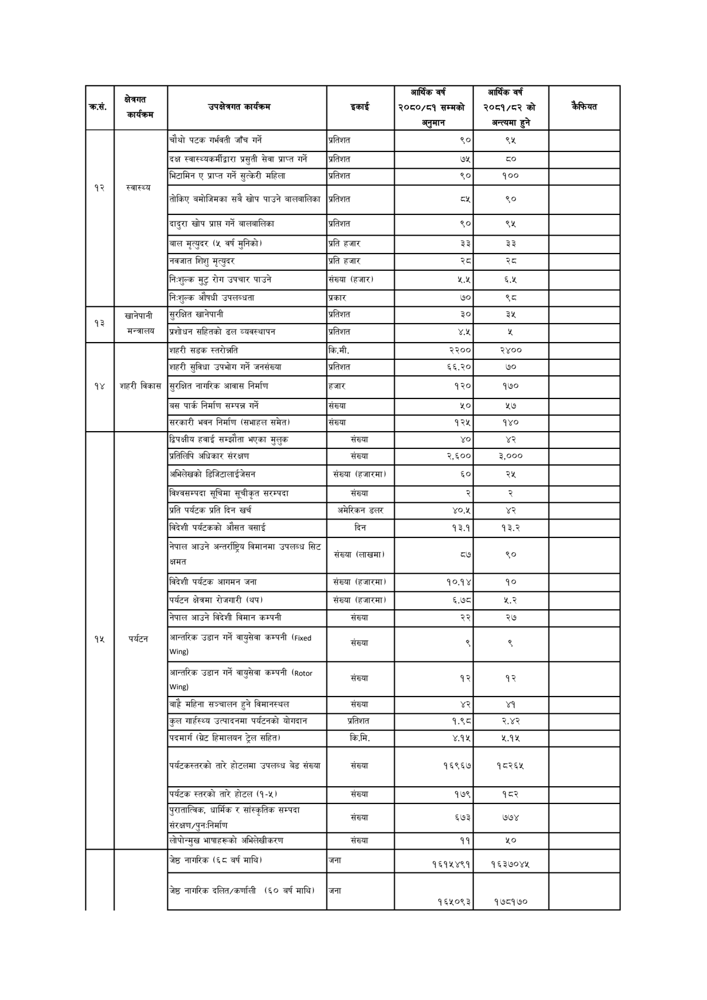

# Page 109 QA

## Rendered page


## Extracted text

```text
| का, | क्षेत्रगत कार्यकम | 'उपक्षेत्रगत कार्यक्रम | इकाई | आर्थिक वर्ष २०६०/६१ सम्मको अनुमान | आर्थिक वर्ष २०६१/८२ को अन्त्यमा हुने | कैफियत |
| --- | --- | --- | --- | --- | --- | --- |
|  |  | चौथो पटक गर्भवती जाँच गर्ने | प्रतिशत | ६९० | २% |  |
|  |  | दक्ष स्वास्थ्वकर्मीदवार प्रसुती सेवा प्राप्त गर्ने | प्रतिशत | ७५ | ६० |  |
|  |  | भिटामिन ए प्राप्त गर्ने सुत्केरी महिला | प्रतिशत |  | १०० |  |
| १२ | स्वास्थ्य | तोकिए बमोजिमका सबै खोप पाउने वालवालिका | प्रतिशत | ५३ | ९० |  |
|  |  | दादुरा खोप प्राप्त गर्ने जालनालिका | प्रतिशत | ९० | ९५ |  |
|  |  | बाल मृत्युदर (५ वर्ष मुनिको) | प्रति हजार | ३३ | ३३ |  |
|  |  | नबजात शिशु मृत्युदर | प्रति हजार | २८ | २८ |  |
|  |  | निःशुल्क मुटु रोग उपचार पाउने | संख्या (हजार) | ५.५ | ६.५ |  |
|  |  | निःशुल्क औषधी उपलब्धता | प्रकार | ७० | ३ |  |
|  | खानेपानी | सुरक्षित खानेपानी | प्रतिशत | २० | ३५ |  |
| १३ | मन्त्रालय | शोधन सहितको प्रशोधन को ढल व्ववस्थापन | प्रतिशत | ४५ |  |  |
|  |  | शहरी सडक स्तरोन्नति | कि.मी. | २२०० | २४०० |  |
|  |  | शहरी सुविधा उपभोग गर्ने जनसंख्या | प्रतिशत | ६६.२० | ७० |  |
| १४ | शहरी बिकास | सुरक्षित नागरिक आवास निर्माण | हजार | १२० | १७० |  |
|  |  | 'बस पार्क निर्माण सम्पन्न गर्ने | सँख्या | ५० | १ |  |
|  |  | सरकारी भवन निर्माण (सभाहल समेत) | सँख्या | १२५ | १४० |  |
|  |  | द्विपक्षीय हवाई सम्झौता भएका मुलुक | संख्या | ४० |  |  |
|  |  | प्रतिलिपि अधिकार संरक्षण | संख्या | २.६०० | ३,००० |  |
|  |  | अभिलेखको डि/ज८।लाई जसन | संख्या (हजारमा) | ६० | २५ |  |
|  |  | विश्वसम्पदा सूचिमा सूचीकृत सरम्पदा | संख्या | र | २ |  |
|  |  | प्रति पर्यटक प्रति दिन खर्च | अमेरिकन डलर |  | ४२ |  |
|  |  | बिदेशी पर्यटकको औसत वसाई | दिन | १३.१ | १३.२ |  |
|  |  | नेपाल आउने अन्तर्राष्ट्रिय विमानमा उपलब्ध सिट क्षमत | संख्या (लाखमा) | ५७ | ९० |  |
|  |  | बिदेशी पर्यटक आगमन जना | संख्या (हजारमा) | १०.१४ | १० |  |
|  |  | पर्यटन क्षेत्रमा रोजगारी (थप) | संख्या (हजारमा) | ६.७८ | २.२ |  |
|  |  | नेपाल आउने विदेशी विमान कम्पनी | संख्या | २२ | २७ |  |
| १५ | पर्यटन | अन्तरिक उडान गर्ने वायुसेवा कम्पनी (५७० ) | संख्या | द्‌ |  |  |
|  |  | आन्तरिक उडान गर्ने वायुसेवा कम्पनी ( ) | संख्या | १२ | १२ |  |
|  |  | बाहै महिना सञ्चालन हुने विमानस्थल | संख्या | ४२ | ४१ |  |
|  |  | कुल गार्हस्थ्य उत्पादनमा पर्यटनको योगदान | प्रतिशत | १.९८ |  |  |
|  |  | पदमार्ग (ग्रेट हिमालयन ट्रेल सहित) | कि.मि. | ४.१५ | ५.१५ |  |
|  |  | पर्वटकल्तरको तारे होटलमा उपलब्ध वेड संख्या | संख्या |  | १८२६५ |  |
|  |  | पर्यटक स्तरको तारे होटल (१-४५। | संख्या | १७९ | १८२ |  |
|  |  | पुरातात्विक, धार्मिक र सांस्कृतिक सम्पदा - © संरक्षण/पुनःनिर्माण | . संख्या | ५७३ | ७७४ |  |
|  |  | लोपोन्मुख भाषाहरूको अभिलेखीकरण | संख्या | ११ | ५० |  |
|  |  | जेष्ठ नागरिक (६८ वर्ष माथि) | जना | १६१५४९१ | १६३७०४५ |  |
|  |  | जेष्ठ नागरिक दलित/कर्णाली (६० बर्ष माथि) | जना | १६५०९३ | १७८१७० |  |
```

## Flags
- table_page
- medium_quality_table
