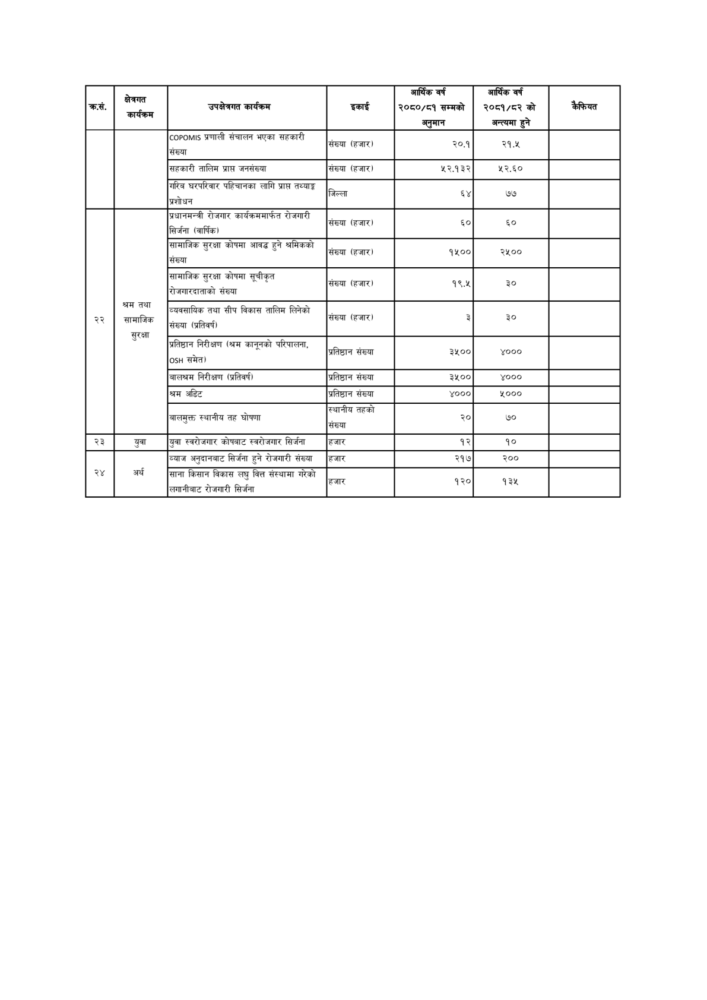

# Page 111 QA

## Rendered page


## Extracted text

```text
| का, | क्षेत्रगत कार्यकम | 'उपक्षेत्रगत कार्यक्रम | इकाई | आर्थिक वर्ष २०६०/६१ सम्मको अनुमान | आर्थिक वर्ष २०६१/८२ को अन्त्यमा हुने | कैफियत |
| --- | --- | --- | --- | --- | --- | --- |
|  |  | प्रणाली संचालन भएका सहकारी संख्या | सँख्या (हजार) | २०.१ | २१४५ |  |
|  |  | सहकारी तालिम प्राप्त जनसंख्या | संख्या (हजार। | ५२.१३२ | ४२८० |  |
|  |  | गरिब घरपरिवार पहिचानका लागि प्राप्त तथ्याङ्क प्रशोधन | जिल्ला |  | ७७ |  |
|  |  | प्रधानमन्त्री रोजगार कार्थकरल मात रोजगारी सिर्जना (वार्षिक) | संख्या (हजार) |  |  |  |
|  |  | सामाजिक सुरक्षा कोषमा आवद्ध हुने श्रमिकको संख्या | संख्या (हजार) | १५०० | २५०० |  |
|  |  | सामाजिक सुरक्षा कोषमा सूचीकृत दि बन सजनारकाताका संख्या | संख्या (हजार) | १९४५ | ३० |  |
| २२ | तम सामाजिक सामाजिक सुरक्षा | व्यवसायिक तथा सीप विकास तालिम लिनेको सख्या (प्रतिवर्ष) | सख्या (हजार) |  | ३० |  |
|  |  | प्रतिष्ठान निरीक्षण (खम कानुनका परिपालना, ०५९ समेत) | . प्रतिष्ठान संख्या | ३५०० | ४००० |  |
|  |  | बालश्रम निरीक्षण (प्रतिवर्ष | प्रतिष्ठान संख्या | ३५०० | ४००० |  |
|  |  | श्रम अडिट | प्रतिष्ठान संख्या | ४००० | ५००० |  |
|  |  | बालमुक्त स्थानीय तह घोषणा | स्थानीय तहको संख्या | २० | ७० |  |
| २३ | युवा | युवा स्वरोजगार कोषबाट स्वरोजगार सिर्जना | हजार | १२ | १० |  |
|  |  | व्याज अनुदानबाट सिर्जना हुने रोजगारी संख्या | हजार | २१७ | २०० |  |
| स४ | गर्ब | साना किसान विकास लघु कित संस्थामा गरेको रोजगारी 'लगानीबाट रोजगारी सिर्जना | हजार | २० २ | १३८ |  |
```

## Flags
- table_page
- medium_quality_table
