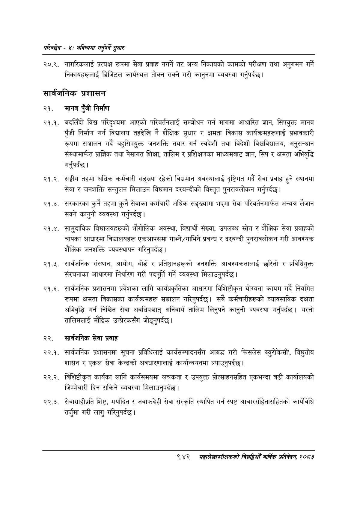

# Page 1000 QA

## Rendered page


## Extracted text

```text
परिच्छेद -४: भविष्यसा गनुपर्ने सुधार
२०.९. नागरिकलाई प्रत्यक्ष रूपमा सेवा प्रवाह नगर्ने तर अन्य निकायको कामको परीक्षण तथा अनुगमन गर्ने निकायहरूलाई डिजिटल कार्यस्थल तोक्न सक्ने गरी कानुनमा व्यवस्था गर्नुपर्दछ |
सार्वजनिक प्रशासन
२१. मानव पुँजी निर्माण
. बदलिँदो विश्व परिदृश्यमा आएको परिवर्तनलाई सम्बोधन गर्न मागमा आधारित ज्ञान, सिपयुक्त मानव पुँजी निर्माण गर्न विद्यालय तहदेखि नै शैक्षिक सुधार र क्षमता विकास कार्यक्रमहरूलाई प्रभावकारी रूपमा सञ्चालन गर्दै बहुसिपयुक्त जनशक्ति तयार गर्न स्वदेशी तथा विदेशी विश्वविद्यालय, अनुसन्धान संस्थामार्फत प्राज्ञिक तथा पेसागत शिक्षा, तालिम र प्रशिक्षणका माध्यमबाट ज्ञान, सिप र क्षमता अभिवृद्धि गर्नुपर्दछ |
२१.२. सङ्घीय तहमा अधिक कर्मचारी सङ्ख्या रहेको विद्यमान अवस्थालाई दृष्टिगत गर्दै सेवा प्रवाह हुने स्थानमा सेवा र जनशक्ति सन्तुलन मिलाउन विद्यमान दरबन्दीको विस्तृत पुनरावलोकन गर्नुपर्दछ |
. सरकारका कुनै तहमा कुनै सेवाका कर्मचारी अधिक सङ्ख्यामा भएमा सेवा परिवर्तनमार्फत अन्यत्र लैजान सक्ने कानुनी व्यवस्था गर्नुपर्दछ |
. सामुदायिक विद्यालयहरूको भौगोलिक अवस्था, विद्यार्थी संख्या, उपलब्ध स्रोत र शैक्षिक सेवा प्रवाहको चापका आधारमा विद्यालयहरू एकआपसमा गाभ्ने/गाभिने प्रबन्ध र दरबन्दी पुनरावलोकन गरी आवश्यक शैक्षिक जनशक्ति व्यवस्थापन गरिनुपर्दछ |
. सार्वजनिक संस्थान, आयोग, बोर्ड र प्रतिष्ठानहहरूको जनशक्ति आवश्यकतालाई छरितो र प्रविधियुक्त संरचनाका आधारमा निर्धारण गरी पदपूर्ति गर्ने व्यवस्था मिलाउनुपर्दछ।
. सार्वजनिक प्रशासनमा प्रवेशका लागि कार्यप्रकृतिका आधारमा विशिष्टीकृत योग्यता कायम गर्दै नियमित रूपमा क्षमता विकासका कार्यक्रमहरू सञ्चालन गरिनुपर्दछ। सबै कर्मचारीहरूको व्यावसायिक दक्षता अभिवृद्धि गर्न निश्चित सेवा अवधिपश्चात्‌ अनिवार्य तालिम लिनुपर्ने कानुनी व्यवस्था गर्नुपर्दछ। यस्तो तालिमलाई मौद्रिक उत्प्ेरकसँग जोड्नुपर्दछ।
२२. सार्वजनिक सेवा प्रवाह
२२.१. सार्वजनिक प्रशासनमा सूचना प्रविधिलाई कार्यसम्पादनसँग आबद्ध गरी 'फेसलेस ब्युरोक्रसी', विद्युतीय शासन र एकल सेवा केन्द्रको अवधारणालाई कार्यान्वयनमा ल्याउनुपर्दछ।
२२.२. विशिष्टीकृत कार्यका लागि कार्यसमयमा लचकता र उपयुक्त प्रोत्साहनसहित एकभन्दा बढी कार्यालयको जिम्मेवारी दिन सकिने व्यवस्था मिलाउनुपर्दछ।
२२.३. सेवाग्राहीप्रति शिष्ट, मर्यादित र जवाफदेही सेवा संस्कृति स्थापित गर्न स्पष्ट आचारसंहितासहितको कार्यविधि तर्जुमा गरी लागु गरिनुपर्दछ |
९४२
मंहालेखापरीक्षकको वार्षिक प्रतिवेदन; २०८२
```

## Flags
- None
